# Technical Specifications

## 1. INTRODUCTION

### EXECUTIVE SUMMARY

| Aspect | Details |
| ------ | ------- |
| Project Overview | An interactive web application for managing and viewing Interaction records through a searchable table interface ("Finder") and a dedicated add/edit form |
| Business Problem | Organizations need a centralized, searchable system to track various interactions across multiple sites with controlled user access |
| Key Stakeholders | Site administrators, regular users tracking interactions, management requiring interaction data analysis |
| Value Proposition | Streamlined interaction management with search capabilities, multi-site support, and secure user access control simplifying organizational communication tracking |

### SYSTEM OVERVIEW

#### Project Context

| Context Aspect | Description |
| -------------- | ----------- |
| Business Context | The application addresses the need for structured interaction management across organizational sites, enabling better tracking and accessibility of communication records |
| Market Positioning | Serves as an internal tool for organizations requiring formalized interaction tracking with multi-user, multi-site capabilities |
| Integration Landscape | Will function as a standalone system with potential for future integration with other organizational systems |

#### High-Level Description

The Interaction Management System provides a streamlined interface for recording, viewing, and managing interaction data. The system consists of three primary components:

- Finder Interface: A searchable table view displaying Interaction records with filterable columns
- Interaction Form: A detailed add/edit interface for Interaction records
- Authentication System: Site-scoped user authentication controlling access to Interaction data

The application will utilize a modern web architecture with responsive design principles to ensure usability across devices.

#### Success Criteria

| Criteria | Measurement |
| -------- | ----------- |
| System Adoption | >90% of target users actively using the system |
| Search Performance | Interaction searches completed in <2 seconds |
| Data Integrity | Zero instances of data loss or corruption |
| User Satisfaction | >85% positive feedback on usability surveys |

### SCOPE

#### In-Scope

Core Features and Functionalities:

- User authentication and authorization system
- Site-based access control for Interaction data
- Searchable Interaction Finder with filtering capabilities
- Comprehensive Interaction add/edit interface
- Complete Interaction entity management (CRUD operations)

Implementation Boundaries:

- Support for multiple organizational sites
- User management within site boundaries
- Support for all specified Interaction fields (title, type, lead, dates/times, timezone, location, description, notes)
- Search functionality across all Interaction fields

#### Out-of-Scope

- Mobile native applications (web responsive only)
- Integration with external calendar systems
- Advanced reporting and analytics functions
- Automated notification system
- Public API for third-party integration
- Offline functionality
- Historical version tracking of Interactions
- Bulk import/export capabilities

## 2. PRODUCT REQUIREMENTS

### 2.1 FEATURE CATALOG

#### Authentication & Authorization

| Feature Metadata | Details |
|------------------|---------|
| ID | F-001 |
| Feature Name | User Authentication |
| Feature Category | Security |
| Priority Level | Critical |
| Status | Proposed |

**Description**
- **Overview**: Secure login system allowing authorized users to access the application
- **Business Value**: Ensures only authorized personnel can access sensitive interaction data
- **User Benefits**: Protects user accounts and provides personalized access to site-specific data
- **Technical Context**: Serves as the gateway to the application, controlling all data access

**Dependencies**
- **Prerequisite Features**: None
- **System Dependencies**: Authentication database, secure connection (HTTPS)
- **External Dependencies**: None
- **Integration Requirements**: Must integrate with site-scoping mechanism

| Feature Metadata | Details |
|------------------|---------|
| ID | F-002 |
| Feature Name | Site-Scoped Access Control |
| Feature Category | Security |
| Priority Level | Critical |
| Status | Proposed |

**Description**
- **Overview**: Mechanism to restrict user access to interactions based on site association
- **Business Value**: Enables multi-tenant usage while maintaining data separation
- **User Benefits**: Users only see relevant interactions for their site
- **Technical Context**: Core authorization layer determining data visibility

**Dependencies**
- **Prerequisite Features**: F-001 User Authentication
- **System Dependencies**: Site-user relationship database
- **External Dependencies**: None
- **Integration Requirements**: Must integrate with all data retrieval operations

#### Interaction Management

| Feature Metadata | Details |
|------------------|---------|
| ID | F-003 |
| Feature Name | Interaction Creation |
| Feature Category | Data Management |
| Priority Level | Critical |
| Status | Proposed |

**Description**
- **Overview**: Form interface for creating new interaction records
- **Business Value**: Enables systematic tracking of organizational interactions
- **User Benefits**: Structured method to record all interaction details
- **Technical Context**: Primary data entry point for the system

**Dependencies**
- **Prerequisite Features**: F-001 User Authentication, F-002 Site-Scoped Access Control
- **System Dependencies**: Database storage for interactions
- **External Dependencies**: None
- **Integration Requirements**: Must associate new interactions with appropriate site

| Feature Metadata | Details |
|------------------|---------|
| ID | F-004 |
| Feature Name | Interaction Editing |
| Feature Category | Data Management |
| Priority Level | High |
| Status | Proposed |

**Description**
- **Overview**: Form interface for modifying existing interaction records
- **Business Value**: Ensures interaction data remains accurate and up-to-date
- **User Benefits**: Allows correction and enhancement of interaction information
- **Technical Context**: Uses same form interface as creation with pre-populated fields

**Dependencies**
- **Prerequisite Features**: F-001 User Authentication, F-002 Site-Scoped Access Control, F-003 Interaction Creation
- **System Dependencies**: Database update capabilities
- **External Dependencies**: None
- **Integration Requirements**: Must maintain site association during updates

| Feature Metadata | Details |
|------------------|---------|
| ID | F-005 |
| Feature Name | Interaction Deletion |
| Feature Category | Data Management |
| Priority Level | Medium |
| Status | Proposed |

**Description**
- **Overview**: Functionality to remove interaction records from the system
- **Business Value**: Maintains data cleanliness by removing obsolete records
- **User Benefits**: Prevents cluttering of interaction lists with irrelevant entries
- **Technical Context**: Requires confirmation and proper authorization checks

**Dependencies**
- **Prerequisite Features**: F-001 User Authentication, F-002 Site-Scoped Access Control
- **System Dependencies**: Database deletion capabilities
- **External Dependencies**: None
- **Integration Requirements**: Must verify site-scoped permissions before deletion

#### Finder Functionality

| Feature Metadata | Details |
|------------------|---------|
| ID | F-006 |
| Feature Name | Interaction Finder View |
| Feature Category | Data Presentation |
| Priority Level | Critical |
| Status | Proposed |

**Description**
- **Overview**: Tabular view displaying interaction records with all specified fields
- **Business Value**: Provides comprehensive visibility into interaction data
- **User Benefits**: Allows quick scanning and review of all interactions
- **Technical Context**: Main data visualization component of the application

**Dependencies**
- **Prerequisite Features**: F-001 User Authentication, F-002 Site-Scoped Access Control
- **System Dependencies**: Database retrieval capabilities
- **External Dependencies**: None
- **Integration Requirements**: Must apply site-scoping filter to all data requests

| Feature Metadata | Details |
|------------------|---------|
| ID | F-007 |
| Feature Name | Interaction Search |
| Feature Category | Data Retrieval |
| Priority Level | High |
| Status | Proposed |

**Description**
- **Overview**: Search functionality across all interaction fields
- **Business Value**: Enables quick location of specific interaction data
- **User Benefits**: Reduces time spent manually scanning for information
- **Technical Context**: Requires efficient database querying and result formatting

**Dependencies**
- **Prerequisite Features**: F-001 User Authentication, F-002 Site-Scoped Access Control, F-006 Interaction Finder View
- **System Dependencies**: Database search capabilities
- **External Dependencies**: None
- **Integration Requirements**: Must respect site-scoping in all search results

### 2.2 FUNCTIONAL REQUIREMENTS TABLE

#### User Authentication (F-001)

| Requirement Details | Description |
|---------------------|-------------|
| ID | F-001-RQ-001 |
| Description | System shall provide a login form with username and password fields |
| Acceptance Criteria | Login form renders correctly with both fields and submit button |
| Priority | Must-Have |
| Complexity | Low |

| Technical Specifications | Details |
|-------------------------|---------|
| Input Parameters | Username (string), Password (string) |
| Output/Response | JWT token or session cookie upon successful authentication |
| Performance Criteria | Authentication response within 2 seconds |
| Data Requirements | Secure storage of user credentials with password hashing |

| Validation Rules | Details |
|------------------|---------|
| Business Rules | Maximum of 5 failed login attempts before temporary lockout |
| Data Validation | Non-empty username and password with minimum length requirements |
| Security Requirements | HTTPS for all authentication requests, password encryption |
| Compliance Requirements | Password must meet organizational complexity standards |

| Requirement Details | Description |
|---------------------|-------------|
| ID | F-001-RQ-002 |
| Description | System shall validate user credentials against stored account information |
| Acceptance Criteria | Valid credentials grant access, invalid credentials display error |
| Priority | Must-Have |
| Complexity | Medium |

| Technical Specifications | Details |
|-------------------------|---------|
| Input Parameters | Username, password |
| Output/Response | Success or failure response with appropriate message |
| Performance Criteria | Validation completed within 1 second |
| Data Requirements | Access to user account database |

| Validation Rules | Details |
|------------------|---------|
| Business Rules | Account must be active and not locked |
| Data Validation | Credentials must match stored values after appropriate hashing |
| Security Requirements | Failed attempts logged with timestamp and IP address |
| Compliance Requirements | Authentication attempts must be auditable |

#### Site-Scoped Access Control (F-002)

| Requirement Details | Description |
|---------------------|-------------|
| ID | F-002-RQ-001 |
| Description | System shall associate users with one or more sites |
| Acceptance Criteria | User's site associations correctly stored and retrievable |
| Priority | Must-Have |
| Complexity | Medium |

| Technical Specifications | Details |
|-------------------------|---------|
| Input Parameters | User ID, Site ID(s) |
| Output/Response | Confirmation of association |
| Performance Criteria | Association operations complete within 1 second |
| Data Requirements | User-site relationship table in database |

| Validation Rules | Details |
|------------------|---------|
| Business Rules | Users must have at least one site association |
| Data Validation | Site must exist in system before association |
| Security Requirements | Site association changes must be logged |
| Compliance Requirements | User-site relationships must be auditable |

| Requirement Details | Description |
|---------------------|-------------|
| ID | F-002-RQ-002 |
| Description | System shall filter all interaction data based on user's site access |
| Acceptance Criteria | Users only see interactions from sites they are associated with |
| Priority | Must-Have |
| Complexity | High |

| Technical Specifications | Details |
|-------------------------|---------|
| Input Parameters | User ID, data request parameters |
| Output/Response | Site-filtered interaction data |
| Performance Criteria | Filtering adds no more than 500ms to query time |
| Data Requirements | Site ID stored with each interaction record |

| Validation Rules | Details |
|------------------|---------|
| Business Rules | No exceptions to site-based filtering without explicit override |
| Data Validation | All interaction queries must include site filter |
| Security Requirements | Attempts to access unauthorized sites must be logged |
| Compliance Requirements | Data access must respect organizational boundaries |

#### Interaction Management (F-003, F-004, F-005)

| Requirement Details | Description |
|---------------------|-------------|
| ID | F-003-RQ-001 |
| Description | System shall provide a form to create new interaction records with all required fields |
| Acceptance Criteria | Form displays all fields: title, type, lead, start date/time, timezone, end date/time, location, description, and notes |
| Priority | Must-Have |
| Complexity | Medium |

| Technical Specifications | Details |
|-------------------------|---------|
| Input Parameters | All interaction fields data |
| Output/Response | Confirmation of successful creation with new record ID |
| Performance Criteria | Form submission processed within 2 seconds |
| Data Requirements | Storage for all interaction fields in database |

| Validation Rules | Details |
|------------------|---------|
| Business Rules | New interactions automatically associated with user's site |
| Data Validation | Required fields cannot be empty, dates must be valid |
| Security Requirements | Form submission via HTTPS with CSRF protection |
| Compliance Requirements | Created records must include audit information (who/when) |

| Requirement Details | Description |
|---------------------|-------------|
| ID | F-004-RQ-001 |
| Description | System shall allow editing of existing interaction records |
| Acceptance Criteria | Edit form pre-populated with existing data, changes saved correctly |
| Priority | Must-Have |
| Complexity | Medium |

| Technical Specifications | Details |
|-------------------------|---------|
| Input Parameters | Interaction ID, updated field values |
| Output/Response | Confirmation of successful update |
| Performance Criteria | Updates processed within 2 seconds |
| Data Requirements | Existing record retrievable and updatable |

| Validation Rules | Details |
|------------------|---------|
| Business Rules | Users can only edit interactions from their associated sites |
| Data Validation | Same validation as creation for all fields |
| Security Requirements | Verify user has permission to edit specific record |
| Compliance Requirements | Update history tracked with timestamp |

| Requirement Details | Description |
|---------------------|-------------|
| ID | F-005-RQ-001 |
| Description | System shall allow deletion of interaction records |
| Acceptance Criteria | Deletion confirmation prompt, record removed after confirmation |
| Priority | Should-Have |
| Complexity | Low |

| Technical Specifications | Details |
|-------------------------|---------|
| Input Parameters | Interaction ID |
| Output/Response | Confirmation of successful deletion |
| Performance Criteria | Deletion processed within 2 seconds |
| Data Requirements | Record must exist before deletion |

| Validation Rules | Details |
|------------------|---------|
| Business Rules | Users can only delete interactions from their associated sites |
| Data Validation | Confirm record exists before attempting deletion |
| Security Requirements | Verify user has permission to delete specific record |
| Compliance Requirements | Deletion logged with timestamp and user information |

#### Finder Functionality (F-006, F-007)

| Requirement Details | Description |
|---------------------|-------------|
| ID | F-006-RQ-001 |
| Description | System shall display interactions in a tabular format showing all required fields |
| Acceptance Criteria | Table displays title, type, lead, dates/times, timezone, location, description, and notes columns |
| Priority | Must-Have |
| Complexity | Medium |

| Technical Specifications | Details |
|-------------------------|---------|
| Input Parameters | Site context, optional filter parameters |
| Output/Response | Formatted table of interaction records |
| Performance Criteria | Initial table load within 3 seconds |
| Data Requirements | Retrievable interaction records filtered by site |

| Validation Rules | Details |
|------------------|---------|
| Business Rules | Only display interactions from user's associated sites |
| Data Validation | Verify data integrity before display |
| Security Requirements | No sensitive data exposure in table view |
| Compliance Requirements | Respect data privacy requirements |

| Requirement Details | Description |
|---------------------|-------------|
| ID | F-007-RQ-001 |
| Description | System shall provide search functionality across all interaction fields |
| Acceptance Criteria | Search returns matching results from any field, respecting site access |
| Priority | Must-Have |
| Complexity | High |

| Technical Specifications | Details |
|-------------------------|---------|
| Input Parameters | Search terms, optional field-specific filters |
| Output/Response | Filtered list of matching interaction records |
| Performance Criteria | Search results returned within 3 seconds |
| Data Requirements | Indexed fields for efficient searching |

| Validation Rules | Details |
|------------------|---------|
| Business Rules | Only search interactions from user's associated sites |
| Data Validation | Sanitize search inputs to prevent injection attacks |
| Security Requirements | Log search parameters for audit purposes |
| Compliance Requirements | Search limitations based on user permissions |

### 2.3 FEATURE RELATIONSHIPS

#### Dependency Map

| Feature ID | Feature Name | Depends On |
|------------|--------------|------------|
| F-001 | User Authentication | None |
| F-002 | Site-Scoped Access Control | F-001 |
| F-003 | Interaction Creation | F-001, F-002 |
| F-004 | Interaction Editing | F-001, F-002, F-003 |
| F-005 | Interaction Deletion | F-001, F-002 |
| F-006 | Interaction Finder View | F-001, F-002 |
| F-007 | Interaction Search | F-001, F-002, F-006 |

#### Integration Points

| Integration Point | Connected Features | Description |
|-------------------|-------------------|-------------|
| Authentication-Authorization | F-001, F-002 | User authentication status determines site access scope |
| Site-Data Filter | F-002, F-006, F-007 | Site associations filter all data retrieval operations |
| Form-Database | F-003, F-004, F-005 | Form submissions create/update database records |
| Search-Display | F-006, F-007 | Search results populate the finder view |

#### Shared Components

| Component | Used By Features | Purpose |
|-----------|------------------|---------|
| Interaction Form | F-003, F-004 | Shared form layout for creating and editing interactions |
| Site Context | F-002, F-003, F-004, F-005, F-006, F-007 | System-wide awareness of user's site associations |
| Data Validation | F-003, F-004 | Common validation rules for interaction data |
| Authentication Token | F-001, F-002, F-003, F-004, F-005, F-006, F-007 | Shared authentication context across all authenticated operations |

### 2.4 IMPLEMENTATION CONSIDERATIONS

#### Authentication & Authorization

| Consideration | Details |
|---------------|---------|
| Technical Constraints | Must use industry-standard authentication protocols |
| Performance Requirements | Authentication response < 2 seconds, token validation < 500ms |
| Scalability Considerations | Authentication system must support concurrent logins |
| Security Implications | Password hashing, secure token storage, HTTPS, protection against brute force attacks |
| Maintenance Requirements | Regular security audits, password reset mechanisms |

#### Interaction Management

| Consideration | Details |
|---------------|---------|
| Technical Constraints | Form must validate all input fields properly |
| Performance Requirements | Form submission processing < 2 seconds |
| Scalability Considerations | Database must handle increasing interaction records efficiently |
| Security Implications | Input sanitization, CSRF protection, authorization checks |
| Maintenance Requirements | Field validation rules may require updates as business needs evolve |

#### Finder Functionality

| Consideration | Details |
|---------------|---------|
| Technical Constraints | Table must support pagination for large datasets |
| Performance Requirements | Initial load < 3 seconds, search results < 3 seconds |
| Scalability Considerations | Efficient indexing for searchable fields, query optimization |
| Security Implications | Search input sanitization, prevention of data leakage across sites |
| Maintenance Requirements | Index maintenance for optimal search performance |

## 3. TECHNOLOGY STACK

### 3.1 PROGRAMMING LANGUAGES

| Layer | Language | Version | Justification |
|-------|----------|---------|---------------|
| Frontend | TypeScript | 4.9.5 | Provides type safety for complex UI components in the Finder and Interaction forms, reducing runtime errors and improving maintainability |
| Frontend | JavaScript (ES6+) | ES2022 | Core language for browser execution, with TypeScript transpiling to modern JavaScript |
| Backend | Python | 3.11 | Excellent for web API development with robust libraries for authentication, data processing, and search functionality |
| Database Queries | SQL | - | For structured data queries against the relational database |

The language selections prioritize developer productivity, type safety, and maintainability while ensuring excellent ecosystem support for the required features.

### 3.2 FRAMEWORKS & LIBRARIES

#### Frontend

| Framework/Library | Version | Purpose | Justification |
|-------------------|---------|---------|---------------|
| Angular | 16.2.0 | UI component framework | Provides robust component architecture with strong typing support for complex Finder table and Interaction forms |
| TailwindCSS | 3.3.3 | CSS utility framework | Enables rapid UI development with consistent styling across components |
| Angular Router | 16.2.0 | Client-side routing | Manages navigation between Finder and form views without page reloads |
| date-fns | 2.30.0 | Date manipulation | Handles date/time formatting and timezone management for Interaction records |
| AG Grid | 30.0.3 | Data grid component | Enterprise-grade grid library for implementing the high-performance Finder table with sorting, filtering, and searching |

#### Backend

| Framework/Library | Version | Purpose | Justification |
|-------------------|---------|---------|---------------|
| Flask | 2.3.2 | Web framework | Lightweight framework providing routing, request handling, and middleware for the API |
| SQLAlchemy | 2.0.19 | ORM | Simplifies database operations and models for Interaction entities |
| Flask-JWT-Extended | 4.5.2 | Authentication | Handles JWT generation and validation for secure user sessions |
| Flask-Cors | 4.0.0 | CORS support | Enables secure cross-origin requests between frontend and backend |
| marshmallow | 3.20.1 | Data serialization | Handles validation and serialization of Interaction data |

### 3.3 DATABASES & STORAGE

| Component | Technology | Version | Justification |
|-----------|------------|---------|---------------|
| Primary Database | PostgreSQL | 15.3 | Relational database providing robust support for complex queries needed for the searchable Finder, with excellent data integrity features |
| Database Migrations | Alembic | 1.11.1 | Tracks and manages database schema changes during development and deployment |
| Connection Pooling | PgBouncer | 1.19.0 | Optimizes database connections for improved performance under concurrent user load |
| Caching Layer | Redis | 7.0.12 | Provides in-memory caching for frequently accessed data like user sessions and common searches |

PostgreSQL was selected over MongoDB (from the default stack) because:
- The Interaction entity has a well-defined structure that benefits from a schema
- The search requirements suggest complex queries across multiple fields
- The site-scoping feature benefits from relational integrity constraints

### 3.4 THIRD-PARTY SERVICES

| Service | Purpose | Justification |
|---------|---------|---------------|
| Auth0 | Authentication provider | Provides secure, scalable authentication with support for various login methods and session management |
| AWS S3 | Static asset storage | Hosts frontend assets with high availability and global distribution |
| AWS CloudWatch | Logging and monitoring | Centralized logging for application events and performance metrics |
| SendGrid | Email notifications | Handles transactional emails for account management and notifications |

### 3.5 DEVELOPMENT & DEPLOYMENT

| Component | Technology | Version | Justification |
|-----------|------------|---------|---------------|
| Version Control | Git/GitHub | - | Industry standard for source control with excellent collaboration features |
| CI/CD | GitHub Actions | - | Automates testing and deployment workflows integrated with the version control system |
| Containerization | Docker | 24.0.5 | Ensures consistent environments across development and production |
| Infrastructure as Code | Terraform | 1.5.4 | Manages cloud infrastructure with version-controlled configuration |
| API Documentation | Swagger/OpenAPI | 3.0 | Self-documenting API specifications for developer reference |
| Code Quality | ESLint, Pylint | 8.46.0, 2.17.5 | Enforces code style and identifies potential issues early |

## 4. PROCESS FLOWCHART

### 4.1 SYSTEM WORKFLOWS

#### 4.1.1 Core Business Processes

##### High-Level System Workflow

The following diagram illustrates the overall system workflow showing main user journeys through the application:

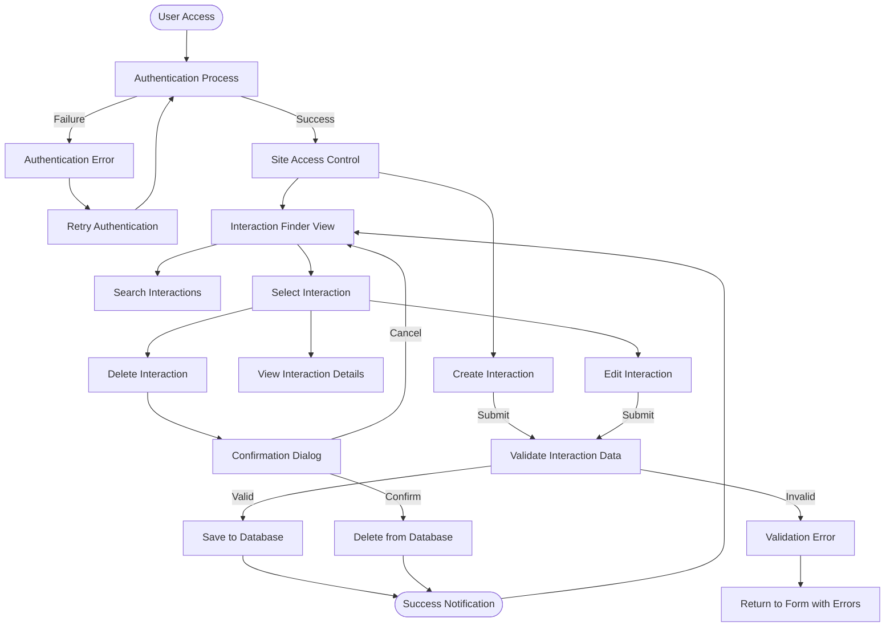
```mermaid
flowchart TD
    Start([User Access]) --> Auth[Authentication Process]
    Auth -- Success --> SiteAccess[Site Access Control]
    Auth -- Failure --> AuthError[Authentication Error]
    AuthError --> RetryAuth[Retry Authentication]
    RetryAuth --> Auth
    
    SiteAccess --> FinderView[Interaction Finder View]
    SiteAccess --> CreateInt[Create Interaction]
    
    FinderView --> Search[Search Interactions]
    FinderView --> SelectInt[Select Interaction]
    
    SelectInt --> ViewInt[View Interaction Details]
    SelectInt --> EditInt[Edit Interaction]
    SelectInt --> DeleteInt[Delete Interaction]
    
    CreateInt -- Submit --> Validate[Validate Interaction Data]
    EditInt -- Submit --> Validate
    
    Validate -- Valid --> SaveData[Save to Database]
    Validate -- Invalid --> ValidationError[Validation Error]
    ValidationError --> ReturnToForm[Return to Form with Errors]
    
    SaveData --> Success([Success Notification])
    
    DeleteInt --> ConfirmDel[Confirmation Dialog]
    ConfirmDel -- Confirm --> PerformDelete[Delete from Database]
    ConfirmDel -- Cancel --> FinderView
    
    PerformDelete --> Success
    Success --> FinderView
```

##### Authentication Workflow

The detailed authentication and site access control process:

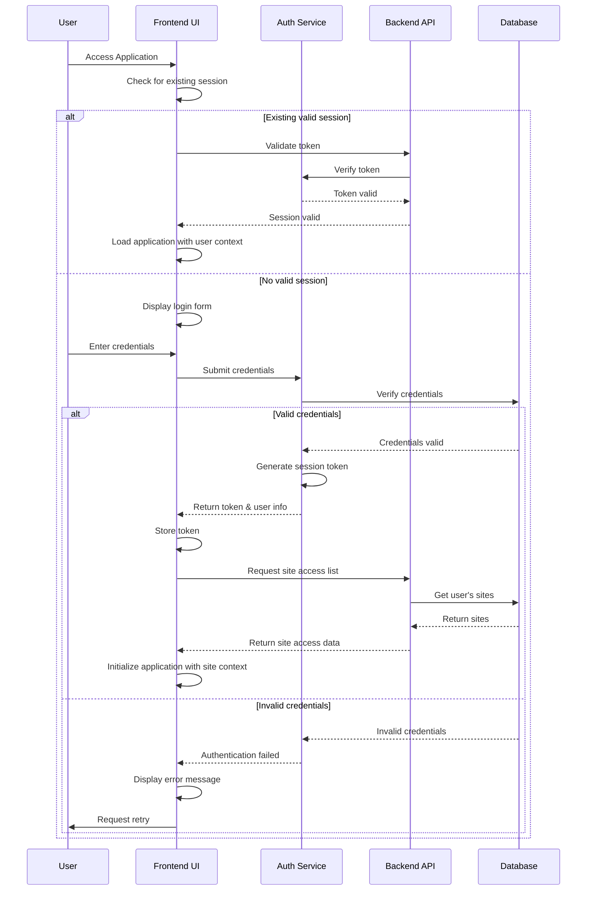
```mermaid
sequenceDiagram
    participant User
    participant UI as Frontend UI
    participant Auth as Auth Service
    participant API as Backend API
    participant DB as Database
    
    User->>UI: Access Application
    UI->>UI: Check for existing session
    
    alt Existing valid session
        UI->>API: Validate token
        API->>Auth: Verify token
        Auth-->>API: Token valid
        API-->>UI: Session valid
        UI->>UI: Load application with user context
    else No valid session
        UI->>UI: Display login form
        User->>UI: Enter credentials
        UI->>Auth: Submit credentials
        Auth->>DB: Verify credentials
        
        alt Valid credentials
            DB-->>Auth: Credentials valid
            Auth->>Auth: Generate session token
            Auth-->>UI: Return token & user info
            UI->>UI: Store token
            UI->>API: Request site access list
            API->>DB: Get user's sites
            DB-->>API: Return sites
            API-->>UI: Return site access data
            UI->>UI: Initialize application with site context
        else Invalid credentials
            DB-->>Auth: Invalid credentials
            Auth-->>UI: Authentication failed
            UI->>UI: Display error message
            UI->>User: Request retry
        end
    end
```

##### Interaction Creation Process

Workflow for creating a new interaction record:

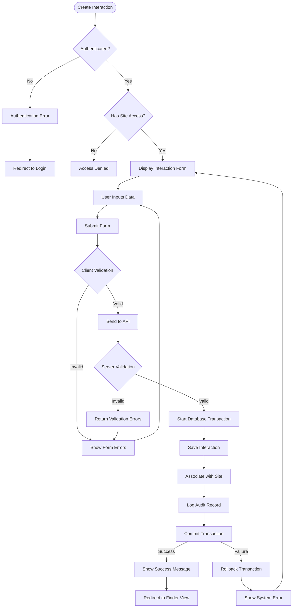
```mermaid
flowchart TD
    Start([Create Interaction]) --> CheckAuth{Authenticated?}
    CheckAuth -- No --> AuthError[Authentication Error]
    AuthError --> Login[Redirect to Login]
    
    CheckAuth -- Yes --> CheckSite{Has Site Access?}
    CheckSite -- No --> AccessError[Access Denied]
    CheckSite -- Yes --> DisplayForm[Display Interaction Form]
    
    DisplayForm --> UserInput[User Inputs Data]
    UserInput --> SubmitForm[Submit Form]
    
    SubmitForm --> ClientValidation{Client Validation}
    ClientValidation -- Invalid --> ShowErrors[Show Form Errors]
    ShowErrors --> UserInput
    
    ClientValidation -- Valid --> SendToAPI[Send to API]
    
    SendToAPI --> ServerValidation{Server Validation}
    ServerValidation -- Invalid --> ReturnErrors[Return Validation Errors]
    ReturnErrors --> ShowErrors
    
    ServerValidation -- Valid --> DBTransaction[Start Database Transaction]
    
    DBTransaction --> SaveInteraction[Save Interaction]
    SaveInteraction --> AssociateSite[Associate with Site]
    AssociateSite --> LogAudit[Log Audit Record]
    LogAudit --> CommitTransaction[Commit Transaction]
    
    CommitTransaction -- Success --> NotifySuccess[Show Success Message]
    CommitTransaction -- Failure --> RollbackTx[Rollback Transaction]
    RollbackTx --> SystemError[Show System Error]
    
    NotifySuccess --> Redirect[Redirect to Finder View]
    SystemError --> DisplayForm
```

##### Interaction Search Process

Workflow for searching and filtering interactions:

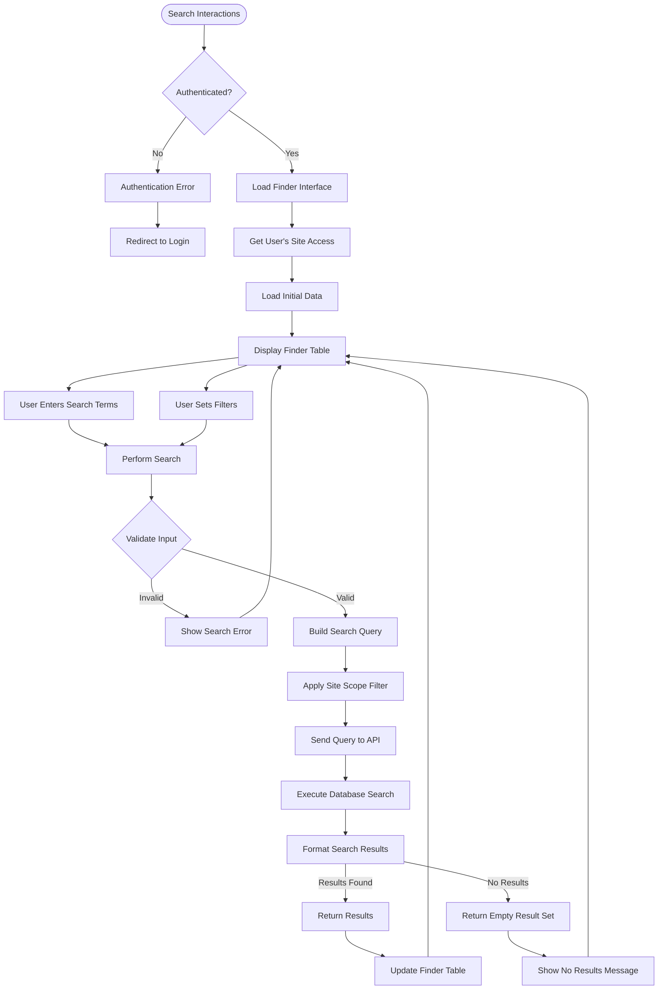
```mermaid
flowchart TD
    Start([Search Interactions]) --> CheckAuth{Authenticated?}
    CheckAuth -- No --> AuthError[Authentication Error]
    AuthError --> Login[Redirect to Login]
    
    CheckAuth -- Yes --> LoadFinder[Load Finder Interface]
    LoadFinder --> GetSites[Get User's Site Access]
    
    GetSites --> InitialLoad[Load Initial Data]
    InitialLoad --> DisplayTable[Display Finder Table]
    
    DisplayTable --> UserSearch[User Enters Search Terms]
    DisplayTable --> UserFilter[User Sets Filters]
    
    UserSearch --> PerformSearch[Perform Search]
    UserFilter --> PerformSearch
    
    PerformSearch --> ValidateInput{Validate Input}
    ValidateInput -- Invalid --> SearchError[Show Search Error]
    SearchError --> DisplayTable
    
    ValidateInput -- Valid --> BuildQuery[Build Search Query]
    BuildQuery --> ApplySiteScope[Apply Site Scope Filter]
    ApplySiteScope --> SendQuery[Send Query to API]
    
    SendQuery --> ExecuteSearch[Execute Database Search]
    ExecuteSearch --> FormatResults[Format Search Results]
    
    FormatResults -- Results Found --> ReturnResults[Return Results]
    FormatResults -- No Results --> EmptyMessage[Return Empty Result Set]
    
    ReturnResults --> UpdateTable[Update Finder Table]
    EmptyMessage --> ShowNoResults[Show No Results Message]
    
    UpdateTable --> DisplayTable
    ShowNoResults --> DisplayTable
```

#### 4.1.2 Integration Workflows

##### Component Integration Sequence

The interaction between system components showing data flow:

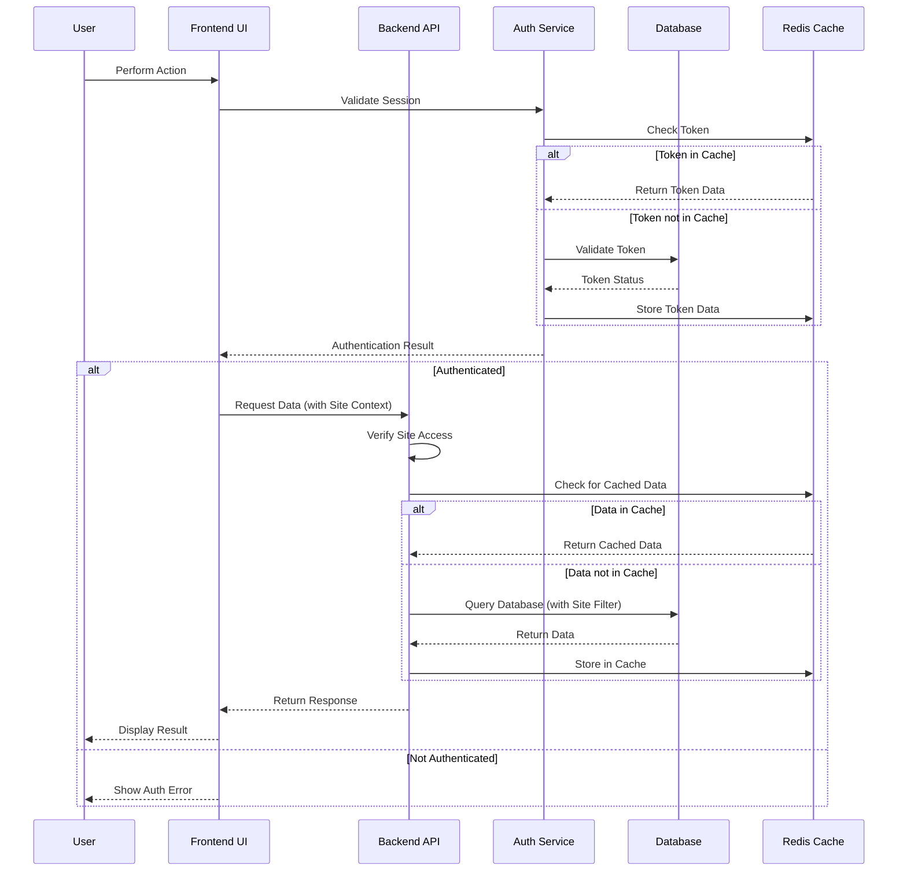
```mermaid
sequenceDiagram
    participant User
    participant UI as Frontend UI
    participant API as Backend API
    participant Auth as Auth Service
    participant DB as Database
    participant Cache as Redis Cache
    
    User->>UI: Perform Action
    UI->>Auth: Validate Session
    Auth->>Cache: Check Token
    
    alt Token in Cache
        Cache-->>Auth: Return Token Data
    else Token not in Cache
        Auth->>DB: Validate Token
        DB-->>Auth: Token Status
        Auth->>Cache: Store Token Data
    end
    
    Auth-->>UI: Authentication Result
    
    alt Authenticated
        UI->>API: Request Data (with Site Context)
        API->>API: Verify Site Access
        API->>Cache: Check for Cached Data
        
        alt Data in Cache
            Cache-->>API: Return Cached Data
        else Data not in Cache
            API->>DB: Query Database (with Site Filter)
            DB-->>API: Return Data
            API->>Cache: Store in Cache
        end
        
        API-->>UI: Return Response
        UI-->>User: Display Result
    else Not Authenticated
        UI-->>User: Show Auth Error
    end
```

### 4.2 FLOWCHART REQUIREMENTS

#### 4.2.1 Validation Rules

The following diagram illustrates the validation checkpoints throughout the system:

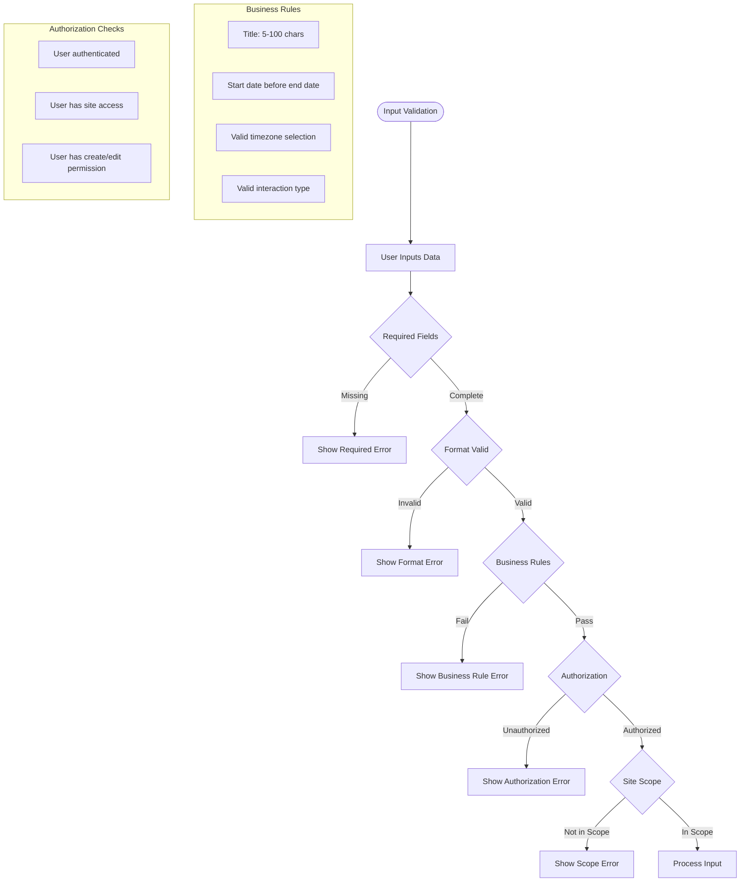
```mermaid
flowchart TD
    Start([Input Validation]) --> FormInput[User Inputs Data]
    
    FormInput --> RequiredFields{Required Fields}
    RequiredFields -- Missing --> RequiredError[Show Required Error]
    RequiredFields -- Complete --> FormatValidation{Format Valid}
    
    FormatValidation -- Invalid --> FormatError[Show Format Error]
    FormatValidation -- Valid --> BusinessRules{Business Rules}
    
    BusinessRules -- Fail --> BusinessError[Show Business Rule Error]
    BusinessRules -- Pass --> AuthzCheck{Authorization}
    
    AuthzCheck -- Unauthorized --> AuthzError[Show Authorization Error]
    AuthzCheck -- Authorized --> SiteScope{Site Scope}
    
    SiteScope -- Not in Scope --> ScopeError[Show Scope Error]
    SiteScope -- In Scope --> ProcessInput[Process Input]
    
    subgraph "Business Rules"
        BR1[Title: 5-100 chars]
        BR2[Start date before end date]
        BR3[Valid timezone selection]
        BR4[Valid interaction type]
    end
    
    subgraph "Authorization Checks"
        AC1[User authenticated]
        AC2[User has site access]
        AC3[User has create/edit permission]
    end
```

#### 4.2.2 Error States and Recovery

Error handling workflow showing detection, notification, and recovery:

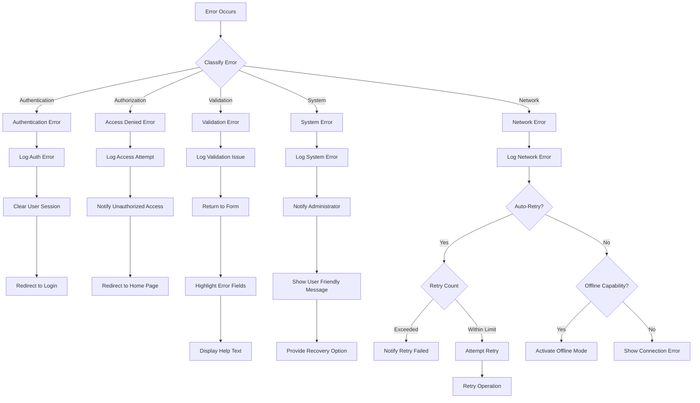
```mermaid
flowchart TD
    Error[Error Occurs] --> Classify{Classify Error}
    
    Classify -- Authentication --> AuthError[Authentication Error]
    Classify -- Authorization --> AccessError[Access Denied Error]
    Classify -- Validation --> ValidError[Validation Error]
    Classify -- System --> SysError[System Error]
    Classify -- Network --> NetError[Network Error]
    
    AuthError --> LogAuthErr[Log Auth Error]
    LogAuthErr --> ClearSession[Clear User Session]
    ClearSession --> RedirectLogin[Redirect to Login]
    
    AccessError --> LogAccessErr[Log Access Attempt]
    LogAccessErr --> NotifyUser[Notify Unauthorized Access]
    NotifyUser --> RedirectHome[Redirect to Home Page]
    
    ValidError --> LogValidErr[Log Validation Issue]
    LogValidErr --> ReturnToForm[Return to Form]
    ReturnToForm --> HighlightErrors[Highlight Error Fields]
    HighlightErrors --> DisplayHelp[Display Help Text]
    
    SysError --> LogSysErr[Log System Error]
    LogSysErr --> NotifyAdmin[Notify Administrator]
    NotifyAdmin --> UserMessage[Show User Friendly Message]
    UserMessage --> RecoveryOption[Provide Recovery Option]
    
    NetError --> LogNetErr[Log Network Error]
    LogNetErr --> RetryMechanism{Auto-Retry?}
    RetryMechanism -- Yes --> RetryCount{Retry Count}
    RetryCount -- Exceeded --> NotifyFailed[Notify Retry Failed]
    RetryCount -- Within Limit --> AttemptRetry[Attempt Retry]
    AttemptRetry --> RetryOperation[Retry Operation]
    
    RetryMechanism -- No --> OfflineCheck{Offline Capability?}
    OfflineCheck -- Yes --> ActivateOffline[Activate Offline Mode]
    OfflineCheck -- No --> ConnErrorMsg[Show Connection Error]
```

### 4.3 TECHNICAL IMPLEMENTATION

#### 4.3.1 State Management

The following state diagram illustrates the lifecycle of an Interaction record:

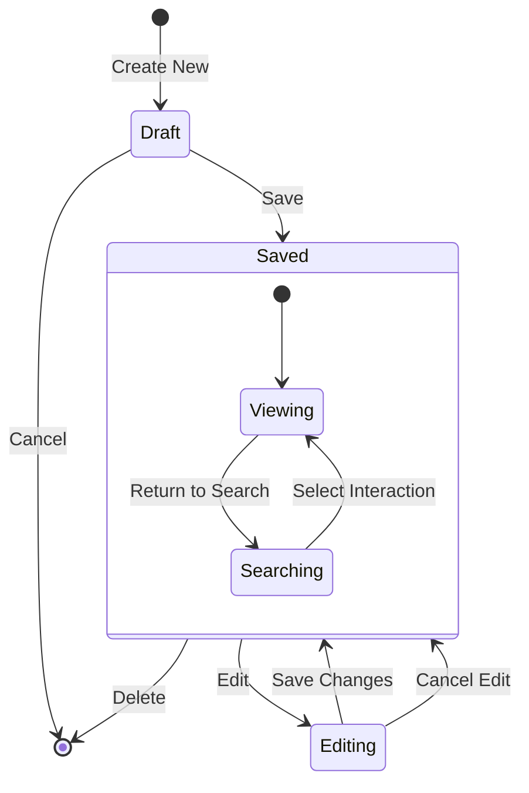
```mermaid
stateDiagram-v2
    [*] --> Draft: Create New
    Draft --> Saved: Save
    Draft --> [*]: Cancel
    
    Saved --> Editing: Edit
    Saved --> [*]: Delete
    
    Editing --> Saved: Save Changes
    Editing --> Saved: Cancel Edit
    
    state Saved {
        [*] --> Viewing
        Viewing --> Searching: Return to Search
        Searching --> Viewing: Select Interaction
    }
```

#### 4.3.2 Transaction Boundaries

The following diagram shows transaction boundaries for key operations:

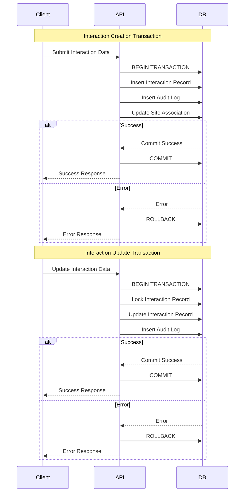
```mermaid
sequenceDiagram
    participant Client
    participant API
    participant DB
    
    Note over Client,DB: Interaction Creation Transaction
    Client->>API: Submit Interaction Data
    API->>DB: BEGIN TRANSACTION
    API->>DB: Insert Interaction Record
    API->>DB: Insert Audit Log
    API->>DB: Update Site Association
    
    alt Success
        DB-->>API: Commit Success
        API->>DB: COMMIT
        API-->>Client: Success Response
    else Error
        DB-->>API: Error
        API->>DB: ROLLBACK
        API-->>Client: Error Response
    end
    
    Note over Client,DB: Interaction Update Transaction
    Client->>API: Update Interaction Data
    API->>DB: BEGIN TRANSACTION
    API->>DB: Lock Interaction Record
    API->>DB: Update Interaction Record
    API->>DB: Insert Audit Log
    
    alt Success
        DB-->>API: Commit Success
        API->>DB: COMMIT
        API-->>Client: Success Response
    else Error
        DB-->>API: Error
        API->>DB: ROLLBACK
        API-->>Client: Error Response
    end
```

#### 4.3.3 Caching Strategy

The following diagram illustrates the caching strategy for the application:

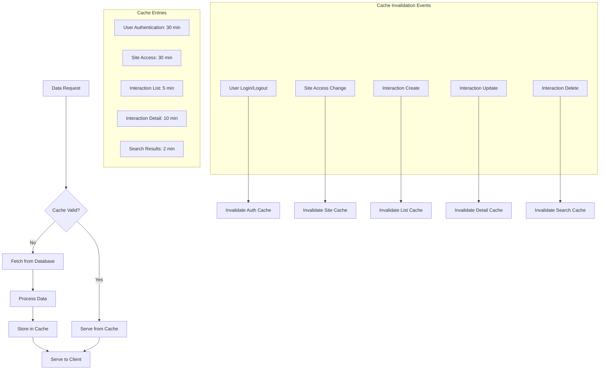
```mermaid
flowchart TD
    Request[Data Request] --> CacheCheck{Cache Valid?}
    
    CacheCheck -- Yes --> ServeCache[Serve from Cache]
    CacheCheck -- No --> FetchData[Fetch from Database]
    
    FetchData --> ProcessData[Process Data]
    ProcessData --> CacheData[Store in Cache]
    CacheData --> ServeData[Serve to Client]
    ServeCache --> ServeData
    
    subgraph "Cache Entries"
        C1[User Authentication: 30 min]
        C2[Site Access: 30 min]
        C3[Interaction List: 5 min]
        C4[Interaction Detail: 10 min]
        C5[Search Results: 2 min]
    end
    
    subgraph "Cache Invalidation Events"
        I1[User Login/Logout]
        I2[Site Access Change]
        I3[Interaction Create]
        I4[Interaction Update]
        I5[Interaction Delete]
    end
    
    I1 --> InvalidateAuth[Invalidate Auth Cache]
    I2 --> InvalidateSite[Invalidate Site Cache]
    I3 --> InvalidateList[Invalidate List Cache]
    I4 --> InvalidateDetail[Invalidate Detail Cache]
    I5 --> InvalidateSearch[Invalidate Search Cache]
```

#### 4.3.4 Error Handling and Retry Mechanisms

The following sequence diagram shows the retry mechanism for API operations:

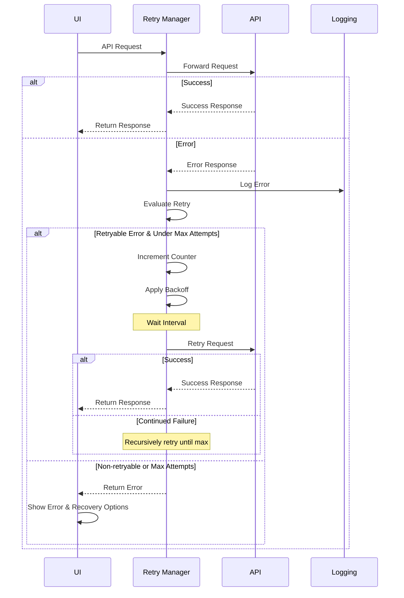
```mermaid
sequenceDiagram
    participant UI
    participant RetryMgr as Retry Manager
    participant API
    participant Logging
    
    UI->>RetryMgr: API Request
    RetryMgr->>API: Forward Request
    
    alt Success
        API-->>RetryMgr: Success Response
        RetryMgr-->>UI: Return Response
    else Error
        API-->>RetryMgr: Error Response
        RetryMgr->>Logging: Log Error
        RetryMgr->>RetryMgr: Evaluate Retry
        
        alt Retryable Error & Under Max Attempts
            RetryMgr->>RetryMgr: Increment Counter
            RetryMgr->>RetryMgr: Apply Backoff
            Note over RetryMgr: Wait Interval
            RetryMgr->>API: Retry Request
            
            alt Success
                API-->>RetryMgr: Success Response
                RetryMgr-->>UI: Return Response
            else Continued Failure
                Note over RetryMgr: Recursively retry until max
            end
        else Non-retryable or Max Attempts
            RetryMgr-->>UI: Return Error
            UI->>UI: Show Error & Recovery Options
        end
    end
```

#### 4.3.5 SLA and Timing Constraints

The following diagram illustrates the timing constraints and SLA targets for key operations:


```mermaid
gantt
    title System Response Time SLAs
    dateFormat s
    axisFormat %S
    
    Authentication      :auth, 0, 2s
    Site Data Load      :site, after auth, 1s
    Initial Table Load  :load, after site, 3s
    Search Execution    :search, after load, 3s
    Form Submission     :submit, after load, 2s
    Delete Operation    :delete, after load, 2s
```

## 5. SYSTEM ARCHITECTURE

### 5.1 HIGH-LEVEL ARCHITECTURE

#### 5.1.1 System Overview

The Interaction Management System follows a multi-tier architecture with clear separation of concerns between presentation, business logic, and data persistence layers:

- **Architecture Style**: Modern web application utilizing a client-server architecture with RESTful API communication between frontend and backend components
- **Key Architectural Principles**:
  - Separation of concerns with distinct frontend and backend codebases
  - RESTful API design for stateless, resource-oriented communications
  - Component-based UI architecture for modularity and reusability
  - Site-scoped data access enforced at multiple layers
  - Token-based authentication with JWT
  - Responsive, mobile-first design approach
  - Caching strategy for performance optimization

- **System Boundaries**:
  - Client boundary: Browser-based Angular application
  - Server boundary: Flask API with authentication middleware
  - Data boundary: PostgreSQL database with site-scoped access controls
  - External service boundaries: Auth0, AWS services, SendGrid

#### 5.1.2 Core Components Table

| Component Name | Primary Responsibility | Key Dependencies | Critical Considerations |
|----------------|------------------------|------------------|-------------------------|
| Angular Frontend | User interface presentation, client-side validation, state management | Auth0 SDK, AG Grid, Angular Router | Browser compatibility, responsive design, performance optimization |
| Flask API Backend | Business logic, data validation, request handling, site-scope enforcement | SQLAlchemy, JWT library, Flask-CORS | API security, request validation, error handling, transaction management |
| Authentication Service | User authentication, site-access validation, token issuance | Auth0, Redis cache | Token security, expiration policies, refresh mechanisms |
| PostgreSQL Database | Data persistence, relational integrity, query execution | PgBouncer, Alembic | Data integrity, query performance, index optimization |
| Redis Cache | Session storage, frequent data caching, rate limiting | None | Cache invalidation strategy, TTL configuration, memory management |

#### 5.1.3 Data Flow Description

The system's primary data flows follow these patterns:

1. **Authentication Flow**:
   - User credentials are submitted to Auth0 via the frontend
   - Auth0 validates credentials and returns JWT token
   - Token is stored in browser and included in all subsequent API requests
   - Backend validates token and extracts user identity and site access rights
   - Redis caches token validation results to improve performance

2. **Interaction Data Flow**:
   - All data requests include user authentication token
   - Backend extracts site access permissions from token
   - Site-scoping filters are automatically applied to all database queries
   - Data returns through API with appropriate HTTP status codes
   - Frontend renders data in Finder table or form components

3. **Search and Filtering Flow**:
   - User inputs search criteria in Finder interface
   - Frontend formulates search parameters
   - Backend constructs optimized database queries with site-scope filters
   - Search results are cached in Redis with short TTL for repeated queries
   - Paginated results return to frontend for display

4. **Form Submission Flow**:
   - Frontend performs initial validation on form inputs
   - Validated data transmits to backend with authentication token
   - Backend validates permissions and input data
   - Database transaction executes to create/update records
   - Confirmation and/or errors return to frontend
   - Related cache entries are invalidated

#### 5.1.4 External Integration Points

| System Name | Integration Type | Data Exchange Pattern | Protocol/Format | SLA Requirements |
|-------------|------------------|------------------------|-----------------|------------------|
| Auth0 | Authentication Service | Request-Response | HTTPS/JSON | Authentication response <2s, 99.9% uptime |
| AWS S3 | Static Asset Storage | CDN Content Delivery | HTTPS | Asset delivery <500ms, 99.9% availability |
| AWS CloudWatch | Monitoring & Logging | Push | HTTPS/JSON | Log delivery <5min, 99.5% reliability |
| SendGrid | Email Notifications | Asynchronous Messaging | HTTPS/JSON | Email delivery within 5min, 99% reliability |

### 5.2 COMPONENT DETAILS

#### 5.2.1 Frontend Application

**Purpose and Responsibilities**:
- Provide responsive user interface for interactions management
- Handle client-side validation and error presentation
- Manage application state and user session
- Implement site-scoped data visualization
- Render the Finder table and Interaction forms

**Technologies and Frameworks**:
- Angular 16.2.0 as core framework
- TypeScript 4.9.5 for type-safe development
- AG Grid 30.0.3 for high-performance table components
- TailwindCSS for responsive styling
- date-fns for date/time manipulation
- Angular Signals for state management

**Key Interfaces**:
- RESTful API communication with backend
- Auth0 integration for authentication
- LocalStorage/SessionStorage for token persistence

**Component Interaction Diagram**:

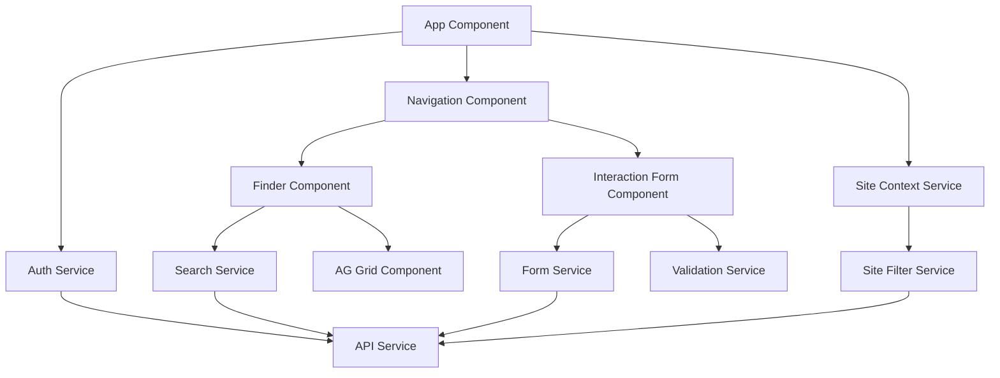
```mermaid
graph TD
    A[App Component] --> B[Auth Service]
    A --> C[Navigation Component]
    A --> D[Site Context Service]
    
    C --> E[Finder Component]
    C --> F[Interaction Form Component]
    
    E --> G[Search Service]
    E --> H[AG Grid Component]
    
    F --> I[Form Service]
    F --> J[Validation Service]
    
    D --> K[Site Filter Service]
    
    G --> L[API Service]
    I --> L
    B --> L
    K --> L
```

**State Transition Diagram (Interaction Form)**:

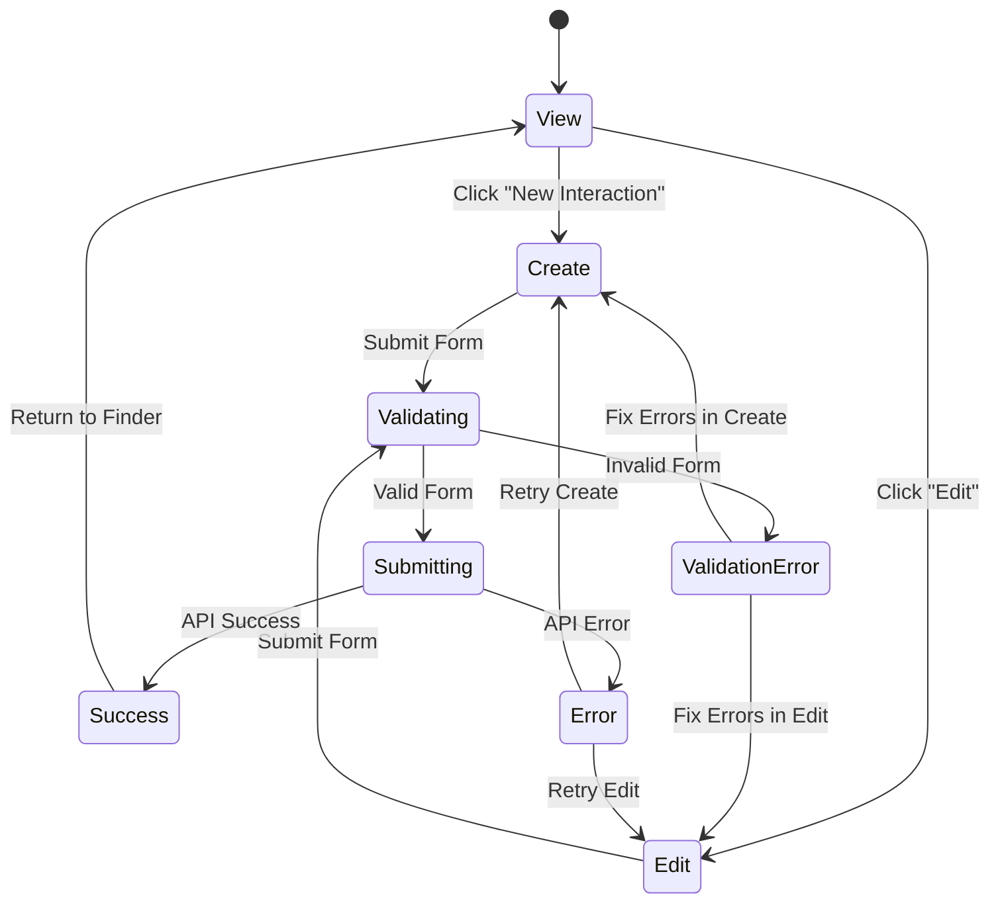
```mermaid
stateDiagram-v2
    [*] --> View
    View --> Create: Click "New Interaction"
    View --> Edit: Click "Edit"
    
    Create --> Validating: Submit Form
    Edit --> Validating: Submit Form
    
    Validating --> Submitting: Valid Form
    Validating --> ValidationError: Invalid Form
    ValidationError --> Create: Fix Errors in Create
    ValidationError --> Edit: Fix Errors in Edit
    
    Submitting --> Success: API Success
    Submitting --> Error: API Error
    
    Success --> View: Return to Finder
    Error --> Create: Retry Create
    Error --> Edit: Retry Edit
```

#### 5.2.2 Backend API

**Purpose and Responsibilities**:
- Process API requests from frontend
- Implement business logic and validation rules
- Enforce site-scoped data access
- Execute database operations
- Manage authentication and authorization

**Technologies and Frameworks**:
- Flask 2.3.2 web framework
- SQLAlchemy 2.0.19 ORM
- Flask-JWT-Extended for token handling
- Marshmallow for serialization/validation
- Flask-CORS for cross-origin resource sharing

**Key Interfaces**:
- RESTful API endpoints for CRUD operations
- JWT validation middleware
- Database connection management
- Redis cache integration

**Data Persistence Requirements**:
- Interaction records with site association
- User-site relationship mappings
- Audit logs for key operations
- Optimized indexes for search fields

**Sequence Diagram (Interaction Search)**:

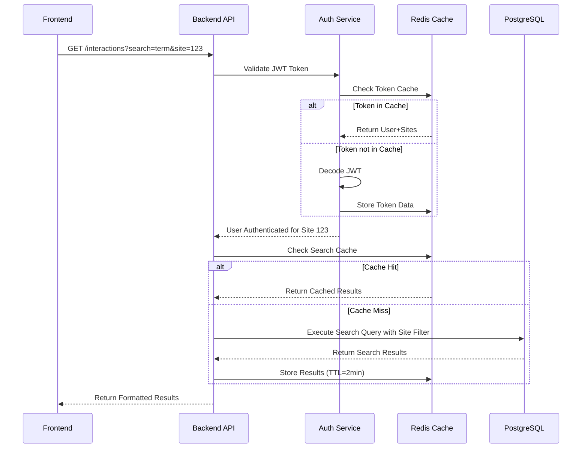
```mermaid
sequenceDiagram
    participant UI as Frontend
    participant API as Backend API
    participant Auth as Auth Service
    participant Cache as Redis Cache
    participant DB as PostgreSQL
    
    UI->>API: GET /interactions?search=term&site=123
    API->>Auth: Validate JWT Token
    Auth->>Cache: Check Token Cache
    
    alt Token in Cache
        Cache-->>Auth: Return User+Sites
    else Token not in Cache
        Auth->>Auth: Decode JWT
        Auth->>Cache: Store Token Data
    end
    
    Auth-->>API: User Authenticated for Site 123
    
    API->>Cache: Check Search Cache
    
    alt Cache Hit
        Cache-->>API: Return Cached Results
    else Cache Miss
        API->>DB: Execute Search Query with Site Filter
        DB-->>API: Return Search Results
        API->>Cache: Store Results (TTL=2min)
    end
    
    API-->>UI: Return Formatted Results
```

#### 5.2.3 Authentication Service

**Purpose and Responsibilities**:
- Authenticate users through Auth0
- Manage JWT tokens
- Maintain user-site associations
- Enforce site-scoped access control

**Technologies and Frameworks**:
- Auth0 SDK
- JWT standard
- Redis for token caching

**Key Interfaces**:
- Auth0 login integration
- Token validation and decoding
- Site access verification

**Sequence Diagram (Authentication Flow)**:

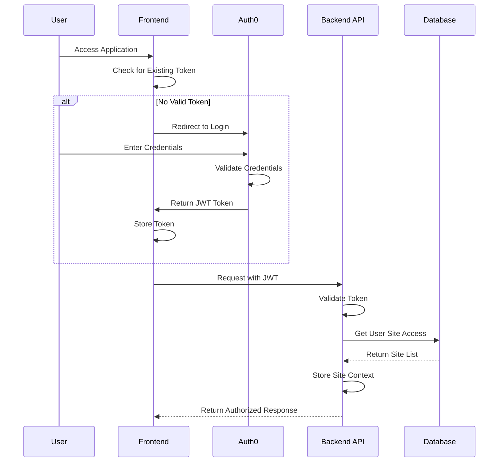
```mermaid
sequenceDiagram
    participant User
    participant UI as Frontend
    participant Auth0
    participant API as Backend API
    participant DB as Database
    
    User->>UI: Access Application
    UI->>UI: Check for Existing Token
    
    alt No Valid Token
        UI->>Auth0: Redirect to Login
        User->>Auth0: Enter Credentials
        Auth0->>Auth0: Validate Credentials
        Auth0->>UI: Return JWT Token
        UI->>UI: Store Token
    end
    
    UI->>API: Request with JWT
    API->>API: Validate Token
    API->>DB: Get User Site Access
    DB-->>API: Return Site List
    API->>API: Store Site Context
    API-->>UI: Return Authorized Response
```

#### 5.2.4 Database Layer

**Purpose and Responsibilities**:
- Store all application data
- Maintain data integrity and relationships
- Execute efficient queries
- Support transaction management

**Technologies and Frameworks**:
- PostgreSQL 15.3
- PgBouncer for connection pooling
- Alembic for migrations

**Key Interfaces**:
- SQLAlchemy ORM models
- Native SQL for complex queries
- Transaction boundaries

**Data Model Diagram**:

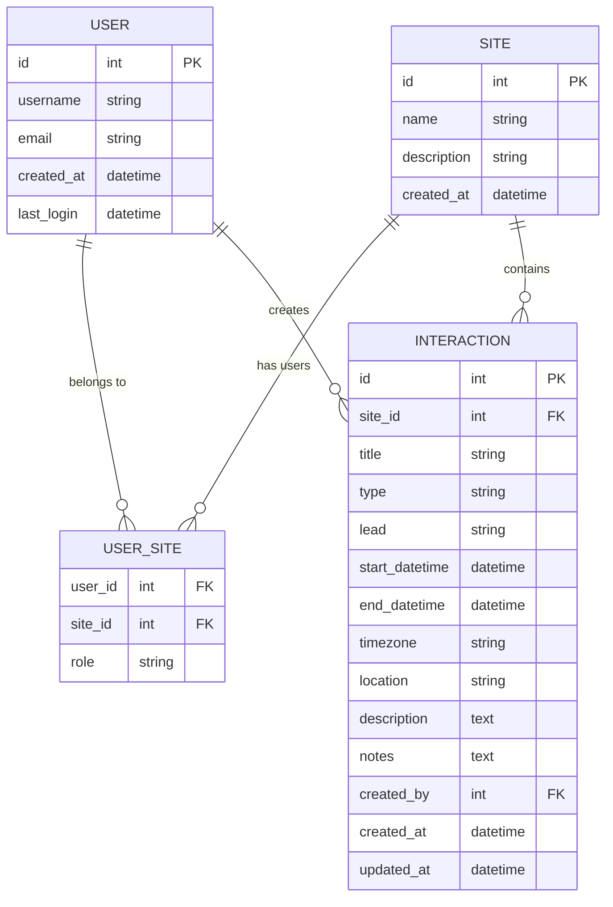
```mermaid
erDiagram
    USER {
        id int PK
        username string
        email string
        created_at datetime
        last_login datetime
    }
    
    SITE {
        id int PK
        name string
        description string
        created_at datetime
    }
    
    USER_SITE {
        user_id int FK
        site_id int FK
        role string
    }
    
    INTERACTION {
        id int PK
        site_id int FK
        title string
        type string
        lead string
        start_datetime datetime
        end_datetime datetime
        timezone string
        location string
        description text
        notes text
        created_by int FK
        created_at datetime
        updated_at datetime
    }
    
    USER ||--o{ USER_SITE : "belongs to"
    SITE ||--o{ USER_SITE : "has users"
    SITE ||--o{ INTERACTION : "contains"
    USER ||--o{ INTERACTION : "creates"
```

#### 5.2.5 Caching Layer

**Purpose and Responsibilities**:
- Cache frequent data requests
- Store user session information
- Improve application performance
- Reduce database load

**Technologies and Frameworks**:
- Redis 7.0.12
- Redis data structures (hashes, lists, sets)

**Key Interfaces**:
- Cache get/set operations
- TTL management
- Invalidation patterns

**Scaling Considerations**:
- Memory limits and eviction policies
- Cache partitioning for high traffic
- Redundancy for reliability

### 5.3 TECHNICAL DECISIONS

#### 5.3.1 Architecture Style Decisions

| Decision | Options Considered | Selection | Rationale |
|----------|-------------------|-----------|-----------|
| Frontend Architecture | SPA vs MPA vs SSR | Single Page Application (SPA) | Provides responsive user experience with client-side rendering, optimal for Finder table with frequent updates and filters |
| Backend Architecture | Monolith vs Microservices | Monolithic API | System scope is well-defined and contained; microservices would add unnecessary complexity for initial requirements |
| API Design | REST vs GraphQL | REST | Simpler implementation, better caching, and sufficient for the defined data models and query patterns |
| State Management | Redux vs Signals vs Services | Angular Signals | Provides reactive state management with less boilerplate than Redux, appropriate for the application complexity |

#### 5.3.2 Communication Pattern Choices

| Communication Pattern | Use Case | Implementation | Justification |
|----------------------|----------|----------------|---------------|
| Request-Response | CRUD operations | RESTful API calls | Simple, well-understood pattern for synchronous operations with immediate feedback |
| Caching | Frequent data | Redis TTL-based caching | Reduces database load for common queries and improves response times |
| Token-based Auth | Authentication | JWT with Redis validation cache | Provides stateless authentication while enabling fast token validation |
| Site-scoped Filtering | Data access control | Database query middleware | Ensures data access restrictions at the data layer for maximum security |

#### 5.3.3 Data Storage Solution Rationale

PostgreSQL was selected as the primary database due to:

- **Schema Enforcement**: Interaction data has well-defined structures requiring schema validation
- **Relational Integrity**: Site associations and user relationships benefit from foreign key constraints
- **Query Complexity**: Advanced search requirements need SQL's powerful query capabilities
- **Transaction Support**: ACID compliance ensures data integrity for critical operations
- **Indexing Capabilities**: Complex search functionality requires sophisticated indexing

Decision factors when compared to alternative options:

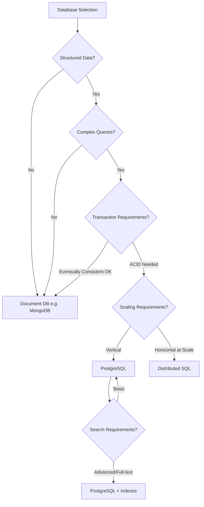
```mermaid
graph TD
    A[Database Selection] --> B{Structured Data?}
    B -->|Yes| C{Complex Queries?}
    B -->|No| D[Document DB e.g. MongoDB]
    
    C -->|Yes| E{Transaction Requirements?}
    C -->|No| D
    
    E -->|ACID Needed| F{Scaling Requirements?}
    E -->|Eventually Consistent OK| D
    
    F -->|Vertical| G[PostgreSQL]
    F -->|Horizontal at Scale| H[Distributed SQL]
    
    G --> I{Search Requirements?}
    
    I -->|Basic| G
    I -->|Advanced/Full-text| J[PostgreSQL + Indexes]
```

#### 5.3.4 Caching Strategy Justification

The system implements a multi-level caching strategy:

- **Session Caching**: JWT validation results cached in Redis (30 min TTL)
- **User Site Access**: Site permissions cached after authentication (30 min TTL)
- **Search Results**: Frequent searches cached with short TTL (2 min)
- **Finder Data**: Common Finder views cached (5 min TTL)
- **Reference Data**: Static lookup values cached (1 hour TTL)

Cache invalidation occurs on:
- JWT expiration or logout
- User site access changes
- Interaction CRUD operations (targeted invalidation)

#### 5.3.5 Security Mechanism Selection

| Security Mechanism | Implementation | Justification |
|--------------------|----------------|---------------|
| Authentication | Auth0 + JWT | Leverages industry-standard identity provider with token-based sessions |
| Authorization | Site-scoped access control | Ensures data separation in multi-tenant environment |
| Transport Security | HTTPS-only | Encrypts all data in transit |
| CSRF Protection | Anti-CSRF tokens | Prevents cross-site request forgery in form submissions |
| Input Validation | Client + Server validation | Defense-in-depth approach to prevent injection attacks |
| Rate Limiting | Redis-based counters | Protects against brute force and DoS attacks |

### 5.4 CROSS-CUTTING CONCERNS

#### 5.4.1 Monitoring and Observability Approach

The application implements a comprehensive monitoring strategy:

- **Infrastructure Monitoring**: AWS CloudWatch for server metrics (CPU, memory, disk)
- **Application Metrics**: Custom metrics for key operations (searches, form submissions)
- **User Experience Tracking**: Page load times, time-to-interactive measurements
- **Business KPIs**: Interaction creation rates, search frequency, error rates

**Key Monitoring Metrics**:

| Metric Category | Specific Metrics | Alerting Threshold | Responsible Team |
|-----------------|-----------------|-------------------|------------------|
| API Performance | Response time, error rate | >2s response, >1% error rate | Backend Team |
| Frontend Performance | Page load time, interactivity | >3s load time | Frontend Team |
| Database | Query time, connection count | >1s query time, >80% connection pool | Database Team |
| Business | Interaction creation rate, search count | >50% deviation from baseline | Product Team |

#### 5.4.2 Logging and Tracing Strategy

The system implements a structured logging approach:

- **Log Levels**: DEBUG, INFO, WARN, ERROR, FATAL with appropriate usage guidelines
- **Log Destinations**: Local files with rotation + CloudWatch centralized logs
- **Context Enrichment**: All logs include request ID, user ID, site context
- **Sensitive Data Handling**: PII/sensitive data redacted from logs
- **Retention Policy**: 30 days online, 1 year archived

**Critical Log Events**:

- Authentication attempts (success/failure)
- Site access changes
- Interaction CRUD operations
- Search operations with parameters
- System errors and exceptions
- Performance degradation events

#### 5.4.3 Error Handling Patterns

Error handling follows these principles:

- **Graceful Degradation**: System continues functioning with reduced capabilities when components fail
- **User-Friendly Messages**: Technical errors translated to actionable user messages
- **Retry Logic**: Automatic retry with exponential backoff for transient failures
- **Circuit Breaking**: Prevents cascading failures when dependent services are unresponsive

**Error Handling Flow**:

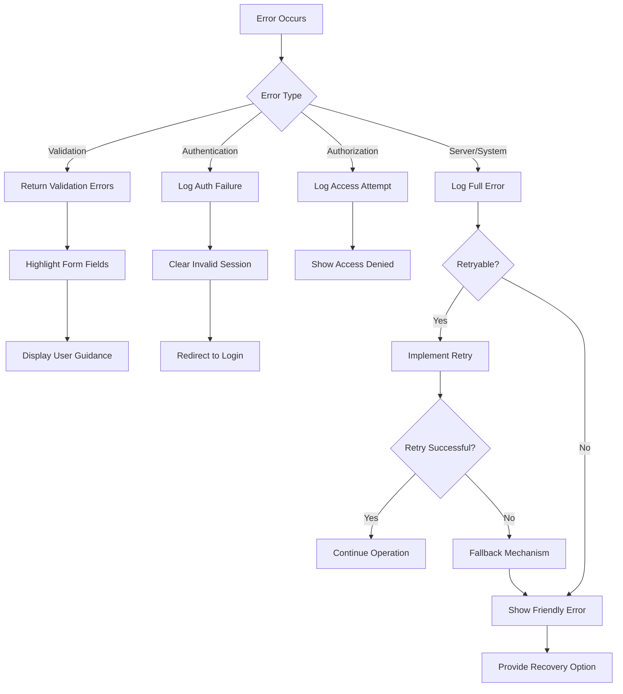
```mermaid
flowchart TD
    A[Error Occurs] --> B{Error Type}
    
    B -->|Validation| C[Return Validation Errors]
    C --> D[Highlight Form Fields]
    D --> E[Display User Guidance]
    
    B -->|Authentication| F[Log Auth Failure]
    F --> G[Clear Invalid Session]
    G --> H[Redirect to Login]
    
    B -->|Authorization| I[Log Access Attempt]
    I --> J[Show Access Denied]
    
    B -->|Server/System| K[Log Full Error]
    K --> L{Retryable?}
    
    L -->|Yes| M[Implement Retry]
    M --> N{Retry Successful?}
    N -->|Yes| O[Continue Operation]
    N -->|No| P[Fallback Mechanism]
    
    L -->|No| Q[Show Friendly Error]
    P --> Q
    
    Q --> R[Provide Recovery Option]
```

#### 5.4.4 Authentication and Authorization Framework

The system implements a comprehensive security framework:

- **Authentication**: Auth0 integration with JWT tokens
- **Authorization Layers**:
  - API Gateway: Basic request validation and rate limiting
  - Route Guards: Frontend route protection
  - API Middleware: Token validation and site context extraction
  - Data Layer: Automatic site-scoping of all queries

**Security Principles**:

- Least privilege access
- Defense in depth
- Secure by default
- Fail closed on errors
- Complete audit trail

#### 5.4.5 Performance Requirements and SLAs

| Operation | Performance Target | SLA | Measurement Method |
|-----------|-------------------|-----|-------------------|
| Page Load | <3 seconds | 95% of requests | Frontend metrics |
| API Response | <2 seconds | 99% of requests | Backend timing logs |
| Search Execution | <3 seconds | 95% of searches | Query timing metrics |
| Form Submission | <2 seconds | 99% of submissions | End-to-end timing |
| Authentication | <2 seconds | 99.5% of attempts | Auth service metrics |

**Scaling Approach**:
- Vertical scaling for initial deployment
- Horizontal scaling options identified for future growth
- Database read replicas for search-heavy workloads
- Cache warming for predictable usage patterns

#### 5.4.6 Disaster Recovery Procedures

The system implements a disaster recovery strategy with:

- **Backup Schedule**: 
  - Database: Daily full backup, hourly incrementals
  - File assets: Continuous replication
  - Configuration: Version-controlled IaC

- **Recovery Time Objectives**:
  - Tier 1 (Critical): <4 hours
  - Tier 2 (Important): <12 hours
  - Tier 3 (Normal): <24 hours

- **Recovery Procedures**:
  - Database restoration from point-in-time backup
  - Application deployment from known-good artifacts
  - Configuration application through Terraform
  - DNS failover to backup environment

- **Testing Schedule**:
  - Quarterly backup restoration validation
  - Annual full disaster recovery simulation

## 6. SYSTEM COMPONENTS DESIGN

### 6.1 FRONTEND COMPONENTS

#### 6.1.1 Authentication Module

| Component | Purpose | Implementation Details |
|-----------|---------|------------------------|
| Login Component | Provides user login interface | Angular component with form controls for username/password |
| Auth Service | Manages authentication state | Angular service integrating with Auth0, storing/retrieving JWT tokens |
| Site Selector | Allows selection between authorized sites | Dropdown component populated from user's site access permissions |
| Auth Guard | Protects routes from unauthorized access | Angular route guard checking authentication status before navigation |

**State Management Design:**

The Authentication module maintains the following state:
- Authentication status (authenticated/unauthenticated)
- Current user information
- Available sites
- Currently selected site
- Token expiration and refresh status

**Component Interaction Diagram:**

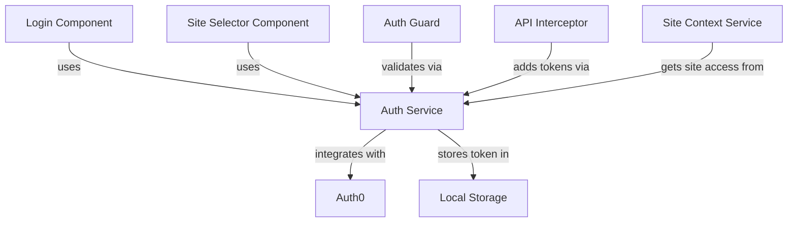
```mermaid
graph TD
    A[Login Component] -->|uses| B[Auth Service]
    B -->|integrates with| C[Auth0]
    B -->|stores token in| D[Local Storage]
    E[Site Selector Component] -->|uses| B
    F[Auth Guard] -->|validates via| B
    G[API Interceptor] -->|adds tokens via| B
    H[Site Context Service] -->|gets site access from| B
```

#### 6.1.2 Finder Component

| Component | Purpose | Implementation Details |
|-----------|---------|------------------------|
| Finder Container | Main container for search and results | Angular component managing search state and pagination |
| Search Form | Interface for search criteria input | Angular reactive form with dynamic filter controls |
| Results Table | Displays interaction records | AG Grid component with sorting, filtering, and pagination |
| Column Configuration | Defines table layout and behavior | Configuration objects for AG Grid columns |
| Row Actions | Interaction-specific actions | Button group for view, edit, delete operations |

**Search and Filter Design:**

The Finder implements a comprehensive search strategy:
- Global text search across all fields
- Field-specific filters for structured searching
- Saved searches functionality
- Search history tracking
- Advanced filter combinations

**Component Structure:**

```mermaid
graph TD
    A[Finder Container] -->|contains| B[Search Form]
    A -->|contains| C[Results Table]
    C -->|uses| D[AG Grid]
    C -->|configures| E[Column Definitions]
    C -->|contains| F[Row Actions]
    A -->|uses| G[Search Service]
    G -->|calls| H[API Service]
    A -->|maintains| I[Pagination State]
    A -->|uses| J[Site Context Service]
```

**State Transitions:**

```mermaid
stateDiagram-v2
    [*] --> Initial: Page Load
    Initial --> Loading: Execute Search
    Loading --> Results: Search Complete
    Loading --> Error: Search Failed
    Results --> Selected: Select Row
    Selected --> Editing: Edit Action
    Selected --> Deleting: Delete Action
    Selected --> Viewing: View Details
    Editing --> Results: Save/Cancel
    Deleting --> Results: Confirm/Cancel
    Error --> Initial: Reset
    Results --> Loading: New Search
```

#### 6.1.3 Interaction Form Component

| Component | Purpose | Implementation Details |
|-----------|---------|------------------------|
| Form Container | Manages form state and submission | Angular component handling create/edit modes |
| Form Controls | Input fields for interaction data | Angular reactive form controls with validation |
| Date/Time Selector | Specialized control for date inputs | Custom component using date-fns for timezone handling |
| Type Selector | Dropdown for interaction types | Dynamic options loaded from configuration |
| Validation Display | Shows validation errors | Error message components with field highlighting |

**Form Field Specifications:**

| Field | Type | Validation Rules | UI Component |
|-------|------|------------------|-------------|
| Title | Text | Required, Min 5 chars, Max 100 chars | Text input |
| Type | Selection | Required, Valid option | Dropdown |
| Lead | Text | Required | Text input |
| Start Date/Time | DateTime | Required, Valid date, Before end date | Date picker with time |
| End Date/Time | DateTime | Required, Valid date, After start date | Date picker with time |
| Timezone | Selection | Required, Valid timezone | Dropdown |
| Location | Text | Optional | Text input |
| Description | Formatted Text | Required, Min 10 chars | Text area |
| Notes | Formatted Text | Optional | Text area |

**Validation Flow:**

```mermaid
flowchart TD
    A[User Input] --> B{Client Validation}
    B -->|Valid| C[Submit Form]
    B -->|Invalid| D[Show Field Errors]
    C --> E{Server Validation}
    E -->|Valid| F[Save Successful]
    E -->|Invalid| G[Show API Errors]
    F --> H[Redirect to Finder]
    D --> A
    G --> A
```

#### 6.1.4 Shared UI Components

| Component | Purpose | Reuse Locations |
|-----------|---------|-----------------|
| Header | Site navigation and user info | All authenticated pages |
| Footer | Legal and version information | All pages |
| Loading Indicator | Visual feedback during async operations | Finder, Form, Authentication |
| Error Display | Standardized error presentation | All components with error states |
| Confirmation Dialog | User confirmation for critical actions | Delete, Navigation with unsaved changes |
| Toast Notifications | Non-blocking user feedback | After form submission, error notifications |

**Theming and Styling:**

The UI components implement a consistent design system using TailwindCSS:
- Standardized color palette with semantic usage
- Consistent spacing and sizing scales
- Responsive design breakpoints
- Accessibility-compliant contrast and focus states
- Consistent input styling and behavior

### 6.2 BACKEND COMPONENTS

#### 6.2.1 API Controllers

| Controller | Responsibility | Endpoints |
|------------|----------------|-----------|
| AuthController | Authentication management | `/api/auth/login`, `/api/auth/refresh`, `/api/auth/logout` |
| SiteController | Site management | `/api/sites`, `/api/sites/{id}`, `/api/users/sites` |
| InteractionController | Interaction CRUD operations | `/api/interactions`, `/api/interactions/{id}` |
| SearchController | Advanced search functionality | `/api/search/interactions`, `/api/search/advanced` |
| UserController | User management | `/api/users`, `/api/users/{id}`, `/api/users/profile` |

**Request Processing Flow:**

```mermaid
flowchart TD
    A[Client Request] --> B[API Gateway]
    B --> C[Authentication Middleware]
    C -->|Unauthenticated| D[Return 401]
    C -->|Authenticated| E[Site Access Middleware]
    E -->|Unauthorized Site| F[Return 403]
    E -->|Authorized| G[Controller Action]
    G -->|Input Validation| H{Valid Input?}
    H -->|No| I[Return 400 + Errors]
    H -->|Yes| J[Process Request]
    J --> K[Service Layer]
    K --> L[Data Access Layer]
    L --> M[Database]
    M --> L
    L --> K
    K --> J
    J --> N[Format Response]
    N --> O[Return Result]
```

#### 6.2.2 Service Layer

| Service | Responsibility | Key Functions |
|---------|----------------|---------------|
| AuthService | Authentication logic | `validateCredentials()`, `generateToken()`, `refreshToken()` |
| SiteService | Site data operations | `getUserSites()`, `getSiteDetails()`, `validateSiteAccess()` |
| InteractionService | Interaction business logic | `createInteraction()`, `updateInteraction()`, `deleteInteraction()` |
| SearchService | Search execution | `searchInteractions()`, `buildSearchQuery()`, `applyFilters()` |
| ValidationService | Business rule validation | `validateInteractionData()`, `validateDateRules()` |

**Service Layer Design Patterns:**

The service layer implements several design patterns:
- **Repository Pattern**: Services interact with repositories, not directly with data access
- **Facade Pattern**: Services provide simplified interfaces to complex subsystems
- **Strategy Pattern**: Different validation strategies based on interaction types
- **Factory Pattern**: Creates properly structured response objects

**Transaction Boundaries:**

```mermaid
sequenceDiagram
    participant C as Controller
    participant S as Service
    participant R as Repository
    participant DB as Database
    
    C->>S: Request Operation
    S->>S: Validate Business Rules
    S->>R: Begin Transaction
    R->>DB: Database Operation 1
    alt Success
        DB-->>R: Result 1
        R->>DB: Database Operation 2
        DB-->>R: Result 2
        R->>R: Commit Transaction
        R-->>S: Success Result
        S-->>C: Operation Complete
    else Error
        DB-->>R: Error
        R->>R: Rollback Transaction
        R-->>S: Error Result
        S-->>C: Operation Failed
    end
```

#### 6.2.3 Data Access Layer

| Component | Responsibility | Implementation Details |
|-----------|----------------|------------------------|
| Models | Data structure definitions | SQLAlchemy ORM models |
| Repositories | Database access abstraction | Class-based repositories with CRUD operations |
| Query Builders | Complex query construction | Helper classes for search/filter queries |
| Migrations | Schema version management | Alembic migration scripts |
| Connection Manager | Database connectivity | Connection pool management via PgBouncer |

**Site-Scoping Implementation:**

The data access layer implements site-scoping through:
- Global query filters at the repository level
- Site ID as required foreign key on relevant entities
- Database-level constraints enforcing site relationships
- Explicit site checking before write operations

```mermaid
flowchart TD
    A[Repository Method] --> B[Get User's Site Context]
    B --> C[Create Base Query]
    C --> D[Apply Site Filter]
    D --> E[Apply Other Filters]
    E --> F[Execute Query]
    F --> G[Transform Results]
    G --> H[Return Data]
    
    subgraph "Site Filter Implementation"
        D1[SQLAlchemy Filter] --> D2["query.filter(Model.site_id.in_(allowed_sites))"]
        D3[Raw SQL] --> D4["WHERE site_id IN (SELECT site_id FROM user_sites WHERE user_id = ?)"]
    end
```

#### 6.2.4 Authentication and Authorization Services

| Component | Responsibility | Implementation Details |
|-----------|----------------|------------------------|
| TokenService | JWT token management | Generation, validation, and refresh of JWTs |
| PermissionService | User permission logic | Site access validation, role-based permissions |
| SiteContextService | Current site context | Tracking and switching between authorized sites |
| AuthMiddleware | Request authentication | Flask middleware validating all API requests |
| UserContextService | Current user state | User information and preferences |

**Token Structure:**

```
{
  "header": {
    "alg": "RS256",
    "typ": "JWT"
  },
  "payload": {
    "sub": "<user_id>",
    "iss": "interaction-manager",
    "iat": <timestamp>,
    "exp": <timestamp+30min>,
    "sites": [1, 2, 3],
    "name": "User Full Name",
    "email": "user@example.com"
  },
  "signature": "..."
}
```

**Authorization Flow:**

```mermaid
sequenceDiagram
    participant C as Client
    participant AM as Auth Middleware
    participant TS as Token Service
    participant PS as Permission Service
    participant A as API Controller
    
    C->>AM: Request with JWT
    AM->>TS: Validate Token
    alt Invalid Token
        TS-->>AM: Invalid
        AM-->>C: 401 Unauthorized
    else Valid Token
        TS-->>AM: Valid + User Info
        AM->>PS: Check Permission
        alt Insufficient Permission
            PS-->>AM: Denied
            AM-->>C: 403 Forbidden
        else Permission Granted
            PS-->>AM: Granted
            AM->>A: Forward Request
            A-->>C: Response
        end
    end
```

### 6.3 DATA MODELS

#### 6.3.1 Core Entities

| Entity | Description | Key Attributes | Relationships |
|--------|-------------|----------------|--------------|
| User | System user | id, username, email, password_hash, created_at, last_login | Many-to-many with Site |
| Site | Organizational site | id, name, description, created_at | Many-to-many with User, One-to-many with Interaction |
| UserSite | User-Site association | user_id, site_id, role | Belongs to User and Site |
| Interaction | Interaction record | id, site_id, title, type, lead, start_datetime, end_datetime, timezone, location, description, notes, created_by, created_at, updated_at | Belongs to Site, Belongs to User (creator) |
| InteractionHistory | Audit trail | id, interaction_id, changed_by, changed_at, change_type, before_state, after_state | Belongs to Interaction |

**Entity Attributes Details:**

**User Entity:**
- `id`: Integer, Primary Key, Auto-increment
- `username`: String(50), Unique, Not Null
- `email`: String(100), Unique, Not Null
- `password_hash`: String(256), Not Null
- `created_at`: DateTime, Not Null, Default: Current timestamp
- `last_login`: DateTime, Nullable

**Site Entity:**
- `id`: Integer, Primary Key, Auto-increment
- `name`: String(100), Not Null
- `description`: Text, Nullable
- `created_at`: DateTime, Not Null, Default: Current timestamp

**UserSite Entity:**
- `user_id`: Integer, Foreign Key (User.id), Primary Key (composite)
- `site_id`: Integer, Foreign Key (Site.id), Primary Key (composite)
- `role`: String(20), Not Null, Default: 'user'

**Interaction Entity:**
- `id`: Integer, Primary Key, Auto-increment
- `site_id`: Integer, Foreign Key (Site.id), Not Null
- `title`: String(100), Not Null
- `type`: String(50), Not Null
- `lead`: String(100), Not Null
- `start_datetime`: DateTime, Not Null
- `end_datetime`: DateTime, Not Null
- `timezone`: String(50), Not Null
- `location`: String(200), Nullable
- `description`: Text, Not Null
- `notes`: Text, Nullable
- `created_by`: Integer, Foreign Key (User.id), Not Null
- `created_at`: DateTime, Not Null, Default: Current timestamp
- `updated_at`: DateTime, Not Null, Default: Current timestamp, On Update: Current timestamp

#### 6.3.2 Relationships and Constraints

**Relationship Diagram:**

```mermaid
erDiagram
    USER ||--o{ USER_SITE : has
    SITE ||--o{ USER_SITE : includes
    USER_SITE }|--|| ROLE : assigned
    SITE ||--o{ INTERACTION : contains
    USER ||--o{ INTERACTION : creates
    INTERACTION ||--o{ INTERACTION_HISTORY : tracks
    USER ||--o{ INTERACTION_HISTORY : modifies
```

**Key Constraints:**

| Constraint Type | Entity | Description |
|-----------------|--------|-------------|
| Primary Key | All entities | Unique identifier for each record |
| Foreign Key | UserSite | Enforces valid User and Site references |
| Foreign Key | Interaction | Enforces valid Site reference |
| Foreign Key | InteractionHistory | Enforces valid Interaction reference |
| Unique | User | Unique username and email |
| Check | Interaction | End date must be after start date |
| Check | UserSite | Role must be one of predefined values |
| Not Null | Critical fields | Ensures data integrity for required information |

**Indexing Strategy:**

| Entity | Index Type | Columns | Purpose |
|--------|------------|---------|---------|
| User | Unique | username, email | Fast lookup during authentication |
| Interaction | Foreign Key | site_id | Fast filtering by site |
| Interaction | Composite | site_id, type | Common filtering scenario |
| Interaction | Composite | site_id, start_datetime | Date-based searches |
| Interaction | Full-text | title, description, notes | Text search optimization |
| InteractionHistory | Foreign Key | interaction_id | Historical lookup |

#### 6.3.3 Schema Design

**PostgreSQL Schema:**

```
-- Users table
CREATE TABLE users (
    id SERIAL PRIMARY KEY,
    username VARCHAR(50) UNIQUE NOT NULL,
    email VARCHAR(100) UNIQUE NOT NULL,
    password_hash VARCHAR(256) NOT NULL,
    created_at TIMESTAMP NOT NULL DEFAULT CURRENT_TIMESTAMP,
    last_login TIMESTAMP
);

-- Sites table
CREATE TABLE sites (
    id SERIAL PRIMARY KEY,
    name VARCHAR(100) NOT NULL,
    description TEXT,
    created_at TIMESTAMP NOT NULL DEFAULT CURRENT_TIMESTAMP
);

-- User-Site association table
CREATE TABLE user_sites (
    user_id INTEGER REFERENCES users(id) ON DELETE CASCADE,
    site_id INTEGER REFERENCES sites(id) ON DELETE CASCADE,
    role VARCHAR(20) NOT NULL DEFAULT 'user',
    PRIMARY KEY (user_id, site_id),
    CONSTRAINT valid_role CHECK (role IN ('admin', 'user', 'viewer'))
);

-- Interactions table
CREATE TABLE interactions (
    id SERIAL PRIMARY KEY,
    site_id INTEGER NOT NULL REFERENCES sites(id) ON DELETE CASCADE,
    title VARCHAR(100) NOT NULL,
    type VARCHAR(50) NOT NULL,
    lead VARCHAR(100) NOT NULL,
    start_datetime TIMESTAMP NOT NULL,
    end_datetime TIMESTAMP NOT NULL,
    timezone VARCHAR(50) NOT NULL,
    location VARCHAR(200),
    description TEXT NOT NULL,
    notes TEXT,
    created_by INTEGER NOT NULL REFERENCES users(id),
    created_at TIMESTAMP NOT NULL DEFAULT CURRENT_TIMESTAMP,
    updated_at TIMESTAMP NOT NULL DEFAULT CURRENT_TIMESTAMP,
    CONSTRAINT valid_dates CHECK (end_datetime > start_datetime)
);

-- Interaction history table
CREATE TABLE interaction_history (
    id SERIAL PRIMARY KEY,
    interaction_id INTEGER NOT NULL REFERENCES interactions(id) ON DELETE CASCADE,
    changed_by INTEGER NOT NULL REFERENCES users(id),
    changed_at TIMESTAMP NOT NULL DEFAULT CURRENT_TIMESTAMP,
    change_type VARCHAR(20) NOT NULL,
    before_state JSONB,
    after_state JSONB
);

-- Indexes
CREATE INDEX idx_interactions_site ON interactions(site_id);
CREATE INDEX idx_interactions_site_type ON interactions(site_id, type);
CREATE INDEX idx_interactions_site_date ON interactions(site_id, start_datetime);
CREATE INDEX idx_interaction_history_interaction ON interaction_history(interaction_id);
CREATE INDEX idx_user_sites_site ON user_sites(site_id);
CREATE INDEX idx_user_sites_user ON user_sites(user_id);

-- Full-text search
CREATE INDEX idx_interactions_fts ON interactions 
USING gin(to_tsvector('english', title || ' ' || description || ' ' || COALESCE(notes, '')));
```

**Migration Strategy:**

- Initial schema creation with Alembic
- Separate migrations for each logical schema change
- Forward and backward migration support
- Site-aware data migrations when schema changes affect existing data
- Testing of migrations in staging environment before production deployment

### 6.4 COMPONENT INTERFACES

#### 6.4.1 API Contracts

**Authentication API:**

| Endpoint | Method | Request Format | Response Format | Status Codes |
|----------|--------|----------------|-----------------|--------------|
| `/api/auth/login` | POST | `{"username": string, "password": string}` | `{"token": string, "expires": timestamp, "user": User}` | 200, 401 |
| `/api/auth/refresh` | POST | `{"refresh_token": string}` | `{"token": string, "expires": timestamp}` | 200, 401 |
| `/api/auth/logout` | POST | `{"token": string}` | `{"success": boolean}` | 200 |
| `/api/auth/password/reset` | POST | `{"email": string}` | `{"success": boolean}` | 200, 400 |

**Sites API:**

| Endpoint | Method | Request Format | Response Format | Status Codes |
|----------|--------|----------------|-----------------|--------------|
| `/api/sites` | GET | N/A | `{"sites": Site[]}` | 200, 401 |
| `/api/sites/{id}` | GET | N/A | `{"site": Site}` | 200, 401, 403, 404 |
| `/api/users/sites` | GET | N/A | `{"sites": Site[]}` | 200, 401 |

**Interactions API:**

| Endpoint | Method | Request Format | Response Format | Status Codes |
|----------|--------|----------------|-----------------|--------------|
| `/api/interactions` | GET | Query params for filtering | `{"interactions": Interaction[], "total": number, "page": number}` | 200, 401 |
| `/api/interactions` | POST | Interaction object | `{"interaction": Interaction}` | 201, 400, 401, 403 |
| `/api/interactions/{id}` | GET | N/A | `{"interaction": Interaction}` | 200, 401, 403, 404 |
| `/api/interactions/{id}` | PUT | Interaction object | `{"interaction": Interaction}` | 200, 400, 401, 403, 404 |
| `/api/interactions/{id}` | DELETE | N/A | `{"success": boolean}` | 200, 401, 403, 404 |

**Search API:**

| Endpoint | Method | Request Format | Response Format | Status Codes |
|----------|--------|----------------|-----------------|--------------|
| `/api/search/interactions` | GET | Query params | `{"results": Interaction[], "total": number, "page": number}` | 200, 400, 401 |
| `/api/search/advanced` | POST | `{"filters": Filter[], "sort": Sort, "page": number, "size": number}` | `{"results": Interaction[], "total": number, "page": number}` | 200, 400, 401 |

**Data Transfer Objects:**

```
// User DTO
User {
  id: number
  username: string
  email: string
  sites: number[]
}

// Site DTO
Site {
  id: number
  name: string
  description: string
}

// Interaction DTO
Interaction {
  id: number
  site_id: number
  title: string
  type: string
  lead: string
  start_datetime: string (ISO format)
  end_datetime: string (ISO format)
  timezone: string
  location: string
  description: string
  notes: string
  created_by: number
  created_at: string (ISO format)
  updated_at: string (ISO format)
}

// Search Filter DTO
Filter {
  field: string
  operator: string (eq, neq, gt, lt, contains, etc.)
  value: any
}

// Sort DTO
Sort {
  field: string
  direction: string (asc, desc)
}
```

#### 6.4.2 Internal Interfaces

**Service-to-Repository Interface:**

```
// Interface (pseudo-code)
interface IInteractionRepository {
  findById(id: number, siteContext: number[]): Interaction
  findByCriteria(criteria: object, siteContext: number[], pagination: object): Interaction[]
  create(interaction: Interaction): Interaction
  update(id: number, interaction: Interaction, siteContext: number[]): Interaction
  delete(id: number, siteContext: number[]): boolean
  count(criteria: object, siteContext: number[]): number
}
```

**Controller-to-Service Interface:**

```
// Interface (pseudo-code)
interface IInteractionService {
  getInteraction(id: number, user: User): Interaction
  findInteractions(criteria: object, user: User, pagination: object): PageResult<Interaction>
  createInteraction(data: object, user: User): Interaction
  updateInteraction(id: number, data: object, user: User): Interaction
  deleteInteraction(id: number, user: User): boolean
  searchInteractions(searchParams: object, user: User): PageResult<Interaction>
}
```

**Authentication Service Interface:**

```
// Interface (pseudo-code)
interface IAuthService {
  authenticate(username: string, password: string): AuthResult
  validateToken(token: string): TokenValidationResult
  refreshToken(refreshToken: string): AuthResult
  getUserSites(userId: number): number[]
  hasAccessToSite(userId: number, siteId: number): boolean
}
```

#### 6.4.3 External System Interfaces

**Auth0 Integration:**

| Operation | Request | Response | Error Handling |
|-----------|---------|----------|---------------|
| User Authentication | POST to Auth0 endpoint with credentials | JWT token with user info | Retry logic, fallback to local auth |
| Token Validation | Validate JWT signature and claims | Validation result | Cache validation results to reduce API calls |
| User Information | GET user profile from Auth0 | User profile data | Cache user profiles with TTL |

**Email Service (SendGrid):**

| Operation | Implementation | Retry Strategy |
|-----------|----------------|---------------|
| Password Reset | REST API call to SendGrid with template | Exponential backoff, 3 retries |
| Welcome Email | REST API call with onboarding template | Exponential backoff, 3 retries |
| Notification Email | REST API call with notification template | Exponential backoff, 3 retries |

**Logging Service (CloudWatch):**

| Log Type | Implementation | Data Included |
|----------|----------------|---------------|
| Application Logs | Structured JSON logging | Timestamp, log level, component, message, context |
| Security Logs | Structured JSON logging | Timestamp, event type, user, IP, resource, result |
| Performance Metrics | CloudWatch custom metrics | Operation, duration, result, resource utilization |
| Audit Trail | Database + CloudWatch | User, timestamp, action, entity, before/after |

**Service Integration Sequence:**

```mermaid
sequenceDiagram
    participant App as Application
    participant Auth0 as Auth0 Service
    participant Email as SendGrid
    participant Logs as CloudWatch
    
    App->>Auth0: Authenticate User
    Auth0-->>App: JWT Token
    
    App->>App: User Action
    App->>Logs: Log Action
    
    alt Password Reset
        App->>Email: Send Reset Email
        Email-->>App: Delivery Status
    end
    
    App->>Logs: Log Operation Metrics
    
    alt Error Occurs
        App->>Logs: Log Detailed Error
        App->>Email: Send Admin Alert (critical errors)
    end
```

### 6.1 CORE SERVICES ARCHITECTURE

While this system is designed as a monolithic application rather than a microservices architecture, it's organized into logical service components with clear boundaries and responsibilities. This approach balances development simplicity with maintainable architecture while enabling future evolution if needed.

#### SERVICE COMPONENTS

The application is structured around the following core logical services:

| Service Component | Primary Responsibilities | Key Dependencies |
|-------------------|---------------------------|------------------|
| Authentication Service | User authentication, token management, site access control | Auth0, Redis |
| Interaction Management Service | CRUD operations for interactions, validation logic | Database, Auth Service |
| Search Service | Advanced searching, filtering, and query optimization | Database, Auth Service |
| Site Context Service | Managing site-scoping, enforcing data boundaries | Auth Service, Database |

**Service Communication Patterns:**

```mermaid
flowchart TD
    Client[Client Browser]
    
    subgraph "Monolithic Application"
        AuthService[Authentication Service]
        InteractionService[Interaction Management Service]
        SearchService[Search Service]
        SiteService[Site Context Service]
        Cache[Cache Layer]
        DataAccess[Data Access Layer]
    end
    
    Database[(PostgreSQL)]
    AuthProvider[Auth0]
    
    Client <--> AuthService
    Client <--> InteractionService
    Client <--> SearchService
    
    AuthService <--> AuthProvider
    AuthService <--> SiteService
    
    InteractionService <--> SiteService
    InteractionService <--> DataAccess
    InteractionService <--> Cache
    
    SearchService <--> SiteService
    SearchService <--> DataAccess
    SearchService <--> Cache
    
    DataAccess <--> Database
```

**Communication Implementation:**

| Communication Pattern | Implementation | Usage |
|----------------------|----------------|-------|
| Method Invocation | Direct in-process calls | Primary pattern between internal service components |
| API-based | RESTful HTTP API | External client to server communication |
| Observer Pattern | Event emitters | Service notification for data changes |
| Pub-Sub | Redis channels | Cache invalidation notifications |

**Service Discovery:**
Since this is a monolithic application, formal service discovery is not required. However, the application implements a Service Registry pattern that:

- Centralizes service instance creation and management
- Provides dependency injection for service consumers
- Enables configuration-based service customization
- Facilitates easier testing through service mocking

#### SCALABILITY DESIGN

**Scaling Approach:**

| Scaling Strategy | Implementation | When Applied |
|------------------|----------------|-------------|
| Vertical Scaling | Increase server resources | Initial approach for growing user base |
| Read Replicas | Database replicas for read operations | When search/finder load increases |
| Caching Tiers | Multi-level Redis caching | For frequently accessed data |
| Connection Pooling | PgBouncer for database connections | Optimize connection management |

**Scalability Architecture:**

```mermaid
flowchart TD
    LB[Load Balancer]
    
    subgraph "Web Tier"
        Web1[Web Server 1]
        Web2[Web Server 2]
        WebN[Web Server N]
    end
    
    subgraph "Cache Tier"
        Redis1[Redis Primary]
        Redis2[Redis Replica]
    end
    
    subgraph "Database Tier"
        PG1[(PostgreSQL Primary)]
        PG2[(PostgreSQL Read Replica)]
    end
    
    Client[Client] --> LB
    LB --> Web1
    LB --> Web2
    LB --> WebN
    
    Web1 --> Redis1
    Web2 --> Redis1
    WebN --> Redis1
    
    Redis1 --> Redis2
    
    Web1 --> PG1
    Web2 --> PG1
    WebN --> PG1
    
    Web1 --> PG2
    Web2 --> PG2
    WebN --> PG2
    
    PG1 --> PG2
```

**Performance Optimization Techniques:**

| Technique | Implementation | Benefit |
|-----------|----------------|---------|
| Query Optimization | Optimized SQL, proper indexing | Faster search and finder operations |
| Result Caching | Redis caching with TTL | Reduces database load for common queries |
| Connection Pooling | PgBouncer | Efficient database connection management |
| Lazy Loading | Pagination, on-demand data fetching | Reduced initial load times |
| Resource Minification | Webpack bundling, compression | Faster frontend asset delivery |
| Content Delivery | AWS S3 + CDN | Distributed static asset delivery |

**Resource Allocation Strategy:**

The application implements a tiered resource allocation approach:

1. **Base Resources:** Minimum resources to run the application with acceptable performance
2. **Growth Increments:** Defined resource increase steps based on user count thresholds
3. **Monitoring Triggers:** Automated alerts when resource utilization exceeds thresholds
4. **Scaling Thresholds:**
   - CPU: 70% sustained utilization triggers vertical scaling
   - Memory: 80% utilization triggers instance memory increase
   - Database: Query time exceeding 1s triggers index optimization or read replicas
   - Connection pool: 80% utilization triggers pool expansion

#### RESILIENCE PATTERNS

**Fault Tolerance Mechanisms:**

| Mechanism | Implementation | Purpose |
|-----------|----------------|---------|
| Circuit Breaker | Programmatic pattern in API client | Prevent cascading failures to external services |
| Retry Logic | Exponential backoff with jitter | Recover from transient failures |
| Timeout Controls | Configurable timeouts on all operations | Prevent blocking on unresponsive services |
| Graceful Degradation | Feature-based fallbacks | Maintain core functionality during partial outages |

**Resilience Implementation:**

```mermaid
sequenceDiagram
    participant Client
    participant API
    participant CircuitBreaker
    participant ExternalService
    
    Client->>API: Request
    API->>CircuitBreaker: Call External Service
    
    alt Circuit Closed (Normal)
        CircuitBreaker->>ExternalService: Forward Request
        alt Service Responds
            ExternalService-->>CircuitBreaker: Response
            CircuitBreaker-->>API: Forward Response
            API-->>Client: Return Result
        else Service Timeout/Error
            ExternalService--xCircuitBreaker: Timeout/Error
            CircuitBreaker->>CircuitBreaker: Record Failure
            CircuitBreaker-->>API: Error Response
            API->>API: Execute Fallback
            API-->>Client: Degraded Response
        end
    else Circuit Open (Failing)
        CircuitBreaker->>CircuitBreaker: Skip External Call
        CircuitBreaker-->>API: Circuit Open Error
        API->>API: Execute Fallback
        API-->>Client: Degraded Response
    else Circuit Half-Open (Testing)
        CircuitBreaker->>ExternalService: Test Request
        alt Service Recovers
            ExternalService-->>CircuitBreaker: Successful Response
            CircuitBreaker->>CircuitBreaker: Close Circuit
            CircuitBreaker-->>API: Forward Response
            API-->>Client: Return Result
        else Service Still Failing
            ExternalService--xCircuitBreaker: Timeout/Error
            CircuitBreaker->>CircuitBreaker: Keep Circuit Open
            CircuitBreaker-->>API: Circuit Open Error
            API->>API: Execute Fallback
            API-->>Client: Degraded Response
        end
    end
```

**Disaster Recovery Procedures:**

| Recovery Level | Strategy | Recovery Time Objective |
|----------------|----------|-------------------------|
| Application Failure | Automatic instance restart via container orchestration | < 5 minutes |
| Database Failure | Failover to read replica, promote to primary | < 15 minutes |
| Zone Failure | Cross-zone deployment with load balancer redirection | < 30 minutes |
| Region Failure | Manual failover to backup region with data replication | < 4 hours |

**Data Redundancy Approach:**

1. **Database Redundancy:**
   - Primary-replica architecture with PostgreSQL
   - Point-in-time recovery from transaction logs
   - Cross-region backups stored in AWS S3

2. **Cache Redundancy:**
   - Redis replication for cache data
   - Graceful degradation to database on cache failure

3. **Application Redundancy:**
   - Multiple application instances behind load balancer
   - Stateless design enabling request routing to any instance

**Service Degradation Policies:**

The application implements a tiered degradation policy when facing resource constraints or partial system failures:

| Degradation Tier | Triggered By | Impact |
|------------------|--------------|--------|
| Tier 1 (Minimal) | Cache failures | Slightly increased response times |
| Tier 2 (Limited) | Search service issues | Limited search functionality, basic filters only |
| Tier 3 (Reduced) | Database read issues | Read-only mode, limited records loaded |
| Tier 4 (Essential) | Database write issues | View-only mode, no edits/creates |
| Tier 5 (Critical) | Authentication issues | Emergency access for admins only |

This strategic approach to core services architecture enables the application to scale efficiently and remain resilient while maintaining the simplicity advantages of a monolithic design. The clear service boundaries within the monolith also facilitate potential future migration to microservices if warranted by business growth.

### 6.2 DATABASE DESIGN

#### 6.2.1 SCHEMA DESIGN

##### Entity Relationships

The database schema is designed around site-scoped interactions, with User and Site entities serving as organizational boundaries. The core entities form a relational structure that ensures data integrity and maintains proper access controls.

```mermaid
erDiagram
    USER {
        int id PK
        string username
        string email
        string password_hash
        datetime created_at
        datetime last_login
    }
    
    SITE {
        int id PK
        string name
        string description
        datetime created_at
    }
    
    USER_SITE {
        int user_id FK
        int site_id FK
        string role
    }
    
    INTERACTION {
        int id PK
        int site_id FK
        string title
        string type
        string lead
        datetime start_datetime
        datetime end_datetime
        string timezone
        string location
        text description
        text notes
        int created_by FK
        datetime created_at
        datetime updated_at
    }
    
    INTERACTION_HISTORY {
        int id PK
        int interaction_id FK
        int changed_by FK
        datetime changed_at
        string change_type
        jsonb before_state
        jsonb after_state
    }
    
    USER ||--o{ USER_SITE : "assigned to"
    SITE ||--o{ USER_SITE : "includes"
    SITE ||--o{ INTERACTION : "contains"
    USER ||--o{ INTERACTION : "creates"
    USER ||--o{ INTERACTION_HISTORY : "modifies"
    INTERACTION ||--o{ INTERACTION_HISTORY : "tracks changes to"
```

##### Data Models and Structures

| Entity | Purpose | Key Fields |
|--------|---------|------------|
| User | Stores user authentication and profile data | id, username, email, password_hash |
| Site | Represents organizational sites that contain interactions | id, name, description |
| UserSite | Junction table defining user-site relationships and roles | user_id, site_id, role |
| Interaction | Core entity storing interaction records | id, site_id, title, type, lead, start/end datetime |
| InteractionHistory | Audit log of changes to interaction records | id, interaction_id, change_type, before/after state |

**Table Constraints:**

| Constraint Type | Entity | Fields | Purpose |
|-----------------|--------|--------|---------|
| Primary Key | All entities | id | Unique identifier |
| Foreign Key | UserSite | user_id, site_id | Referential integrity to User and Site |
| Foreign Key | Interaction | site_id, created_by | Referential integrity to Site and User |
| Foreign Key | InteractionHistory | interaction_id, changed_by | Referential integrity |
| Check | Interaction | start_datetime, end_datetime | Ensures end time is after start time |
| Unique | User | username, email | Prevents duplicate accounts |

##### Indexing Strategy

| Entity | Index Type | Fields | Purpose |
|--------|------------|--------|---------|
| User | Unique | username, email | Efficient authentication lookup |
| UserSite | Foreign Key | user_id, site_id | Site access verification |
| Interaction | Foreign Key | site_id | Site-based filtering |
| Interaction | Composite | site_id, type | Common filtering pattern |
| Interaction | Composite | site_id, start_datetime | Date-based searching |
| Interaction | GIN | title, description, notes | Full-text search capability |
| InteractionHistory | Foreign Key | interaction_id | Audit trail lookup |

##### Partitioning Approach

The database employs table partitioning to optimize the Interaction table, which is expected to grow significantly over time:

```mermaid
graph TD
    I[Interaction Master Table]
    I --> S1[Partition by Site ID Range 1-100]
    I --> S2[Partition by Site ID Range 101-200]
    I --> S3[Partition by Site ID Range 201-300]
    
    S1 --> T1[Sub-partition by Time - Current Year]
    S1 --> T2[Sub-partition by Time - Previous Year]
    S1 --> T3[Sub-partition by Time - Archive]
    
    S2 --> T4[Sub-partition by Time - Current Year]
    S2 --> T5[Sub-partition by Time - Previous Year]
    S2 --> T6[Sub-partition by Time - Archive]
```

This partitioning strategy provides:
- Improved query performance through partition pruning
- More efficient maintenance operations
- Better scalability as data volumes grow
- Simplified archival of older interaction records

##### Replication Configuration

The system implements a primary-replica architecture for high availability and read scalability:

```mermaid
graph TD
    PG[PostgreSQL Primary]
    R1[Read Replica 1]
    R2[Read Replica 2]
    
    PG -->|Synchronous Replication| R1
    PG -->|Asynchronous Replication| R2
    
    App[Application Servers]
    App -->|Writes| PG
    App -->|Reads| R1
    App -->|Reads| R2
    
    subgraph "High Availability"
        direction TB
        HA[HA Proxy]
        HA --> PG
        HA -.->|Failover| R1
    end
```

- Primary node handles all write operations
- Read replicas serve queries for search and finder views
- Synchronous replication ensures data durability
- Automatic failover capability with minimal downtime

##### Backup Architecture

| Backup Type | Frequency | Retention | Storage |
|-------------|-----------|-----------|---------|
| Full Backup | Daily | 30 days | AWS S3 |
| WAL Archives | Continuous | 7 days | AWS S3 |
| Logical Dumps | Weekly | 1 year | AWS S3 Glacier |
| Point-in-Time | On-demand | - | Temporary |

The system implements a comprehensive backup strategy with:
- Transaction log shipping for point-in-time recovery
- Automated testing of restore procedures
- Cross-region backup storage
- Immutable backup storage to prevent tampering

#### 6.2.2 DATA MANAGEMENT

##### Migration Procedures

Database migrations follow a structured approach using Alembic:

| Migration Type | Procedure | Validation Steps |
|----------------|-----------|-----------------|
| Schema Changes | Forward/backward migrations | Schema verification, test suite |
| Data Migrations | Batched transformations | Data integrity checks, sampling |
| Seed Data | Environment-specific templates | Reference data validation |
| Rollback | Revert to previous version | Schema comparison, data validation |

The migration workflow ensures:
- Zero-downtime migrations where possible
- Comprehensive testing in staging environments
- Automated rollback capabilities
- Version-controlled migration scripts

##### Versioning Strategy

```mermaid
graph TD
    S[Database Schema] --> V1[Version 1.0]
    V1 --> V1_1[Version 1.1 - Add indexes]
    V1_1 --> V1_2[Version 1.2 - Extend fields]
    V1_2 --> V2[Version 2.0 - Add history table]
    
    subgraph "Migration Path"
        V1 -.- M1[Migration 001]
        M1 -.- V1_1
        V1_1 -.- M2[Migration 002]
        M2 -.- V1_2
        V1_2 -.- M3[Migration 003]
        M3 -.- V2
    end
```

The database employs semantic versioning aligned with application releases:
- Major version changes for structural modifications
- Minor version changes for field additions or constraint changes
- Patch version for index additions or performance optimizations

##### Archival Policies

| Data Type | Active Retention | Archive Retention | Purge Policy |
|-----------|------------------|-------------------|--------------|
| Interactions | 2 years | 5 years | Soft delete |
| User Activity | 1 year | 3 years | Anonymization |
| Audit Logs | 1 year | 7 years | Read-only archive |

The archival process includes:
- Scheduled movement of data to archive partitions
- Compression of archived data
- Maintenance of searchability for archived data
- Compliance with regulatory requirements

##### Data Storage and Retrieval Mechanisms

| Operation | Implementation | Optimization |
|-----------|----------------|--------------|
| Create | Direct SQL insert via ORM | Batch inserts for bulk operations |
| Read | Filtered queries with site scope | Cached common queries, pagination |
| Update | Transactional updates with audit | Optimistic locking |
| Delete | Soft deletion with status flag | Batched physical deletion during maintenance |
| Search | Full-text search with GIN indexes | Result caching, parallel query execution |

The storage and retrieval strategy prioritizes:
- Consistent site-scoping for all data access
- Optimization for common query patterns
- Efficient search across text fields
- Transactional integrity for all operations

##### Caching Policies

| Cache Level | Data Type | TTL | Invalidation Trigger |
|-------------|-----------|-----|----------------------|
| Application | User site access | 30 minutes | User role changes, site assignment changes |
| Application | Common search results | 5 minutes | New interactions, updates to matching records |
| Application | Reference data | 1 hour | Administrative updates to reference tables |
| Database | Query plan cache | Automatic | Schema changes, statistics updates |
| Database | Result cache | 2 minutes | Data modifications to relevant tables |

#### 6.2.3 COMPLIANCE CONSIDERATIONS

##### Data Retention Rules

| Data Category | Retention Period | Justification | Exception Handling |
|---------------|------------------|---------------|-------------------|
| User Accounts | Active + 1 year | User continuity | Legal hold process |
| Interactions | 7 years total | Business records | Extended retention option |
| Authentication Logs | 1 year | Security monitoring | Extended for security incidents |
| Access Attempt Logs | 90 days | Threat detection | Extended for investigation |

The retention policies comply with:
- Industry standard record-keeping requirements
- Organization's data governance policies
- Automated enforcement through database mechanisms
- Exceptions management through administrative interface

##### Backup and Fault Tolerance Policies

| Component | Recovery Strategy | RTO | RPO |
|-----------|-------------------|-----|-----|
| Database Primary | Replica promotion | < 5 minutes | < 1 minute |
| Database Replicas | Rebuild from primary | < 30 minutes | 0 |
| Backup Restoration | S3 to new instance | < 2 hours | < 24 hours |
| Catastrophic Recovery | Cross-region restore | < 4 hours | < 24 hours |

Fault tolerance is achieved through:
- Multi-AZ deployment for database instances
- Synchronous replication for zero data loss
- Regular testing of recovery procedures
- Automated monitoring and alerting

##### Privacy Controls

| Mechanism | Implementation | Purpose |
|-----------|----------------|---------|
| Data Masking | Function-based column masking | Protect sensitive data in non-production |
| Column Encryption | AES-256 for sensitive fields | Protect PII at rest |
| Row-Level Security | PostgreSQL RLS policies | Enforce site-scoping at database level |
| Data Minimization | Limited retention of personal data | Comply with privacy principles |

The privacy architecture includes:
- Site-scoped data access enforced at database level
- Minimal collection of personal information
- Clear separation between authentication and application data
- Configurable anonymization for archived data

##### Audit Mechanisms

The database implements comprehensive auditing through:

```mermaid
graph TD
    A[Database Action] --> B{Audit Type}
    B -->|Schema Changes| C[DDL Audit Log]
    B -->|Data Changes| D[DML Audit Log]
    B -->|Authentication| E[Security Audit Log]
    B -->|Interaction Updates| F[Business Audit Log]
    
    C --> G[Admin Review]
    D --> H[Automated Monitoring]
    E --> I[Security Monitoring]
    F --> J[InteractionHistory Table]
    
    J --> K[Historical Record]
    J --> L[Change Timeline]
```

| Audit Type | Implementation | Retention | Access Control |
|------------|----------------|-----------|---------------|
| Schema Changes | PostgreSQL event triggers | 1 year | Admin only |
| Data Changes | Trigger-based logging | 1 year | Admin only |
| Authentication | Application logs | 90 days | Security team |
| Interaction Changes | InteractionHistory table | 7 years | Site admins |

##### Access Controls

The database implements a multi-layered access control strategy:

| Control Level | Mechanism | Purpose |
|--------------|-----------|---------|
| Network | VPC, Security Groups | Restrict database connectivity |
| Authentication | Database roles, password policies | Secure login |
| Authorization | Role-based access, row-level security | Appropriate access |
| Application | Site-scoping, permission checking | Business rules |

The database roles follow the principle of least privilege:

```
-- Example role definitions (pseudo-code)
CREATE ROLE app_readonly;
GRANT SELECT ON interactions, sites TO app_readonly;

CREATE ROLE app_readwrite;
GRANT SELECT, INSERT, UPDATE ON interactions TO app_readwrite;
GRANT SELECT ON sites TO app_readwrite;

CREATE ROLE app_admin;
GRANT ALL ON ALL TABLES IN SCHEMA public TO app_admin;
```

#### 6.2.4 PERFORMANCE OPTIMIZATION

##### Query Optimization Patterns

| Query Type | Optimization Technique | Implementation |
|------------|------------------------|----------------|
| Finder Queries | Partial indexes | Create indexes filtered by common conditions |
| Search Queries | Full-text search | GIN indexes with tsvector columns |
| Reporting Queries | Materialized views | Pre-aggregated data refreshed on schedule |
| Site-scoped Queries | Index-only scans | Cover queries with proper indexing |

The system employs the following optimization approaches:

```sql
-- Example of optimized search query (pseudo-code)
SELECT * FROM interactions
WHERE site_id IN (SELECT site_id FROM user_sites WHERE user_id = ?)
  AND to_tsvector('english', title || ' ' || description) @@ plainto_tsquery('english', ?)
  AND start_datetime BETWEEN ? AND ?
ORDER BY start_datetime DESC
LIMIT 100;
```

SQL query patterns are consistently reviewed for:
- Proper use of indexes
- Efficient join strategies
- Appropriate use of subqueries vs. joins
- Avoidance of N+1 query problems

##### Caching Strategy

The database caching approach employs multiple layers:

```mermaid
graph TD
    Q[Query Request] --> C1{Redis Cache?}
    C1 -->|Hit| CR[Return Cached Result]
    C1 -->|Miss| C2{PG Result Cache?}
    
    C2 -->|Hit| PR[Return DB Cached Result]
    C2 -->|Miss| DB[Execute Full Query]
    
    DB --> ST[Store in PG Cache]
    ST --> SR[Store in Redis]
    SR --> RR[Return Result]
    
    PR --> SR
```

| Cache Type | Implementation | Scope | Invalidation |
|------------|----------------|-------|--------------|
| Query Result | Redis | Common search patterns | Time-based, update-based |
| Query Plan | PostgreSQL | All queries | Statistics update |
| Reference Data | Application memory | Lookup tables | Time-based, admin changes |
| Authentication | Redis | User sessions | Time-based, explicit logout |

##### Connection Pooling

The database uses PgBouncer for connection pooling with the following configuration:

| Pool Type | Size | Purpose | Session Handling |
|-----------|------|---------|-----------------|
| Transaction Pooling | 150 connections | API requests | Reset after transaction |
| Session Pooling | 20 connections | Admin operations | Maintain session variables |
| Statement Pooling | 30 connections | Simple queries | Maximum efficiency |

Connection pool sizing is based on:
- Expected concurrent users (500)
- Average database operations per request (3)
- Database connection overhead
- Hardware resources available

##### Read/Write Splitting

The application implements read/write splitting to optimize database load:

```mermaid
flowchart TD
    A[Client Request]
    A --> B{Operation Type}
    
    B -->|Write| C[Primary Database]
    B -->|Read| D{Query Type}
    
    D -->|Complex Search| C
    D -->|Standard Read| E[Load Balancer]
    
    E --> F[Read Replica 1]
    E --> G[Read Replica 2]
    
    subgraph "Write Operations"
        H[Create Interaction]
        I[Update Interaction]
        J[Delete Interaction]
    end
    
    subgraph "Read Operations"
        K[Find Interactions]
        L[View Interaction]
        M[Search]
    end
```

| Operation Type | Database Target | Consistency Requirements |
|----------------|-----------------|--------------------------|
| Authentication | Primary | Strong consistency |
| Find/Search | Read replicas | Eventual consistency acceptable |
| Form Submission | Primary | Strong consistency |
| Reference Data | Read replicas | Eventual consistency acceptable |

##### Batch Processing Approach

The system implements efficient batch processing for:

| Process | Implementation | Schedule | Resource Control |
|---------|----------------|----------|-----------------|
| Data Import | Chunked processing with COPY | On-demand | Rate limited |
| Data Export | Paginated extraction | Scheduled | Off-peak hours |
| Archival | Partitioned movement | Monthly | Transaction batching |
| Index Maintenance | Concurrent rebuilds | Weekly | Low priority |

Batch operations follow these principles:
- Chunked processing to limit transaction size
- Scheduled execution during off-peak hours
- Progress tracking for resumability
- Error handling with partial success capability

## 6.3 INTEGRATION ARCHITECTURE

### 6.3.1 API DESIGN

The Interaction Management System exposes a RESTful API to facilitate communication between the frontend application and backend services, as well as to enable future integrations with other organizational systems.

#### Protocol Specifications

| Aspect | Specification | Details |
|--------|--------------|---------|
| Protocol | HTTPS | All API communications require TLS 1.2+ |
| Format | JSON | Request/response payloads use JSON format |
| HTTP Methods | GET, POST, PUT, DELETE | Standard REST methods for CRUD operations |
| Status Codes | Standard HTTP | 2xx success, 4xx client error, 5xx server error |

#### Authentication Methods

```mermaid
sequenceDiagram
    participant Client as Frontend Client
    participant API as API Gateway
    participant Auth as Auth Service
    participant Auth0 as Auth0
    
    Client->>Auth: Login Request
    Auth->>Auth0: Authenticate Credentials
    Auth0-->>Auth: JWT Token + User Info
    Auth-->>Client: Return JWT Token
    
    Client->>API: API Request + JWT
    API->>Auth: Validate Token
    Auth-->>API: Token Valid + Site Access
    API-->>Client: API Response
```

| Method | Implementation | Use Case |
|--------|----------------|----------|
| JWT Authentication | Auth0 integration with token validation | Primary authentication mechanism |
| API Keys | Limited usage for machine-to-machine | Reserved for future integrations |
| OAuth 2.0 | Supported through Auth0 | External service authentication |

#### Authorization Framework

The system implements a multi-layered authorization approach centered on site-scoped access control:

```mermaid
flowchart TD
    A[API Request] --> B[Authentication Layer]
    B -->|Token Valid| C[Site Context Extraction]
    B -->|Token Invalid| R[401 Unauthorized]
    
    C --> D[Authorization Layer]
    D -->|Has Site Access| E[Resource Authorization]
    D -->|No Site Access| S[403 Forbidden]
    
    E -->|Authorized| F[Resource Access]
    E -->|Unauthorized| T[403 Forbidden]
```

| Authorization Level | Implementation | Purpose |
|---------------------|----------------|---------|
| Authentication | JWT validation | Verifies user identity |
| Site Access | User-site association check | Ensures data isolation between sites |
| Resource Permission | Role-based access control | Controls specific interaction operations |

#### Rate Limiting Strategy

| Limit Type | Default Rate | Scope | Enforcement |
|------------|--------------|-------|-------------|
| Anonymous Requests | 30/minute | IP address | Redis counter |
| Authenticated API | 300/minute | User ID | Redis counter |
| Search Operations | 60/minute | User ID | Redis counter |
| Auth Operations | 10/minute | IP address | Redis counter |

Response headers include rate limit information:
- `X-RateLimit-Limit`: Maximum requests allowed
- `X-RateLimit-Remaining`: Requests remaining in window
- `X-RateLimit-Reset`: Time when limit resets

#### Versioning Approach

The API implements a pragmatic versioning strategy to ensure backward compatibility:

| Versioning Method | Implementation | Change Policy |
|-------------------|----------------|---------------|
| URL Path Versioning | `/api/v1/resource` | Major version changes in path |
| Content Negotiation | Accept header with version | Minor version variations |
| Query Parameter | `?version=1.2` | For testing specific versions |

Version lifecycle policy:
- Major versions supported for minimum 12 months after deprecation notice
- Deprecation notices provided in response headers
- Documentation maintained for all supported versions

#### Documentation Standards

| Documentation Asset | Tool/Format | Purpose |
|---------------------|-------------|---------|
| API Specification | OpenAPI 3.0 | Machine-readable API contract |
| Interactive Documentation | Swagger UI | Developer exploration and testing |
| Code Examples | Multiple languages | Implementation guidance |
| Changelog | Markdown | Version difference tracking |

### 6.3.2 MESSAGE PROCESSING

The system utilizes various message processing patterns for handling asynchronous operations and integrating with external services.

#### Event Processing Patterns

```mermaid
flowchart TD
    A[System Event] --> B{Event Type}
    
    B -->|User Activity| C[Activity Logger]
    B -->|Data Change| D[Cache Invalidation]
    B -->|Security Event| E[Security Monitor]
    
    C --> F[(Audit Logs)]
    D --> G[Redis Cache]
    E --> H[Alert System]
    
    subgraph "Event Processing"
        C
        D
        E
    end
```

| Event Type | Processing Method | Consumers |
|------------|-------------------|-----------|
| Authentication Events | Push to CloudWatch | Security monitoring |
| Data Change Events | Cache invalidation | Redis cache system |
| Audit Events | Database logging | Audit trail system |

#### Message Queue Architecture

While the system primarily uses synchronous communication, it employs limited message queuing for specific operations:

```mermaid
sequenceDiagram
    participant App as Application
    participant Queue as Redis Queue
    participant Worker as Background Worker
    participant Email as SendGrid
    
    App->>Queue: Enqueue Email Request
    Queue-->>App: Acknowledge
    Worker->>Queue: Dequeue Message
    Worker->>Email: Send Email
    Email-->>Worker: Delivery Status
    Worker->>App: Update Status
```

| Queue | Implementation | Use Cases |
|-------|----------------|-----------|
| Email Queue | Redis List | Password reset, notifications |
| Export Queue | Redis List | Report generation, data exports |
| Audit Queue | Redis List | High-volume audit logging |

#### Stream Processing Design

The system does not implement complex stream processing due to its current requirements. Basic event streams are handled through:

| Stream Type | Implementation | Purpose |
|-------------|----------------|---------|
| Activity Stream | Database + Redis | User activity tracking |
| Audit Stream | Database logging | Security and compliance |

#### Batch Processing Flows

```mermaid
flowchart TD
    A[Schedule Trigger] --> B[Job Scheduler]
    B --> C{Job Type}
    
    C -->|Data Export| D[Export Worker]
    C -->|Maintenance| E[Maintenance Worker]
    C -->|Reporting| F[Report Generator]
    
    D --> G[(Database)]
    E --> G
    F --> G
    
    D --> H[S3 Storage]
    F --> I[Email Service]
```

| Batch Process | Schedule | Implementation |
|---------------|----------|----------------|
| Index Optimization | Weekly | Scheduled database maintenance |
| Usage Reports | Monthly | Scheduled data aggregation |
| Data Archiving | Quarterly | Scheduled data movement |

#### Error Handling Strategy

The system implements a comprehensive error handling strategy for message processing:

| Error Type | Handling Approach | Recovery Mechanism |
|------------|-------------------|-------------------|
| Transient Errors | Retry with exponential backoff | Automatic retry up to 3 times |
| Persistent Errors | Dead letter queue | Manual review and reprocessing |
| Critical Errors | Alert notification | Immediate administrator attention |

Error logging details:
- Error type and code
- Timestamp and context
- Payload sample (sanitized)
- Stack trace (in development)

### 6.3.3 EXTERNAL SYSTEMS

The Interaction Management System integrates with several external services to provide authentication, storage, monitoring, and communication capabilities.

#### Third-party Integration Patterns

```mermaid
graph TD
    App[Application Core]
    
    subgraph "Authentication"
        Auth0[Auth0 Service]
    end
    
    subgraph "Cloud Services"
        S3[AWS S3]
        CloudWatch[AWS CloudWatch]
    end
    
    subgraph "Communication"
        SendGrid[SendGrid Email]
    end
    
    App -->|Authentication| Auth0
    App -->|Static Assets| S3
    App -->|Logs & Metrics| CloudWatch
    App -->|Email Notifications| SendGrid
```

| Integration | Pattern | Implementation |
|-------------|---------|----------------|
| Auth0 | Service API | SDK + OAuth 2.0 flows |
| AWS S3 | Object Storage | AWS SDK with IAM |
| AWS CloudWatch | Logs & Metrics | AWS SDK with structured logs |
| SendGrid | Email API | REST API client |

#### Auth0 Integration Details

```mermaid
sequenceDiagram
    participant User
    participant Frontend
    participant Backend
    participant Auth0
    
    User->>Frontend: Login Request
    Frontend->>Auth0: Authenticate
    Auth0->>Auth0: Validate Credentials
    Auth0-->>Frontend: JWT Token
    Frontend->>Backend: API Request with Token
    Backend->>Auth0: Verify Token
    Auth0-->>Backend: Token Information
    Backend-->>Frontend: API Response
    Frontend-->>User: Display Data
```

| Integration Point | Implementation | Configuration |
|-------------------|----------------|---------------|
| User Authentication | Auth0 Universal Login | Customized login page |
| Token Validation | JWT Verification | RS256 signature, issuer validation |
| User Profile | User Metadata Storage | Custom site claims in tokens |

#### AWS S3 Integration

| Usage | Access Pattern | Configuration |
|-------|---------------|---------------|
| Static Assets | CDN-backed delivery | Public read access, versioned objects |
| Generated Reports | Authenticated access | Pre-signed URLs, temporary access |
| Backups | Service account access | Encrypted storage, lifecycle policies |

#### SendGrid Email Integration

```mermaid
sequenceDiagram
    participant App as Application
    participant Queue as Message Queue
    participant Worker as Email Worker
    participant SendGrid
    participant User
    
    App->>Queue: Queue Email Request
    Queue-->>App: Acknowledge
    Worker->>Queue: Dequeue Request
    Worker->>SendGrid: Send Email API Call
    SendGrid-->>Worker: Delivery Status
    SendGrid->>User: Deliver Email
    Worker->>App: Update Status
```

| Email Type | Template | Trigger |
|------------|----------|---------|
| Password Reset | security/password-reset | User request |
| Account Notification | account/notification | Account changes |
| System Alert | system/alert | Error conditions |

#### API Gateway Configuration

The system uses a lightweight API gateway pattern to manage external service communications:

```mermaid
flowchart TD
    Client[Client Application]
    
    subgraph "API Gateway Layer"
        Gateway[API Gateway]
        Auth[Authentication]
        RateLimit[Rate Limiting]
        Transform[Response Transform]
    end
    
    subgraph "Service Layer"
        InteractionAPI[Interaction API]
        SearchAPI[Search API]
        UserAPI[User API]
    end
    
    subgraph "External Services"
        Auth0[Auth0]
        S3[AWS S3]
        SendGrid[SendGrid]
    end
    
    Client --> Gateway
    Gateway --> Auth
    Auth --> RateLimit
    RateLimit --> InteractionAPI
    RateLimit --> SearchAPI
    RateLimit --> UserAPI
    
    InteractionAPI --> Transform
    SearchAPI --> Transform
    UserAPI --> Transform
    
    Transform --> Client
    
    Auth --> Auth0
    InteractionAPI --> S3
    UserAPI --> SendGrid
```

| Gateway Feature | Implementation | Purpose |
|-----------------|----------------|---------|
| Request Routing | Path-based routing | Direct requests to appropriate services |
| Authentication | JWT validation middleware | Secure all API endpoints |
| Rate Limiting | Redis-based counters | Prevent API abuse |
| Response Caching | Redis cache with TTL | Improve performance |

#### External Service Contracts

The system maintains formal contracts with external services to ensure reliable integration:

| Service | Contract Type | SLA Expectation |
|---------|--------------|-----------------|
| Auth0 | Service API | 99.9% uptime, <500ms response |
| AWS S3 | SDK/API | 99.9% availability, regional redundancy |
| AWS CloudWatch | SDK/API | 99.9% log ingestion reliability |
| SendGrid | REST API | 99.5% delivery rate, <5min delivery time |

### 6.3.4 INTEGRATION MONITORING AND ERROR HANDLING

```mermaid
flowchart TD
    A[Integration Point] --> B{Monitor Type}
    
    B -->|Availability| C[Health Check]
    B -->|Performance| D[Response Time]
    B -->|Error Rate| E[Error Counter]
    B -->|Data Validity| F[Schema Validation]
    
    C --> G[Alert System]
    D --> G
    E --> G
    F --> G
    
    G -->|Critical| H[Immediate Alert]
    G -->|Warning| I[Daily Digest]
    G -->|Info| J[Logging Only]
    
    H --> K[On-Call Response]
    I --> L[Routine Review]
```

| Monitoring Type | Implementation | Threshold |
|-----------------|----------------|-----------|
| Availability | Heartbeat checks | <99.5% triggers alert |
| Performance | Response time tracking | >2s triggers warning |
| Error Rate | Failed request counting | >5% error rate triggers alert |
| Data Validation | Schema validation | Any schema error logged |

#### Integration Error Recovery Strategy

| Error Scenario | Recovery Approach | Business Continuity |
|----------------|-------------------|---------------------|
| Auth0 Outage | Local authentication fallback | Limited user operations |
| S3 Unavailable | Local asset serving | Degraded performance |
| SendGrid Failure | Store and retry emails | Delayed notifications |
| API Rate Limiting | Exponential backoff | Graceful degradation |

The system implements circuit breakers for all external service calls to prevent cascading failures and enable graceful degradation during service disruptions.

### 6.4 SECURITY ARCHITECTURE

#### 6.4.1 AUTHENTICATION FRAMEWORK

The system implements a comprehensive authentication framework leveraging Auth0 as the primary identity provider while maintaining secure user sessions and access control.

##### Identity Management

| Component | Implementation | Purpose |
|-----------|----------------|---------|
| User Repository | Auth0 User Store | Central repository for user identities |
| Identity Provider | Auth0 | Authentication and identity verification |
| Local User Store | PostgreSQL Users Table | Maintains application-specific user data |
| Identity Synchronization | Auth0 Hooks | Keeps local user store in sync with Auth0 |

The system follows a delegated authentication model where:
- Primary user identities are managed in Auth0
- Application-specific attributes (site associations) are stored locally
- JWT tokens contain user identity and site access claims

##### Multi-factor Authentication (MFA)

| MFA Method | Implementation | User Type |
|------------|----------------|-----------|
| Time-based OTP | Auth0 Authenticator App | Standard for administrators |
| SMS Verification | Auth0 SMS Provider | Optional for standard users |
| Email Verification | Auth0 Email Provider | Required for initial login |

MFA is configured with the following rules:
- Required for all administrative accounts
- Optional but encouraged for standard users
- Required for any sensitive operations (user management, bulk deletions)
- Configurable reminder period to set up MFA

##### Session Management

```mermaid
stateDiagram-v2
    [*] --> Unauthenticated
    Unauthenticated --> Authenticating: Login Attempt
    Authenticating --> SessionActive: Success
    Authenticating --> Unauthenticated: Failure
    
    SessionActive --> TokenRefresh: Approaching Expiry
    TokenRefresh --> SessionActive: Success
    TokenRefresh --> SessionExpired: Failure
    
    SessionActive --> SessionExpired: Token Expired
    SessionActive --> Unauthenticated: Logout
    SessionExpired --> Unauthenticated: Redirect to Login
```

| Session Property | Value | Justification |
|------------------|-------|---------------|
| Token Lifetime | 30 minutes | Balance between security and user experience |
| Refresh Token | 7 days | Allow reasonable period for return users |
| Idle Timeout | 15 minutes | Security for inactive sessions |
| Concurrent Sessions | Allowed | Support for multiple devices |

##### Token Handling

| Token Type | Storage Location | Security Controls |
|------------|------------------|-------------------|
| JWT Access Token | Browser memory | Never persisted to localStorage/cookies |
| Refresh Token | HTTP-only cookie | Secure, SameSite=strict |
| ID Token | Browser memory | Temporary usage during authentication |

The JWT token structure includes:
- Standard claims (iss, sub, exp, iat)
- Custom claims for site access (site_ids)
- User role information
- Token signature using RS256 algorithm

```mermaid
sequenceDiagram
    participant User
    participant Frontend
    participant Auth0
    participant API
    participant Redis
    
    User->>Frontend: Login
    Frontend->>Auth0: Authentication Request
    Auth0-->>Frontend: JWT + Refresh Token
    Frontend->>API: Request with JWT
    
    API->>Redis: Check Token Blacklist
    Redis-->>API: Token Status
    
    alt Valid Token
        API->>API: Validate JWT Signature
        API->>API: Extract User & Site Claims
        API-->>Frontend: Authorized Response
    else Invalid Token
        API-->>Frontend: 401 Unauthorized
        Frontend->>Auth0: Refresh Token Request
        Auth0-->>Frontend: New JWT
    end
```

##### Password Policies

| Policy Element | Requirement | Enforcement Point |
|----------------|-------------|-------------------|
| Minimum Length | 10 characters | Auth0 Password Policy |
| Complexity | Upper, lower, number, special | Auth0 Password Policy |
| History | No reuse of last 5 passwords | Auth0 Password Policy |
| Expiration | 90 days | Auth0 Password Policy |
| Failed Attempts | 5 max before temporary lockout | Auth0 + API Rate Limiting |

#### 6.4.2 AUTHORIZATION SYSTEM

The system implements a multi-layered authorization model centered around site-scoping and role-based permissions.

##### Role-Based Access Control

| Role | Description | Permissions |
|------|-------------|-------------|
| Site Admin | Manages site settings and users | Full access to site data, user management |
| Editor | Creates and edits interactions | Create, read, update interactions |
| Viewer | Views interactions only | Read-only access to interactions |
| System Admin | Application administration | Cross-site access, system settings |

The role hierarchy follows the principle of least privilege:
- Each role inherits permissions from lower roles
- Site-specific roles apply only within site boundaries
- System-wide roles have defined scope limitations

##### Permission Management

```mermaid
flowchart TD
    A[Authorization Request] --> B{Authentication Valid?}
    B -->|No| C[401 Unauthorized]
    B -->|Yes| D{Has Site Access?}
    
    D -->|No| E[403 Forbidden]
    D -->|Yes| F{Has Required Role?}
    
    F -->|No| G[403 Forbidden]
    F -->|Yes| H{Has Required Permission?}
    
    H -->|No| I[403 Forbidden]
    H -->|Yes| J[200 Authorized]
    
    subgraph "Permission Hierarchy"
        K[System Level]
        L[Site Level]
        M[Resource Level]
        K --> L
        L --> M
    end
```

| Permission Type | Example | Enforcement Point |
|-----------------|---------|-------------------|
| System Permission | Manage system settings | API middleware |
| Site Permission | Manage site users | Site context service |
| Resource Permission | Edit interaction | Resource handler |
| Field Permission | View sensitive notes | Field-level filtering |

##### Resource Authorization

The system implements resource-level authorization through:

1. **Site-scoping**: All resources (interactions) belong to a site
2. **Ownership concept**: Resources have creators/owners with elevated permissions
3. **Action-based checks**: Different permissions for view/edit/delete operations
4. **Context-aware rules**: Time-based or status-based permission adjustments

Resource authorization is enforced through:

```mermaid
sequenceDiagram
    participant Client
    participant API
    participant AuthService
    participant DB
    
    Client->>API: Resource Request
    API->>AuthService: Check Authorization
    
    AuthService->>AuthService: Validate Token
    AuthService->>AuthService: Extract Site Access
    AuthService->>AuthService: Extract User Role
    
    AuthService->>DB: Check Resource Ownership
    DB-->>AuthService: Ownership Data
    
    AuthService->>AuthService: Apply Authorization Rules
    AuthService-->>API: Authorization Decision
    
    alt Authorized
        API->>DB: Filtered Resource Query
        DB-->>API: Resource Data
        API-->>Client: Resource Response
    else Unauthorized
        API-->>Client: 403 Forbidden
    end
```

##### Policy Enforcement Points

| Enforcement Layer | Implementation | Purpose |
|-------------------|----------------|---------|
| API Gateway | Authentication middleware | Token validation, basic authorization |
| Controllers | Permission decorators | Resource-specific permission checks |
| Services | Business rule validation | Complex authorization logic |
| Data Layer | Query filters | Automatic site-scoping of all queries |
| Frontend | UI element visibility | User experience based on permissions |

The system employs a defense-in-depth approach with multiple authorization checkpoints:

1. **Pre-request**: JWT validation and site context extraction
2. **Route guarding**: Permission checks before processing requests
3. **Data access**: Automatic filtering of data based on site access
4. **Response filtering**: Removal of unauthorized fields or properties
5. **UI restrictions**: Permission-based display of UI elements

##### Audit Logging

| Event Category | Events Logged | Retention Period |
|----------------|---------------|------------------|
| Authentication | Login, logout, MFA, failures | 90 days |
| Authorization | Permission checks, access denials | 90 days |
| Resource Access | View, create, update, delete | 1 year |
| Admin Actions | User management, site changes | 3 years |

Audit logs include:
- Timestamp with timezone
- User identifier
- Action attempted
- Resource affected
- Result of action
- IP address and user agent
- Site context identifier

#### 6.4.3 DATA PROTECTION

##### Encryption Standards

| Data State | Encryption Method | Key Strength |
|------------|-------------------|--------------|
| Data in Transit | TLS 1.2+ | 256-bit |
| Data at Rest (Database) | AES-256 | 256-bit |
| Data at Rest (Backups) | AES-256 | 256-bit |
| Sensitive Fields | Column-level encryption | 256-bit |

The system implements encryption across all data states:
- All client-server communication occurs over HTTPS
- Database encryption at rest through PostgreSQL encryption
- Backup encryption before cloud storage
- Additional field-level encryption for sensitive data

##### Key Management

```mermaid
flowchart TD
    A[Encryption Keys] --> B{Key Type}
    
    B -->|TLS Certificates| C[Certificate Management]
    B -->|Database Encryption| D[Database Key Management]
    B -->|Application Keys| E[Application Key Management]
    
    C --> F[Certificate Authority]
    C --> G[Certificate Rotation]
    
    D --> H[Master Key]
    D --> I[Data Encryption Keys]
    
    E --> J[Key Storage]
    E --> K[Key Rotation]
    
    H --> L[Hardware Security Module]
    J --> M[Secret Management Service]
```

| Key Type | Management Approach | Rotation Policy |
|----------|---------------------|-----------------|
| TLS Certificates | Managed certificates with auto-renewal | 90 days |
| Database Encryption Keys | Master key with derived data keys | Master: 1 year, Data: 6 months |
| JWT Signing Keys | RS256 public/private key pair | 6 months |
| API Keys | Securely stored hashed values | On-demand or 1 year |

##### Data Masking Rules

| Data Type | Masking Method | Display Format |
|-----------|----------------|----------------|
| Email Addresses | Partial masking | user***@domain.com |
| Personal Names | No masking | Full display |
| IP Addresses | Full masking in logs | Hashed value |
| Sensitive Notes | Access-controlled | Based on permissions |

The system implements different masking levels depending on:
- User role and permissions
- Purpose of data access
- Context of data presentation
- Regulatory requirements

##### Secure Communication

```mermaid
graph TD
    Client[Client Browser]
    
    subgraph "DMZ"
        LB[Load Balancer]
        WAF[Web Application Firewall]
    end
    
    subgraph "Application Tier"
        Web[Web Servers]
        API[API Servers]
    end
    
    subgraph "Data Tier"
        DB[Database]
        Cache[Redis Cache]
    end
    
    subgraph "External Services"
        Auth0[Auth0]
        S3[AWS S3]
        Email[SendGrid]
    end
    
    Client -->|HTTPS| WAF
    WAF --> LB
    LB -->|HTTPS| Web
    Web -->|HTTPS| API
    API -->|TLS| DB
    API -->|TLS| Cache
    API -->|HTTPS| Auth0
    API -->|HTTPS| S3
    API -->|HTTPS| Email
```

| Communication Path | Protocol | Security Controls |
|--------------------|----------|-------------------|
| Client to Web | HTTPS | TLS 1.2+, HSTS, Proper cipher suite |
| Web to API | HTTPS | Mutual TLS, API tokens |
| API to Database | TLS | Encrypted connection, certificate validation |
| API to Auth0 | HTTPS | Secure API tokens, certificate validation |
| API to Email Service | HTTPS | API keys, certificate validation |

##### Compliance Controls

| Regulation | Control Implementation | Validation Method |
|------------|------------------------|-------------------|
| GDPR | User data access, data minimization | Compliance reviews, privacy audits |
| SOC 2 | Security, availability, confidentiality | Annual SOC 2 assessment |
| HIPAA | Not applicable | N/A |
| PCI DSS | Not applicable | N/A |

The system implements specific controls to meet compliance requirements:

1. **Data minimization**: Collecting only necessary information
2. **Retention limits**: Automated data archiving and deletion
3. **Audit trails**: Comprehensive logging of security events
4. **Access controls**: Role and site-based permission enforcement
5. **Security monitoring**: Proactive threat detection

#### 6.4.4 SECURITY ZONES AND BOUNDARIES

The application architecture implements distinct security zones with controlled boundaries:

```mermaid
graph TD
    A[Internet] -->|TLS| B[Public Zone]
    
    subgraph "Public Zone"
        WAF[Web Application Firewall]
        LB[Load Balancer]
    end
    
    B -->|TLS| C[Web Zone]
    
    subgraph "Web Zone"
        Web[Frontend Servers]
        Static[Static Assets]
    end
    
    C -->|Authenticated API| D[Application Zone]
    
    subgraph "Application Zone"
        API[API Servers]
        Auth[Authentication Service]
    end
    
    D -->|Restricted Access| E[Data Zone]
    
    subgraph "Data Zone"
        DB[Database]
        Cache[Redis Cache]
        Backup[Backup Storage]
    end
    
    F[Management Zone] -->|Privileged Access| C
    F -->|Privileged Access| D
    F -->|Privileged Access| E
    
    subgraph "External Security Services"
        IDPS[Intrusion Detection]
        Log[Security Logging]
        Monitor[Security Monitoring]
    end
    
    B -.->|Logs| IDPS
    C -.->|Logs| IDPS
    D -.->|Logs| IDPS
    E -.->|Logs| IDPS
    
    IDPS -.->|Alerts| Monitor
    Log -.->|Data| Monitor
```

##### Zone Security Controls

| Security Zone | Purpose | Access Controls | Security Measures |
|---------------|---------|-----------------|-------------------|
| Public Zone | External-facing entry point | IP filtering, rate limiting | WAF, DDoS protection |
| Web Zone | Frontend application delivery | Authentication required | TLS, CSP headers |
| Application Zone | Business logic processing | Authenticated API requests | Token validation, RBAC |
| Data Zone | Data storage and processing | Service account access only | Encryption, network isolation |
| Management Zone | Administrative access | MFA, privileged access | Bastion hosts, audit logging |

#### 6.4.5 THREAT MITIGATION STRATEGIES

| Threat Category | Mitigation Strategy | Implementation |
|-----------------|---------------------|----------------|
| Authentication Attacks | Brute force prevention | Rate limiting, account lockout |
| Injection Attacks | Input validation | Parameterized queries, input sanitization |
| Cross-site Scripting | Output encoding | CSP headers, HTML sanitization |
| CSRF | Anti-forgery tokens | CSRF tokens with all state-changing requests |
| Privilege Escalation | Permission enforcement | Strict RBAC, boundary validations |
| Data Exposure | Data minimization | Field-level security, encryption |

The system implements defense-in-depth with multiple security layers:

1. **Preventive controls**: Input validation, authentication, encryption
2. **Detective controls**: Logging, monitoring, intrusion detection
3. **Responsive controls**: Alerting, incident response procedures
4. **Recovery controls**: Backups, disaster recovery plans

### 6.5 MONITORING AND OBSERVABILITY

#### 6.5.1 MONITORING INFRASTRUCTURE

The Interaction Management System implements a comprehensive monitoring infrastructure to ensure reliability, performance, and security across all components.

##### Metrics Collection

| Component | Collection Method | Metrics Type | Retention |
|-----------|-------------------|-------------|-----------|
| Application Servers | CloudWatch Agent | System & Application | 30 days |
| Frontend | Browser Instrumentation | User Experience | 14 days |
| Database | CloudWatch Agent | Performance & Capacity | 30 days |
| API Endpoints | Custom Middleware | Response Times & Errors | 30 days |

The metrics collection strategy follows a multi-layered approach:

- **Infrastructure Metrics**: CPU, memory, disk, and network utilization
- **Application Metrics**: Request counts, response times, error rates
- **Business Metrics**: Interaction creation rate, search frequency, active users
- **User Experience Metrics**: Page load time, time to interactive, client errors

All metrics are tagged with relevant dimensions:
- Environment (production, staging)
- Site identifier
- Service component
- Instance identifier

##### Log Aggregation

```mermaid
flowchart TD
    A[Application Logs] --> B[CloudWatch Logs]
    C[Database Logs] --> B
    D[Web Server Logs] --> B
    E[Auth Service Logs] --> B
    
    B --> F[Log Groups]
    F --> G[Log Streams]
    
    G --> H[Log Insights]
    G --> I[Log Subscriptions]
    I --> J[S3 Long-term Storage]
    
    H --> K[Dashboards]
    H --> L[Alerts]
```

The system implements structured logging with the following characteristics:

| Log Level | Usage | Examples |
|-----------|-------|----------|
| ERROR | Runtime exceptions, system failures | Database connection failure, API errors |
| WARN | Potential issues requiring attention | Slow queries, rate limiting |
| INFO | Normal operational events | User logins, interaction creation |
| DEBUG | Detailed troubleshooting information | Request parameters, response data |

All logs include standardized context:
- Request ID (correlation ID)
- User ID (when authenticated)
- Site context
- Timestamp with timezone
- Component/service name

##### Distributed Tracing

For complex operations spanning multiple services, the system implements distributed tracing:

```mermaid
sequenceDiagram
    participant Client
    participant Frontend
    participant API
    participant Auth
    participant DB
    
    Client->>Frontend: User Request
    Note over Client,Frontend: Trace ID generated
    
    Frontend->>API: API Request
    Note over Frontend,API: Trace ID propagated
    
    API->>Auth: Validate Token
    Note over API,Auth: Trace ID propagated
    
    Auth-->>API: Token Valid
    API->>DB: Database Query
    Note over API,DB: Trace ID propagated
    
    DB-->>API: Query Result
    API-->>Frontend: API Response
    Frontend-->>Client: Rendered Result
    
    Note over Client,DB: Complete transaction traced
```

Tracing is implemented via:
- X-Ray SDK integration with Flask backend
- Unique trace IDs for each user transaction
- Span collection for timing of individual operations
- Trace annotations for contextual information

##### Alert Management

```mermaid
flowchart TD
    A[CloudWatch Metrics] --> B[CloudWatch Alarms]
    C[Log Patterns] --> D[Log Metric Filters]
    D --> B
    
    B --> E{Severity}
    
    E -->|Critical| F[PagerDuty]
    F --> G[On-call Alert]
    
    E -->|Warning| H[Email Notification]
    E -->|Info| I[Dashboard Indicator]
    
    G --> J[Incident Response]
    H --> K[Routine Review]
```

| Alert Severity | Criteria | Notification | Response Time |
|----------------|----------|--------------|---------------|
| Critical | System unavailable, data loss risk | PagerDuty, SMS | 15 minutes |
| Warning | Performance degradation, rising error rates | Email, Slack | 2 hours |
| Info | Unusual patterns, capacity thresholds | Dashboard | Daily review |

##### Dashboard Design

The monitoring system provides specialized dashboards for different stakeholders:

```mermaid
graph TD
    subgraph "Operations Dashboard"
        A1[System Health]
        A2[Error Rates]
        A3[Response Times]
        A4[Resource Utilization]
    end
    
    subgraph "Development Dashboard"
        B1[API Performance]
        B2[Database Queries]
        B3[Error Distribution]
        B4[Deployment Status]
    end
    
    subgraph "Business Dashboard"
        C1[Active Users]
        C2[Interaction Volume]
        C3[Search Frequency]
        C4[Site Utilization]
    end
    
    subgraph "Executive Dashboard"
        D1[System Availability]
        D2[User Adoption]
        D3[Performance SLAs]
        D4[Incident Summary]
    end
```

Each dashboard is designed around specific user needs:
- **Operations**: Focus on system health, real-time alerting
- **Development**: Detailed performance metrics for troubleshooting
- **Business**: Usage patterns and adoption metrics
- **Executive**: High-level availability and SLA compliance

#### 6.5.2 OBSERVABILITY PATTERNS

##### Health Checks

The system implements multi-level health checks to verify component status:

| Component | Health Check Type | Frequency | Failure Action |
|-----------|-------------------|-----------|----------------|
| Web Server | HTTP endpoint | 30 seconds | Route traffic away |
| API Server | /health endpoint | 30 seconds | Restart service |
| Database | Connection test | 1 minute | Failover to replica |
| Auth0 | API verification | 2 minutes | Alert only |
| Redis Cache | Connection test | 1 minute | Flush and restart |

The health check endpoints provide graduated response status:
- **Simple Check**: 200 OK for basic process running
- **Deep Check**: Component-specific health with dependency status
- **Synthetic Check**: Simulates key user flows end-to-end

##### Performance Metrics

```mermaid
graph TD
    subgraph "Frontend Metrics"
        A1[Page Load Time]
        A2[Time to Interactive]
        A3[JavaScript Errors]
        A4[Network Requests]
    end
    
    subgraph "API Metrics"
        B1[Request Duration]
        B2[Request Rate]
        B3[Error Rate]
        B4[Payload Size]
    end
    
    subgraph "Database Metrics"
        C1[Query Duration]
        C2[Connection Pool]
        C3[Index Usage]
        C4[Transaction Volume]
    end
    
    subgraph "Infrastructure Metrics"
        D1[CPU Utilization]
        D2[Memory Usage]
        D3[Disk I/O]
        D4[Network Traffic]
    end
```

Key performance indicators include:

| Metric | Target | Warning Threshold | Critical Threshold |
|--------|--------|-------------------|-------------------|
| API Response Time | <200ms | >500ms | >2s |
| Page Load Time | <2s | >3s | >5s |
| Database Query Time | <100ms | >300ms | >1s |
| Search Response Time | <1s | >2s | >5s |

##### Business Metrics

The system tracks business-specific metrics to measure usage and adoption:

| Metric Category | Key Metrics | Purpose |
|-----------------|------------|---------|
| User Engagement | Active users, session duration | Track system adoption |
| Interaction Management | Creation rate, edit frequency | Measure core functionality usage |
| Search Effectiveness | Search frequency, zero-result rate | Evaluate search quality |
| Site Utilization | Activity per site, user distribution | Compare multi-site usage |

Business metrics are collected via:
- Application instrumentation
- User event tracking
- Feature usage analytics
- Periodic database analysis

##### SLA Monitoring

```mermaid
graph TD
    A[Service Level Indicators] --> B{SLO Compliance}
    
    B -->|Compliant| C[Green Status]
    B -->|Warning| D[Yellow Status]
    B -->|Violation| E[Red Status]
    
    E --> F[Incident Response]
    D --> G[Proactive Improvement]
    
    subgraph "Key SLIs"
        H[Availability]
        I[Latency]
        J[Error Rate]
        K[Data Accuracy]
    end
```

| Service Level | Metric | Target | Measurement Window |
|---------------|--------|--------|-------------------|
| Availability | System uptime | 99.9% | Monthly |
| Performance | API response time | 95% <1s | Daily |
| Reliability | Successful request rate | 99.5% | Daily |
| Data Integrity | No data loss | 100% | Continuous |

SLA metrics are reported:
- Daily in operational dashboards
- Weekly in team reviews
- Monthly in executive reporting
- Quarterly for trend analysis

##### Capacity Tracking

The system implements proactive capacity monitoring to anticipate growth needs:

| Resource | Metrics | Warning Threshold | Action Trigger |
|----------|---------|-------------------|---------------|
| Database | Size, query time, connections | 70% capacity | 85% capacity |
| Application Servers | CPU, memory, request rate | 60% capacity | 80% capacity |
| Cache | Memory usage, hit ratio | 70% capacity | 85% capacity |
| Storage | Disk usage, growth rate | 70% capacity | 85% capacity |

Capacity planning is based on:
- Current utilization trends
- Growth rate of interactions
- User adoption patterns
- Seasonal usage variations

#### 6.5.3 INCIDENT RESPONSE

##### Alert Routing

```mermaid
flowchart TD
    A[Alert Triggered] --> B{Severity}
    
    B -->|Critical| C[On-call Engineer]
    B -->|Warning| D[Team Channel]
    B -->|Info| E[Log Only]
    
    C --> F[Acknowledge]
    F --> G[Investigate]
    G --> H{Resolved?}
    
    H -->|No| I[Escalate]
    H -->|Yes| J[Resolve]
    
    I --> K[Secondary On-call]
    K --> G
    
    J --> L[Document]
    L --> M[Post-mortem]
```

| Alert Type | Primary Recipient | Secondary Recipient | Escalation Time |
|------------|-------------------|---------------------|-----------------|
| System Down | On-call Engineer | Engineering Manager | 15 minutes |
| Performance Degradation | Development Team | On-call Engineer | 30 minutes |
| Security Event | Security Team | Engineering Manager | 15 minutes |
| Data Consistency | Database Team | Development Team | 30 minutes |

##### Escalation Procedures

The incident response follows a tiered escalation process:

1. **Level 1 (Primary On-call):**
   - Initial triage and response
   - Basic recovery procedures
   - Documentation of initial findings

2. **Level 2 (Specialist Team):**
   - Deep technical analysis
   - Complex recovery operations
   - Root cause identification

3. **Level 3 (Engineering Management):**
   - Resource coordination
   - Business impact assessment
   - Stakeholder communication

4. **Level 4 (Executive Involvement):**
   - Major incident coordination
   - External communication
   - Business continuity decisions

##### Runbooks

The system maintains comprehensive runbooks for common scenarios:

| Scenario | Runbook Components | Automation Level |
|----------|-------------------|------------------|
| API Performance Degradation | Diagnosis steps, query analysis, scaling procedures | Semi-automated |
| Database Failover | Pre-failover checks, execution steps, validation | Manual with tooling |
| Auth Service Disruption | Fallback options, temporary access, recovery steps | Manual |
| Cache Failure | Flush procedures, restart steps, warmup process | Fully automated |

Each runbook includes:
- Prerequisites and required access
- Step-by-step procedures
- Expected outcomes and verification steps
- Rollback procedures if needed
- Related alerts and monitoring references

##### Post-mortem Processes

```mermaid
flowchart LR
    A[Incident Resolved] --> B[Schedule Post-mortem]
    B --> C[Collect Data]
    C --> D[Analysis Meeting]
    D --> E[Document Findings]
    E --> F[Action Items]
    F --> G[Track Implementation]
    G --> H[Verify Effectiveness]
    H --> I[Share Learnings]
```

The post-mortem process follows a blameless approach focusing on:
- Timeline reconstruction
- Contributing factors
- Technical root cause
- Process improvements
- Preventive measures

Post-mortem documentation includes:
- Incident summary and timeline
- Detection and response evaluation
- Root cause analysis
- Action items with owners
- Lessons learned

##### Improvement Tracking

The system maintains a continuous improvement process for monitoring and observability:

| Improvement Category | Review Frequency | Implementation Priority |
|----------------------|------------------|-------------------------|
| Alert Tuning | Bi-weekly | High for noisy alerts |
| Dashboard Enhancement | Monthly | Medium |
| Runbook Updates | After each use | High |
| Monitoring Coverage | Quarterly | Medium |

Improvement initiatives are tracked through:
- Dedicated improvement backlog
- Regular review meetings
- Implementation metrics
- Effectiveness measurement

#### 6.5.4 MONITORING ARCHITECTURE DIAGRAM

```mermaid
flowchart TD
    Client[Client Browser]
    
    subgraph "User Experience Monitoring"
        RUM[Real User Monitoring]
        Synthetic[Synthetic Tests]
    end
    
    subgraph "Application Layer"
        API[API Servers]
        Web[Web Servers]
        Cache[Redis Cache]
    end
    
    subgraph "Data Layer"
        DB[PostgreSQL]
        S3[AWS S3]
    end
    
    subgraph "External Services"
        Auth0[Auth0]
        SendGrid[SendGrid]
    end
    
    subgraph "Monitoring Infrastructure"
        CloudWatch[CloudWatch]
        XRay[X-Ray]
        Logs[CloudWatch Logs]
        Alarms[CloudWatch Alarms]
    end
    
    subgraph "Response Systems"
        Dashboard[Dashboards]
        PagerDuty[PagerDuty]
        Email[Email Alerts]
        Slack[Slack Notifications]
    end
    
    Client --> RUM
    Client --> Web
    Web --> API
    
    API --> Cache
    API --> DB
    API --> S3
    API --> Auth0
    API --> SendGrid
    
    Synthetic --> Web
    Synthetic --> API
    
    RUM --> CloudWatch
    API -- Metrics --> CloudWatch
    Web -- Metrics --> CloudWatch
    Cache -- Metrics --> CloudWatch
    DB -- Metrics --> CloudWatch
    
    API -- Traces --> XRay
    Web -- Traces --> XRay
    
    API -- Logs --> Logs
    Web -- Logs --> Logs
    Cache -- Logs --> Logs
    DB -- Logs --> Logs
    Auth0 -- Logs --> Logs
    
    CloudWatch --> Alarms
    Logs --> Alarms
    
    Alarms -- Critical --> PagerDuty
    Alarms -- Warning --> Email
    Alarms -- Info --> Slack
    
    CloudWatch --> Dashboard
    XRay --> Dashboard
    Logs --> Dashboard
```

#### 6.5.5 ALERT THRESHOLDS AND SLA MATRIX

| Component | Metric | Warning Threshold | Critical Threshold | SLA Target |
|-----------|--------|-------------------|-------------------|------------|
| Web Server | CPU Utilization | >70% for 5 min | >85% for 5 min | <80% avg |
| Web Server | Memory Usage | >70% for 5 min | >85% for 5 min | <80% avg |
| API Server | Response Time | >500ms avg for 5 min | >2s avg for 2 min | 95% <1s |
| API Server | Error Rate | >1% for 5 min | >5% for 2 min | <0.5% |
| Database | Query Time | >300ms avg for 5 min | >1s avg for 2 min | 95% <500ms |
| Database | Connection Pool | >70% for 5 min | >90% for 2 min | <80% |
| Cache | Hit Ratio | <80% for 15 min | <60% for 5 min | >85% |
| Auth Service | Response Time | >500ms for 5 min | >2s for 2 min | 99% <1s |
| Auth Service | Error Rate | >1% for 5 min | >5% for 2 min | <0.5% |
| Overall System | Availability | <99.95% over 1 hour | <99.9% over 30 min | 99.9% |

#### 6.5.6 MONITORING IMPLEMENTATION PLAN

| Phase | Focus | Timeline | Deliverables |
|-------|-------|----------|--------------|
| Foundation | Core infrastructure monitoring | Sprint 1-2 | Server metrics, basic alerts |
| Application | API and service monitoring | Sprint 3-4 | Endpoint metrics, error tracking |
| Experience | User-focused monitoring | Sprint 5-6 | RUM, synthetic tests, business metrics |
| Advanced | Tracing and advanced analytics | Sprint 7-8 | Distributed tracing, custom dashboards |

Implementation priorities:
1. Critical system health monitoring
2. Performance metrics for core functions
3. Business metrics for adoption tracking
4. Advanced diagnostics for troubleshooting

The monitoring system will be continuously refined based on operational experience and evolving system requirements.

## 6.6 TESTING STRATEGY

### 6.6.1 TESTING APPROACH

#### Unit Testing

| Framework/Tool | Purpose | Implementation |
|----------------|---------|----------------|
| Jasmine/Karma | Angular component testing | Frontend component, service, and state management tests |
| Jest | Angular utility testing | Frontend utility functions and helper logic |
| pytest | Python backend testing | API endpoints, services, and data access layer testing |
| Hypothesis | Property-based testing | Data validation and edge case discovery |

**Test Organization Structure**

```mermaid
graph TD
    subgraph "Frontend Tests"
        A[Components] --> A1[Finder]
        A --> A2[Interaction Form]
        A --> A3[Authentication]
        B[Services] --> B1[API Service]
        B --> B2[Auth Service]
        B --> B3[Site Service]
        C[Utilities] --> C1[Date Helpers]
        C --> C2[Form Validators]
    end
    
    subgraph "Backend Tests"
        D[Controllers] --> D1[Interaction API]
        D --> D2[Auth API]
        D --> D3[Search API]
        E[Services] --> E1[Authentication]
        E --> E2[Business Logic]
        F[Data Access] --> F1[Repositories]
        F --> F2[Query Builders]
    end
```

**Mocking Strategy**

| Component | Mocking Approach | Tools |
|-----------|------------------|-------|
| API Services | HTTP interceptors | Angular HttpTestingController |
| External Services | Service mocks | Jasmine spies, Jest mock functions |
| Database | In-memory test database | pytest-postgresql, SQLAlchemy |
| Auth0 | Authentication service mocks | Custom test providers |

**Code Coverage Requirements**

| Component | Line Coverage | Branch Coverage | Function Coverage |
|-----------|--------------|----------------|-------------------|
| Frontend Components | 85% | 75% | 90% |
| Frontend Services | 90% | 80% | 95% |
| Backend Controllers | 90% | 85% | 95% |
| Backend Services | 90% | 85% | 95% |
| Data Access Layer | 85% | 75% | 90% |

**Test Naming Conventions**

```
// Frontend unit tests
describe('ComponentName', () => {
  describe('methodName', () => {
    it('should behave in specific way when specific condition', () => {
      // Test implementation
    });
  });
});

# Backend unit tests
def test_function_name_expected_behavior_when_condition():
    # Test implementation
```

**Test Data Management**

| Data Type | Management Approach | Implementation |
|-----------|---------------------|----------------|
| Test Fixtures | Static JSON files | Stored in test/fixtures directory |
| Database Seeds | Factory functions | Using pytest fixtures |
| Mock Responses | Inline definitions | Within test cases as needed |
| Test Users | Predefined set | Different permission levels and site access |

#### Integration Testing

| Test Type | Approach | Tools |
|-----------|----------|-------|
| API Integration | Contract-based testing | Supertest, pytest-flask |
| Service Integration | Component interaction testing | Angular TestBed, pytest fixtures |
| Database Integration | Repository pattern testing | SQLAlchemy test suite |
| Authentication Flow | Auth0 integration testing | Auth0 test tenant |

**Service Integration Test Approach**

```mermaid
flowchart TD
    A[Test Preparation] --> B[Setup Test Environment]
    B --> C[Configure Test Database]
    C --> D[Seed Test Data]
    D --> E[Execute Integration Tests]
    E --> F[Verify Results]
    F --> G[Teardown Environment]
    
    subgraph "Integration Test Types"
        H[API Contract Tests]
        I[Data Flow Tests]
        J[Authentication Flow Tests]
        K[Transaction Tests]
    end
```

**API Testing Strategy**

| API Area | Testing Focus | Validation Criteria |
|----------|---------------|---------------------|
| Authentication | Token issuance and validation | Valid tokens accepted, invalid rejected |
| Interaction CRUD | Data persistence and retrieval | Correct data storage and response formats |
| Search | Query accuracy and performance | Result correctness, response time < 2s |
| Site Access | Site-scoped data access | Cross-site data isolation |

**External Service Mocking**

| Service | Mock Implementation | Use Case |
|---------|---------------------|----------|
| Auth0 | Mock authentication server | Authentication flow testing |
| SendGrid | Email capture service | Email notification testing |
| AWS Services | LocalStack | S3 and CloudWatch integration testing |

**Test Environment Management**

| Environment | Purpose | Configuration |
|-------------|---------|--------------|
| Local Dev | Developer testing | Docker Compose with mocked services |
| CI Pipeline | Automated testing | GitHub Actions with test containers |
| Integration | Service integration testing | Dedicated test environment with test instances |
| Staging | Pre-production validation | Production-like with sandboxed external services |

#### End-to-End Testing

| Framework | Purpose | Implementation |
|-----------|---------|----------------|
| Cypress | UI automation testing | User journey and critical path testing |
| Playwright | Cross-browser validation | Multi-browser compatibility testing |
| k6 | Performance testing | API load and stress testing |
| Lighthouse | Accessibility testing | UI accessibility compliance verification |

**E2E Test Scenarios**

| Test Category | Scenarios | Critical Paths |
|---------------|-----------|---------------|
| Authentication | Login, logout, site selection | User login and access verification |
| Interaction Management | Create, view, edit, delete | Full interaction lifecycle |
| Search & Filter | Basic search, advanced filtering | Complex search patterns |
| Site Access | Multi-site user workflows | Site-specific data access |

**UI Automation Approach**

```mermaid
flowchart TD
    A[Define User Journeys] --> B[Implement Page Objects]
    B --> C[Create Test Scenarios]
    C --> D[Setup Test Data]
    D --> E[Execute Test Suite]
    
    E --> F{Tests Pass?}
    F -->|Yes| G[Generate Reports]
    F -->|No| H[Debug Failures]
    H --> I[Fix Issues]
    I --> E
    G --> J[Publish Results]
```

**Performance Testing Requirements**

| Metric | Target | Testing Method |
|--------|--------|---------------|
| Page Load Time | < 3s | Lighthouse, custom timing |
| Search Response | < 2s | API timing measurements |
| Concurrent Users | 100 users | k6 load simulation |
| Database Query | < 500ms | SQL query timing |

**Cross-browser Testing Strategy**

| Browser | Version | Test Frequency |
|---------|---------|---------------|
| Chrome | Latest, Latest-1 | Every build |
| Firefox | Latest, Latest-1 | Every build |
| Safari | Latest | Daily |
| Edge | Latest | Daily |
| Mobile Browsers | iOS Safari, Android Chrome | Weekly |

### 6.6.2 TEST AUTOMATION

**CI/CD Integration**

```mermaid
flowchart TD
    A[Code Commit] --> B[GitHub Actions Trigger]
    
    B --> C[Static Analysis]
    B --> D[Unit Tests]
    
    C --> E{Quality Gate}
    D --> E
    
    E -->|Pass| F[Integration Tests]
    E -->|Fail| G[Notify Developer]
    
    F --> H{Integration Tests Pass?}
    H -->|Yes| I[E2E Tests]
    H -->|No| G
    
    I --> J{E2E Tests Pass?}
    J -->|Yes| K[Build Artifacts]
    J -->|No| G
    
    K --> L[Deploy to Environment]
    L --> M[Smoke Tests]
    
    M --> N{Smoke Tests Pass?}
    N -->|Yes| O[Release Ready]
    N -->|No| P[Rollback]
```

**Automated Test Triggers**

| Trigger Event | Test Suite | Environment |
|---------------|------------|-------------|
| Pull Request | Linting, Unit Tests | CI |
| Branch Merge to Main | Unit, Integration | CI |
| Scheduled Daily | Full E2E Suite | Staging |
| Release Candidate | Performance, Security | Pre-Production |

**Parallel Test Execution**

| Test Type | Parallelization Strategy | Speed Improvement |
|-----------|--------------------------|------------------|
| Unit Tests | Spec file parallelization | 5-10x faster |
| Integration Tests | Service-based sharding | 3-5x faster |
| E2E Tests | Feature-based splitting | 3-4x faster |
| Performance Tests | Scenario-based distribution | 2-3x faster |

**Test Reporting Requirements**

| Report Type | Contents | Distribution |
|------------|----------|--------------|
| Test Summary | Pass/fail, coverage, duration | CI Dashboard, Email |
| Detailed Test Report | Specific failures, screenshots | CI Artifacts |
| Performance Report | Response times, resource usage | Shared Dashboard |
| Coverage Report | Code coverage metrics, trends | Code Review Tool |

**Failed Test Handling**

| Failure Type | Response | Resolution Path |
|--------------|----------|-----------------|
| Unit Test | Block PR merge | Developer fixes before merge |
| Integration Test | Alert development team | Fix in priority queue |
| E2E Test | Create issue, allow conditional merge | Fix before release |
| Performance Test | Performance review meeting | Optimization task creation |

**Flaky Test Management**

| Strategy | Implementation | Success Metric |
|----------|----------------|---------------|
| Identification | Quarantine flaky tests | Flaky test rate < 2% |
| Retry Logic | Automatic retry (max 3 attempts) | Reduced false negatives |
| Root Cause Analysis | Dedicated analysis workflow | Resolution of top flaky tests |
| Monitoring | Flaky test dashboard | Trending improvement |

### 6.6.3 QUALITY METRICS

**Code Coverage Targets**

| Component | Current | Target | Timeline |
|-----------|---------|--------|----------|
| Frontend | New project | 85% | End of development phase |
| Backend | New project | 90% | End of development phase |
| Critical Paths | New project | 95% | End of development phase |

**Test Success Rate Requirements**

| Environment | Required Success Rate | Action on Failure |
|-------------|------------------------|-------------------|
| Development | 90% | Fix before PR |
| CI Pipeline | 100% | Block merge |
| Staging | 100% | Block promotion |
| Production | 100% | Rollback |

**Performance Test Thresholds**

| Operation | Target (P95) | Maximum (P99) | Action on Breach |
|-----------|--------------|---------------|------------------|
| Page Load | 2s | 3s | Performance optimization |
| Search | 1.5s | 2s | Query optimization |
| Form Submission | 1s | 2s | API optimization |
| Authentication | 1s | 1.5s | Auth flow review |

**Quality Gates**

```mermaid
flowchart TD
    A[Quality Gate Check] --> B{Unit Test Coverage}
    B -->|>= 85%| C{Zero Failing Tests}
    B -->|< 85%| R[Reject: Insufficient Coverage]
    
    C -->|Yes| D{Lint Errors}
    C -->|No| S[Reject: Failing Tests]
    
    D -->|None| E{Security Scan}
    D -->|Has Errors| T[Reject: Code Style Issues]
    
    E -->|Pass| F{Performance Criteria}
    E -->|Fail| U[Reject: Security Issues]
    
    F -->|Meet| G[Approve PR/Build]
    F -->|Fail| V[Reject: Performance Issues]
```

**Documentation Requirements**

| Documentation Type | Required Elements | Validation |
|--------------------|-------------------|------------|
| Test Plans | Scope, scenarios, environment | Peer review |
| Test Results | Summary, details, issues | Automated generation |
| Test Coverage Reports | Coverage metrics, gaps | Automated generation |
| Performance Test Reports | Metrics, trends, recommendations | Peer review |

### 6.6.4 TEST ENVIRONMENT ARCHITECTURE

```mermaid
graph TD
    subgraph "Development Environment"
        DevA[Local Development]
        DevA --> DevDB[(Local DB)]
        DevA --> DevMock[Mocked Services]
    end
    
    subgraph "CI Environment"
        CI[GitHub Actions]
        CI --> CITest[Test Containers]
        CI --> CIDB[(Test Database)]
        CI --> CIMock[Mocked External Services]
    end
    
    subgraph "Integration Environment"
        IntEnv[Integration Testing]
        IntEnv --> IntDB[(Dedicated Test DB)]
        IntEnv --> IntAuth[Test Auth0 Tenant]
        IntEnv --> IntS3[Test S3 Bucket]
    end
    
    subgraph "Staging Environment"
        Stage[Staging Environment]
        Stage --> StageDB[(Staging DB)]
        Stage --> StageAuth[Staging Auth0]
        Stage --> StageAWS[Staging AWS Services]
    end
    
    Developer[Developer] --> DevA
    CI --> IntEnv
    IntEnv --> Stage
```

### 6.6.5 TEST DATA FLOW

```mermaid
flowchart TD
    A[Test Data Sources] --> B[Static Test Fixtures]
    A --> C[Generated Test Data]
    A --> D[Production Clones]
    
    B --> E[Test Data Management]
    C --> E
    D --> F[Data Sanitization]
    F --> E
    
    E --> G[Local Development]
    E --> H[CI Pipeline]
    E --> I[Integration Environment]
    E --> J[Staging Environment]
    
    subgraph "Data Operations"
        K[Seeding]
        L[Cleanup]
        M[Refreshing]
        N[Versioning]
    end
    
    E --- K
    E --- L
    E --- M
    E --- N
```

### 6.6.6 SECURITY TESTING

| Security Test Type | Implementation | Frequency |
|--------------------|----------------|-----------|
| Static Application Security Testing | SonarQube, Snyk | Every build |
| Dependency Scanning | OWASP Dependency Check | Daily |
| Authentication Testing | Custom test suite | Every release |
| Authorization Testing | Role-based access tests | Every release |
| Penetration Testing | Manual security testing | Quarterly |

**Security Test Scenarios**

| Area | Test Scenarios | Validation Criteria |
|------|----------------|---------------------|
| Authentication | Brute force protection, session management | Failed login limits, proper token handling |
| Authorization | Site data isolation, permission enforcement | Cross-site access prevention |
| Data Protection | Input validation, XSS prevention | Rejection of malicious inputs |
| API Security | Rate limiting, CSRF protection | Request throttling, token validation |

### 6.6.7 TEST EXECUTION FLOW

```mermaid
sequenceDiagram
    participant Dev as Developer
    participant CI as CI/CD Pipeline
    participant QA as QA Engineer
    participant Auto as Automation
    
    Dev->>Dev: Local Unit Tests
    Dev->>CI: Commit Code
    
    CI->>CI: Static Analysis
    CI->>CI: Unit Tests
    CI->>CI: Integration Tests
    
    alt Tests Pass
        CI->>Auto: Trigger E2E Tests
        Auto->>Auto: Execute Test Suite
        Auto->>CI: Report Results
    else Tests Fail
        CI->>Dev: Notify Failures
        Dev->>CI: Fix and Recommit
    end
    
    alt E2E Tests Pass
        CI->>QA: Deploy to Test Environment
        QA->>QA: Exploratory Testing
        QA->>Auto: Execute Performance Tests
    else E2E Tests Fail
        CI->>Dev: Notify Failures
        Dev->>CI: Fix and Recommit
    end
    
    alt All Tests Pass
        QA->>CI: Approve for Staging
        CI->>Auto: Deploy to Staging
        Auto->>Auto: Execute Smoke Tests
    else Issues Found
        QA->>Dev: Report Issues
        Dev->>CI: Fix and Recommit
    end
```

### 6.6.8 TESTING TOOLS MATRIX

| Category | Tool | Purpose | Integration |
|----------|------|---------|------------|
| Unit Testing | Jasmine/Karma | Frontend testing | Angular CLI |
| Unit Testing | pytest | Backend testing | pytest.ini configuration |
| E2E Testing | Cypress | UI automation | GitHub Actions |
| Performance | k6 | Load/performance testing | Grafana dashboards |
| API Testing | Postman/Newman | API testing/automation | CI pipeline |
| Security | OWASP ZAP | Security scanning | Scheduled scans |
| Reporting | Allure | Test reporting | GitHub Actions reporter |
| Coverage | Istanbul | Frontend coverage | Angular CLI |
| Coverage | Coverage.py | Backend coverage | pytest coverage plugin |

### 6.6.9 TESTING RESOURCES REQUIREMENTS

| Resource | Specifications | Purpose |
|----------|---------------|---------|
| CI Runners | 4 vCPU, 8GB RAM | Unit and integration tests |
| E2E Test Runners | 8 vCPU, 16GB RAM | Cypress/Playwright execution |
| Performance Testing | 8 vCPU, 16GB RAM | k6 load test execution |
| Test Databases | 2 vCPU, 4GB RAM, 50GB Storage | Test data storage |
| Monitoring | Grafana + Prometheus | Test metrics and dashboards |

The testing strategy outlined above provides comprehensive coverage across all layers of the Interaction Management System, ensuring that the application meets its functional requirements, performance targets, and security standards. The strategy is designed to be integrated with the CI/CD pipeline, enabling automated validation of all code changes before they reach production.

## 7. USER INTERFACE DESIGN

### 7.1 DESIGN PRINCIPLES

The Interaction Management System follows these core design principles:

| Principle | Description |
|-----------|-------------|
| Clarity | Clear, consistent interfaces that prioritize readability and reduce cognitive load |
| Efficiency | Streamlined workflows that minimize clicks and optimize for common tasks |
| Responsiveness | Fluid design adapting across devices while maintaining functionality |
| Consistency | Uniform patterns, spacing, and interactions across all system interfaces |
| Accessibility | WCAG 2.1 AA compliance with keyboard navigation and screen reader support |

### 7.2 WIREFRAME SYMBOL KEY

```
CONTAINERS AND LAYOUT
+---------------------+ Box/Container
|                     | Vertical container wall  
+--------------------- Horizontal container wall
|                     |
+---------------------+

NAVIGATION AND CONTROLS
[Button]              Button
[v]                   Dropdown menu
[<] [>]               Navigation/pagination controls
[=]                   Menu toggle
[@]                   User/profile
[?]                   Help/information
[+]                   Add/create
[x]                   Close/delete/remove
[←]                   Back/return

INPUT ELEMENTS
[...............]     Text input field
[XXXXXXXXXXXXXXX]     Password input field
[ ]                   Checkbox (unchecked)
[✓]                   Checkbox (checked)
( )                   Radio button (unselected)
(•)                   Radio button (selected)
[MM/DD/YYYY HH:MM]    Date/time picker

DATA DISPLAY
|-------------------|  Table header separator
| Col 1 | Col 2     |  Table with columns
|-------------------|
| Data  | Data      |  Table rows
|-------------------|
[Search............] Search field
[v] Dropdown        Dropdown selector
[====]              Progress bar
```

### 7.3 AUTHENTICATION SCREENS

#### 7.3.1 Login Screen

```
+------------------------------------------------------+
|                Interaction Management                |
+------------------------------------------------------+
|                                                      |
|                      [LOGO]                          |
|                                                      |
|              Please sign in to continue              |
|                                                      |
|    Username                                          |
|    [..........................................]      |
|                                                      |
|    Password                                          |
|    [XXXXXXXXXXXXXXXXXXXXXXXXXXXXXXXXXXXXXXX]         |
|                                                      |
|    [✓] Remember me             [Forgot Password?]    |
|                                                      |
|                    [Sign In]                         |
|                                                      |
|                                                      |
| [!] Please enter valid credentials                   |
|                                                      |
+------------------------------------------------------+
|        © 2023 Interaction Management System          |
+------------------------------------------------------+
```

**Interaction Notes:**
- Error messages appear below inputs when validation fails
- Username field uses email validation pattern
- Password field enforces organizational complexity standards
- "Sign In" button is disabled until required fields have values
- Authentication requests are submitted to Auth0 integration

#### 7.3.2 Site Selection Screen

```
+------------------------------------------------------+
|  Interaction Management          [@User] [=] [?]     |
+------------------------------------------------------+
|                                                      |
|                 Select a Site                        |
|                                                      |
|    Please select which site you want to access:      |
|                                                      |
|    +----------------------------------------+        |
|    | [v] Choose a site                      |        |
|    +----------------------------------------+        |
|                                                      |
|    Your available sites:                             |
|                                                      |
|    +----------------------------------------+        |
|    | ( ) Headquarters                       |        |
|    | (•) Northwest Regional Office          |        |
|    | ( ) Southwest Regional Office          |        |
|    | ( ) Eastern Division                   |        |
|    +----------------------------------------+        |
|                                                      |
|                    [Continue]                        |
|                                                      |
+------------------------------------------------------+
|                                                      |
+------------------------------------------------------+
```

**Interaction Notes:**
- Displayed after successful authentication when user has multiple site associations
- Site list is populated based on user's authorized sites from JWT token
- Selection is remembered for future sessions in browser storage
- If user has only one site, this screen is skipped and user is directed to Finder

### 7.4 INTERACTION FINDER INTERFACE

#### 7.4.1 Main Finder View

```
+------------------------------------------------------+
|  Interaction Management          [@User] [=] [?]     |
+------------------------------------------------------+
|  [#] Dashboard > Interactions                        |
+------------------------------------------------------+
|                                                      |
|  Interactions                            [+ New]     |
|                                                      |
|  [Search...........................] [v] Filters     |
|                                                      |
|  +--------------------------------------------------+|
|  | Title↓  | Type  | Lead | Date      | Location   ||
|  |--------------------------------------------------||
|  | Team    | Meet  | J.   | 06/12/23  | Conference ||
|  | Kickoff | -ing  | Smith| 10:00 AM  | Room A     ||
|  |--------------------------------------------------||
|  | Client  | Call  | M.   | 06/14/23  | Virtual    ||
|  | Review  |       | Jones| 2:30 PM   |            ||
|  |--------------------------------------------------||
|  | Project | Meet  | J.   | 06/18/23  | East Wing  ||
|  | Update  | -ing  | Smith| 9:15 AM   | Room 305   ||
|  |--------------------------------------------------||
|  | Status  | Email | T.   | 06/20/23  | N/A        ||
|  | Report  |       | Lee  | 11:45 AM  |            ||
|  +--------------------------------------------------+|
|                                                      |
|  Showing 1-4 of 24 items    [<] 1 2 3 ... 6 [>]     |
|                                                      |
+------------------------------------------------------+
```

**Interaction Notes:**
- Implemented using AG Grid component as specified in tech stack
- Column headers are clickable for sorting (current sort indicated by ↓ symbol)
- Each row is clickable to view interaction details
- Pagination controls display based on total result count
- Search field supports full-text search across all fields
- Filters dropdown opens advanced filtering options

#### 7.4.2 Advanced Filters Panel

```
+------------------------------------------------------+
|  Interaction Management          [@User] [=] [?]     |
+------------------------------------------------------+
|  [#] Dashboard > Interactions                        |
+------------------------------------------------------+
|                                                      |
|  Interactions                            [+ New]     |
|                                                      |
|  [Search...........................] [v] Filters     |
|  +--------------------------------------------------+|
|  | FILTER OPTIONS                           [x]     ||
|  |--------------------------------------------------||
|  | Type:                                            ||
|  | [✓] Meeting  [✓] Call  [✓] Email  [ ] Other     ||
|  |                                                  ||
|  | Date Range:                                      ||
|  | From: [06/01/2023] To: [06/30/2023]             ||
|  |                                                  ||
|  | Lead:                                            ||
|  | [v] Select a lead                                ||
|  |                                                  ||
|  | Location:                                        ||
|  | [..........................................]     ||
|  |                                                  ||
|  | [Clear Filters]                    [Apply]       ||
|  +--------------------------------------------------+|
|  | Title↓  | Type  | Lead | Date      | Location   ||
|  |--------------------------------------------------||
|  | Team    | Meet  | J.   | 06/12/23  | Conference ||
|  | Kickoff | -ing  | Smith| 10:00 AM  | Room A     ||
|  |--------------------------------------------------||
|  ...                                                 |
+------------------------------------------------------+
```

**Interaction Notes:**
- Filter panel appears as an overlay when Filters button is clicked
- Changes to filters are not applied until Apply button is clicked
- Clear Filters resets all filter selections to default state
- Filter selections are remembered within the user's session
- Closing the panel without applying preserves previous filter state

### 7.5 INTERACTION FORM INTERFACE

#### 7.5.1 Create/Edit Interaction Form

```
+------------------------------------------------------+
|  Interaction Management          [@User] [=] [?]     |
+------------------------------------------------------+
|  [#] Dashboard > Interactions > Create New           |
+------------------------------------------------------+
|                                                      |
|  Create New Interaction                   [←] Back   |
|                                                      |
|  +--------------------------------------------------+|
|  | Title*                                           ||
|  | [..........................................]     ||
|  |                                                  ||
|  | Type*                                            ||
|  | [v] Select interaction type                      ||
|  |                                                  ||
|  | Lead*                                            ||
|  | [..........................................]     ||
|  |                                                  ||
|  | Date and Time*                                   ||
|  | Start: [06/15/2023 10:00 AM]                    ||
|  | End:   [06/15/2023 11:00 AM]                    ||
|  | Timezone: [v] Eastern Time (ET)                 ||
|  |                                                  ||
|  | Location                                         ||
|  | [..........................................]     ||
|  |                                                  ||
|  | Description*                                     ||
|  | +----------------------------------------+       ||
|  | |                                        |       ||
|  | |                                        |       ||
|  | +----------------------------------------+       ||
|  |                                                  ||
|  | Notes                                            ||
|  | +----------------------------------------+       ||
|  | |                                        |       ||
|  | |                                        |       ||
|  | +----------------------------------------+       ||
|  |                                                  ||
|  | * Required fields                                ||
|  |                                                  ||
|  | [Cancel]                              [Save]     ||
|  +--------------------------------------------------+|
|                                                      |
+------------------------------------------------------+
```

**Interaction Notes:**
- Form uses Angular reactive forms for validation
- Required fields are marked with asterisk and validated before submission
- Date pickers include time selection with appropriate formatting
- Timezone dropdown is populated with standard timezone options
- Description and Notes fields support multi-line text with basic formatting
- Cancel returns to the previous screen without saving changes
- Save button is disabled until all required fields are valid

#### 7.5.2 Delete Confirmation Modal

```
+------------------------------------------------------+
|                                                      |
|  +--------------------------------------------------+|
|  |                                           [x]    ||
|  | Confirm Deletion                                 ||
|  |                                                  ||
|  | Are you sure you want to delete this interaction?||
|  |                                                  ||
|  | Title: Project Update Meeting                    ||
|  | Date: 06/18/2023 9:15 AM                        ||
|  |                                                  ||
|  | This action cannot be undone.                    ||
|  |                                                  ||
|  |                                                  ||
|  | [Cancel]                           [Delete]      ||
|  +--------------------------------------------------+|
|                                                      |
+------------------------------------------------------+
```

**Interaction Notes:**
- Modal appears centered on screen with background overlay
- Displays key information about the interaction to be deleted
- Delete button is highlighted in warning color (red)
- Cancel button closes the modal without taking action
- Successful deletion redirects to Finder view with confirmation toast

### 7.6 RESPONSIVE DESIGN SPECIFICATIONS

#### 7.6.1 Breakpoint Definitions

| Breakpoint | Screen Width | Target Devices |
|------------|--------------|----------------|
| XS | <576px | Mobile phones in portrait mode |
| SM | 576px - 767px | Mobile phones in landscape, small tablets |
| MD | 768px - 991px | Tablets in portrait mode |
| LG | 992px - 1199px | Tablets in landscape, small desktops |
| XL | ≥1200px | Desktop monitors, large screens |

#### 7.6.2 Mobile Adaptation - Finder View

```
+----------------------------------+
|  Interactions        [=] [@] [+] |
+----------------------------------+
|                                  |
|  [Search.....................]   |
|                                  |
|  [v] Filter (3 active)          |
|                                  |
|  +------------------------------+|
|  | Team Kickoff Meeting        ||
|  | J. Smith | 06/12/23 10:00 AM||
|  | Location: Conference Room A  ||
|  +------------------------------+|
|  | Client Review Call          ||
|  | M. Jones | 06/14/23 2:30 PM ||
|  | Location: Virtual           ||
|  +------------------------------+|
|  | Project Update Meeting      ||
|  | J. Smith | 06/18/23 9:15 AM ||
|  | Location: East Wing Room 305||
|  +------------------------------+|
|                                  |
|  Items 1-3 of 24   [<] 1 2 [>]  |
|                                  |
+----------------------------------+
```

**Adaptation Notes:**
- Table view changes to card-based layout for narrow screens
- Each card contains all essential information in a stacked format
- Pagination controls remain at bottom with simplified page selector
- Search and filter controls span full width of screen
- Header controls consolidated to maximize screen space

#### 7.6.3 Mobile Adaptation - Form View

```
+----------------------------------+
|  New Interaction       [←] [?]   |
+----------------------------------+
|                                  |
|  Title*                          |
|  [................................]|
|                                  |
|  Type*                           |
|  [v] Select type                 |
|                                  |
|  Lead*                           |
|  [................................]|
|                                  |
|  Start Date/Time*                |
|  [06/15/2023 10:00 AM]          |
|                                  |
|  End Date/Time*                  |
|  [06/15/2023 11:00 AM]          |
|                                  |
|  Timezone*                       |
|  [v] Eastern Time (ET)          |
|                                  |
|  Location                        |
|  [................................]|
|                                  |
|  Description*                    |
|  +------------------------------+|
|  |                              ||
|  |                              ||
|  +------------------------------+|
|                                  |
|  Notes                           |
|  +------------------------------+|
|  |                              ||
|  |                              ||
|  +------------------------------+|
|                                  |
|  [Cancel]           [Save]       |
|                                  |
+----------------------------------+
```

**Adaptation Notes:**
- Form controls stack vertically and span full width of the screen
- Date/time fields use native mobile pickers on supported devices
- Multi-line text fields adapt height to maintain usability
- Action buttons remain accessible at the bottom of the form
- Scrolling is enabled to accommodate all form fields

### 7.7 UI COMPONENT SPECIFICATIONS

#### 7.7.1 Color Palette

| Color Name | Hex Code | Usage |
|------------|----------|-------|
| Primary | #3B82F6 | Main brand color, primary buttons, active elements |
| Secondary | #6B7280 | Secondary buttons, non-essential UI elements |
| Success | #10B981 | Success messages, positive feedback |
| Warning | #F59E0B | Warning messages, alerts requiring attention |
| Danger | #EF4444 | Error messages, destructive actions |
| Background | #F9FAFB | Page background, content areas |
| Surface | #FFFFFF | Cards, dialogs, elevated components |
| Text Primary | #111827 | Primary text content |
| Text Secondary | #6B7280 | Secondary text, labels, placeholders |
| Border | #E5E7EB | Element borders, dividers, separators |

#### 7.7.2 Typography

| Text Role | Font Style | Weight | Size Range | Usage |
|-----------|------------|--------|------------|-------|
| Heading 1 | Inter | 700 | 24-32px | Page titles |
| Heading 2 | Inter | 600 | 20-24px | Section headers |
| Heading 3 | Inter | 600 | 16-20px | Panel titles, group labels |
| Body | Inter | 400 | 14-16px | Primary content text |
| Small Text | Inter | 400 | 12-14px | Secondary information, metadata |
| Button Text | Inter | 500 | 14-16px | Button labels |
| Input Text | Inter | 400 | 14-16px | Form input text |

#### 7.7.3 AG Grid Configuration

The Finder interface will utilize AG Grid with the following specifications:

| Feature | Configuration |
|---------|---------------|
| Theme | AG Grid Alpine Theme (customized with system colors) |
| Row Selection | Single row selection with highlight |
| Sorting | Client-side single-column sorting |
| Filtering | Custom filter panel with combined server-side filtering |
| Pagination | Server-side pagination with customized controls |
| Cell Rendering | Custom cell renderers for special data types (dates, status) |
| Responsiveness | Column visibility based on screen width, mobile-optimized display |

#### 7.7.4 Form Components

| Component | Angular Implementation | Behavior |
|-----------|------------------------|----------|
| Text Input | Angular Material Input | Real-time validation with error messages |
| Dropdown | Angular Material Select | Searchable options for large lists |
| Date/Time | Angular Material Datepicker | Combined date/time selection with timezone awareness |
| Text Area | Angular Material Text Area | Auto-expanding with character count |
| Checkbox | Angular Material Checkbox | Toggle selection with accessibility support |
| Radio Group | Angular Material Radio | Option selection with visual feedback |
| Form Layout | Angular Reactive Forms | Grid-based responsive layout with label alignment |

### 7.8 UI NAVIGATION FLOWS

```mermaid
flowchart TD
    Login[Login Screen] --> Auth{Authentication}
    Auth -->|Failed| Login
    Auth -->|Success| SiteCheck{Multiple Sites?}
    
    SiteCheck -->|Yes| SiteSelect[Site Selection]
    SiteCheck -->|No| Finder
    SiteSelect --> Finder[Interaction Finder]
    
    Finder -->|View| Details[Interaction Details]
    Finder -->|Create New| CreateForm[New Interaction Form]
    Finder -->|Edit| EditForm[Edit Interaction Form]
    
    Details --> EditForm
    Details -->|Delete| DeleteConfirm[Delete Confirmation]
    
    CreateForm -->|Save| Finder
    CreateForm -->|Cancel| Finder
    
    EditForm -->|Save| Finder
    EditForm -->|Cancel| Finder
    
    DeleteConfirm -->|Confirm| Finder
    DeleteConfirm -->|Cancel| Details
```

### 7.9 ACCESSIBILITY COMPLIANCE

The interface will comply with WCAG 2.1 AA standards through the following implementations:

| Accessibility Feature | Implementation |
|-----------------------|----------------|
| Color Contrast | All text and interactive elements maintain minimum 4.5:1 contrast ratio |
| Keyboard Navigation | Complete keyboard accessibility with visible focus indicators |
| Screen Reader Support | ARIA labels and landmarks for all components |
| Text Scaling | Interface remains functional when text is scaled up to 200% |
| Input Alternatives | Multiple input methods supported where appropriate |
| Error Identification | Clear error messages with suggestions for correction |
| Consistent Navigation | Predictable interface patterns throughout the application |
| Form Labels | All form controls have associated labels |
| Focus Management | Logical focus order and appropriate focus management in modals |

The UI design follows the Angular Material accessibility guidelines and will be tested with screen readers and keyboard-only navigation to ensure compliance.

## 8. INFRASTRUCTURE

### 8.1 DEPLOYMENT ENVIRONMENT

#### 8.1.1 Target Environment Assessment

| Aspect | Details | Rationale |
|--------|---------|-----------|
| Environment Type | Cloud-based (AWS) | Best suited for multi-site access requirements and scalability needs while minimizing upfront infrastructure investment |
| Geographic Distribution | Multi-AZ with single-region | Provides high availability while balancing cost and complexity; multi-region can be considered for future international expansion |
| Regulatory Requirements | Data residency compliance | Interaction data must remain within specific geographic boundaries based on organizational requirements |

**Resource Requirements:**

| Component | Compute | Memory | Storage | Network |
|-----------|---------|--------|---------|---------|
| Web Tier | 2 vCPU | 4 GB | 20 GB | 1 Gbps |
| API Tier | 2 vCPU | 4 GB | 20 GB | 1 Gbps |
| Database | 4 vCPU | 16 GB | 100 GB SSD | 1 Gbps |
| Cache | 2 vCPU | 8 GB | 10 GB | 1 Gbps |

These specifications represent the initial production environment sizing. Development and staging environments can be scaled down to approximately 50% of these resources to reduce costs while maintaining functional parity.

#### 8.1.2 Environment Management

**Infrastructure as Code Approach:**

The system will utilize Terraform for infrastructure provisioning with the following organization:

```mermaid
graph TD
    A[Terraform Root Module] --> B[Network Module]
    A --> C[Compute Module]
    A --> D[Database Module]
    A --> E[Security Module]
    A --> F[Monitoring Module]
    
    B --> G[VPC]
    B --> H[Subnets]
    B --> I[Security Groups]
    
    C --> J[Frontend Resources]
    C --> K[Backend Resources]
    
    D --> L[PostgreSQL RDS]
    D --> M[Redis ElastiCache]
    
    E --> N[IAM Roles/Policies]
    E --> O[KMS Keys]
    
    F --> P[CloudWatch]
    F --> Q[Alarms]
```

**Configuration Management Strategy:**

| Configuration Type | Management Approach | Security Measures |
|--------------------|---------------------|-------------------|
| Environment Variables | AWS Parameter Store | Encryption for sensitive values |
| Application Config | Environment-specific config files | Stored in private repository |
| Secrets | AWS Secrets Manager | Automatic rotation, access auditing |
| Database Credentials | AWS Secrets Manager | Least privilege access |

**Environment Promotion Strategy:**

```mermaid
flowchart LR
    A[Development] --> B[Automated Tests]
    B --> C{Tests Pass?}
    C -->|Yes| D[Staging]
    C -->|No| A
    D --> E[UAT]
    E --> F{Approval?}
    F -->|Yes| G[Production]
    F -->|No| A
```

| Environment | Purpose | Refresh Cycle | Data Strategy |
|-------------|---------|---------------|---------------|
| Development | Feature development, unit testing | Continuous | Anonymized subset of production data |
| Staging | Integration testing, performance validation | Weekly | Synthetic and anonymized data |
| Production | Live system | N/A | Full production data with backups |

**Backup and Disaster Recovery Plans:**

| Resource | Backup Method | Frequency | Retention | RPO | RTO |
|----------|---------------|-----------|-----------|-----|-----|
| Database | Automated snapshots | Daily | 30 days | 24 hours | 4 hours |
| Database | Point-in-time recovery | Continuous | 7 days | 5 minutes | 1 hour |
| Configuration | IaC in Git repository | Each change | Indefinite | N/A | 2 hours |
| Static Assets | S3 versioning | Continuous | 90 days | 0 | 15 minutes |

### 8.2 CLOUD SERVICES

#### 8.2.1 Provider Selection

AWS has been selected as the cloud provider based on:
- Existing technical expertise within the organization
- Comprehensive service offerings that align with system requirements
- Strong security posture and compliance certifications
- Cost-effective pricing model for the anticipated workload

#### 8.2.2 Core Services Requirements

| Service | Purpose | Configuration | Justification |
|---------|---------|---------------|---------------|
| EC2 (or ECS) | Application hosting | t3.medium instances | Balanced compute/memory for application needs |
| RDS PostgreSQL | Database | db.t3.large, Multi-AZ | Managed database with high availability |
| ElastiCache Redis | Caching | cache.t3.medium | In-memory caching for performance |
| S3 | Static content, backups | Standard storage | Cost-effective, highly available storage |
| CloudWatch | Monitoring, logging | Standard | Centralized monitoring and alerting |
| Route 53 | DNS management | Standard | Reliable DNS routing with health checks |
| CloudFront | Content delivery | Standard | Edge caching for static assets |

#### 8.2.3 High Availability Design

```mermaid
graph TD
    subgraph "Availability Zone A"
        LBA[Load Balancer A]
        WA1[Web/API Instance 1]
        WA2[Web/API Instance 2]
        DBA[Database Primary]
        CA[Cache Node A]
    end
    
    subgraph "Availability Zone B"
        LBB[Load Balancer B]
        WB1[Web/API Instance 1]
        WB2[Web/API Instance 2]
        DBB[Database Standby]
        CB[Cache Node B]
    end
    
    Internet((Internet)) --> CloudFront
    CloudFront --> LBA
    CloudFront --> LBB
    
    LBA --> WA1
    LBA --> WA2
    LBB --> WB1
    LBB --> WB2
    
    WA1 --> DBA
    WA2 --> DBA
    WB1 --> DBA
    WB2 --> DBA
    
    DBA -- Replication --> DBB
    
    WA1 --- CA
    WA2 --- CA
    WB1 --- CB
    WB2 --- CB
    
    CA --- CB
```

The architecture provides redundancy at multiple levels:
- Multiple instances across availability zones
- Database Multi-AZ deployment for automatic failover
- Redis replication for cache availability
- Load balancer health checks for automatic instance replacement

#### 8.2.4 Cost Optimization Strategy

| Strategy | Implementation | Estimated Savings |
|----------|----------------|-------------------|
| Reserved Instances | 1-year commitment for production | 20-40% |
| Auto-scaling | Scale based on demand patterns | 15-30% |
| Storage Tiering | Lifecycle policies for backups | 40-60% |
| Dev/Test Environments | Scheduled start/stop for non-business hours | 50-70% |

**Estimated Monthly Cost Breakdown:**

| Component | Development | Staging | Production | Total |
|-----------|------------|---------|------------|-------|
| Compute | $150 | $200 | $450 | $800 |
| Database | $100 | $150 | $350 | $600 |
| Storage | $20 | $30 | $100 | $150 |
| Network | $30 | $50 | $150 | $230 |
| Monitoring | $10 | $20 | $80 | $110 |
| **Total** | **$310** | **$450** | **$1,130** | **$1,890** |

#### 8.2.5 Security and Compliance Considerations

| Area | Implementation | Compliance Standards |
|------|----------------|---------------------|
| Data Encryption | At-rest and in-transit encryption | GDPR, CCPA |
| Access Control | IAM roles and policies, least privilege | SOC 2 |
| Network Security | VPC isolation, security groups, NACLs | ISO 27001 |
| Logging and Auditing | CloudTrail, CloudWatch Logs | SOC 2, GDPR |
| Vulnerability Management | AWS Inspector, regular scanning | ISO 27001 |

### 8.3 CONTAINERIZATION

#### 8.3.1 Container Platform Selection

Docker has been selected as the containerization platform due to:
- Standardized deployment artifacts across environments
- Simplified dependency management
- Existing team expertise
- Integration with CI/CD workflows
- Compatibility with multiple orchestration platforms

#### 8.3.2 Base Image Strategy

| Component | Base Image | Justification |
|-----------|------------|---------------|
| Frontend | node:19-alpine | Lightweight, includes Node.js for Angular build |
| Backend | python:3.11-slim | Minimal image with required Python version |
| Database | N/A (Using AWS RDS) | Managed service preferred for database |
| Cache | N/A (Using ElastiCache) | Managed service preferred for Redis |

#### 8.3.3 Image Versioning Approach

```mermaid
flowchart TD
    A[Source Code Update] --> B[CI Build Triggered]
    B --> C[Build Docker Image]
    C --> D[Tag with Version]
    D --> E[Tag with Environment]
    D --> F[Tag as Latest]
    E --> G[Push to Registry]
    F --> G
    G --> H[Deploy to Environment]
```

| Versioning Scheme | Format | Example | Usage |
|-------------------|--------|---------|-------|
| Semantic Versioning | major.minor.patch | 1.2.3 | Release tracking |
| Git Commit SHA | sha-8chars | abc12345 | Build traceability |
| Environment | env-name | prod | Deployment context |

#### 8.3.4 Build Optimization Techniques

| Technique | Implementation | Benefit |
|-----------|----------------|---------|
| Multi-stage Builds | Separate build and runtime stages | Smaller production images |
| Layer Caching | Order dependencies by change frequency | Faster builds |
| Dependency Pruning | Production-only dependencies | Reduced image size |
| Image Scanning | Integrated vulnerability scanning | Security compliance |

#### 8.3.5 Security Scanning Requirements

| Scan Type | Tool | Frequency | Action on Failure |
|-----------|------|-----------|-------------------|
| Vulnerability Scanning | Trivy | Every build | Block deployment |
| Secret Detection | GitLeaks | Every commit | Block build |
| Compliance Scanning | Docker Bench | Weekly | Review findings |
| Runtime Monitoring | Falco | Continuous | Alert security team |

### 8.4 ORCHESTRATION

#### 8.4.1 Orchestration Platform Selection

AWS Elastic Container Service (ECS) has been selected for orchestration based on:
- Seamless integration with other AWS services
- Lower operational overhead compared to Kubernetes
- Simplified deployment and scaling
- Cost-effectiveness for the current scale
- Compatibility with existing AWS security controls

#### 8.4.2 Cluster Architecture

```mermaid
graph TD
    subgraph "ECS Cluster"
        subgraph "Task Definition: Frontend"
            F1[Frontend Container]
            F2[Nginx Container]
        end
        
        subgraph "Task Definition: Backend"
            B1[API Container]
            B2[Worker Container]
        end
        
        ALB[Application Load Balancer]
        
        ALB --> F1
        F1 --- F2
        ALB --> B1
        B1 --- B2
    end
    
    subgraph "External Services"
        RDS[(RDS Database)]
        Redis[(ElastiCache)]
        Auth0[Auth0 Service]
    end
    
    B1 --> RDS
    B1 --> Redis
    B1 --> Auth0
    B2 --> RDS
    B2 --> Redis
```

#### 8.4.3 Service Deployment Strategy

| Service | Deployment Type | Scaling Strategy | Resource Allocation |
|---------|----------------|------------------|---------------------|
| Frontend | Rolling update | CPU/Memory Utilization | 1 vCPU, 2 GB memory |
| Backend API | Blue/green | Request count | 1 vCPU, 2 GB memory |
| Worker | Rolling update | Queue depth | 1 vCPU, 2 GB memory |

#### 8.4.4 Auto-scaling Configuration

| Component | Scaling Metric | Scale Out Threshold | Scale In Threshold | Cooldown Period |
|-----------|----------------|---------------------|-------------------|----------------|
| Frontend | CPU Utilization | >70% for 3 minutes | <30% for 10 minutes | 5 minutes |
| Backend API | Request Count/Target | >1000 req/minute | <300 req/minute | 3 minutes |
| Worker | Queue Depth | >100 messages | <10 messages | 5 minutes |

#### 8.4.5 Resource Allocation Policies

| Resource | Allocation Strategy | Reservation vs. Limit |
|----------|---------------------|----------------------|
| CPU | Burstable instances (t3) | Reservation: 50%, Limit: 100% |
| Memory | Fixed allocation | Reservation: 70%, Limit: 100% |
| Storage | EBS gp3 volumes | Baseline: 3000 IOPS, Burst: 16000 IOPS |
| Network | Shared bandwidth | N/A |

### 8.5 CI/CD PIPELINE

#### 8.5.1 Build Pipeline

```mermaid
flowchart TD
    A[Developer Push] --> B[GitHub Actions Trigger]
    B --> C[Code Linting]
    C --> D[Unit Tests]
    C --> E[Security Scanning]
    
    D --> F{Tests Pass?}
    E --> F
    
    F -->|No| G[Notify Developer]
    F -->|Yes| H[Build Artifacts]
    
    H --> I[Build Docker Images]
    I --> J[Push to ECR]
    J --> K[Tag with Metadata]
    K --> L[Update Deployment Manifest]
```

| Build Stage | Tool | Requirements | Artifacts |
|-------------|------|--------------|-----------|
| Linting | ESLint/Pylint | Code quality standards | Quality report |
| Testing | Jest/pytest | >85% code coverage | Test report |
| Security Scanning | OWASP Dependency Check | Zero critical issues | Security report |
| Artifact Building | npm/pip | Build environment | Distribution packages |
| Image Building | Docker | Docker daemon access | Container images |

#### 8.5.2 Deployment Pipeline

```mermaid
flowchart TD
    A[Deployment Trigger] --> B{Environment?}
    
    B -->|Development| C[Deploy to Dev]
    B -->|Staging| D[Deploy to Staging]
    B -->|Production| E[Production Approval]
    
    C --> F[Dev Integration Tests]
    F -->|Pass| G[Mark as Ready for Staging]
    F -->|Fail| H[Revert Dev Deployment]
    
    D --> I[Staging Integration Tests]
    I -->|Pass| J[UAT Tests]
    I -->|Fail| K[Revert Staging Deployment]
    
    J -->|Pass| L[Mark as Ready for Production]
    J -->|Fail| M[Additional Testing Required]
    
    E --> N[Blue/Green Production Deployment]
    N --> O[Smoke Tests]
    O -->|Pass| P[Switch Traffic to New Version]
    O -->|Fail| Q[Rollback to Previous Version]
```

**Deployment Strategy:**

| Environment | Strategy | Downtime | Rollback Mechanism |
|-------------|----------|----------|-------------------|
| Development | Direct replacement | Minimal | Redeployment of previous version |
| Staging | Blue/Green | None | Switch back to previous environment |
| Production | Blue/Green | None | Traffic routing to previous environment |

**Post-Deployment Validation:**

| Check Type | Implementation | Failure Handling |
|------------|----------------|------------------|
| Smoke Tests | Automated API/UI tests | Automatic rollback |
| Health Checks | HTTP status endpoints | Alert and manual intervention |
| Error Rate Monitoring | CloudWatch metrics | Automatic rollback if threshold exceeded |
| Performance Validation | Load testing in staging | Block production promotion |

### 8.6 INFRASTRUCTURE MONITORING

#### 8.6.1 Resource Monitoring Approach

```mermaid
graph TD
    subgraph "Monitoring Infrastructure"
        CW[CloudWatch]
        LA[CloudWatch Logs]
        Alarms[CloudWatch Alarms]
        Dashboard[CloudWatch Dashboards]
    end
    
    subgraph "Application Components"
        Frontend[Frontend Service]
        Backend[Backend Service]
        DB[Database]
        Cache[Redis Cache]
    end
    
    Frontend -- Metrics --> CW
    Backend -- Metrics --> CW
    DB -- Metrics --> CW
    Cache -- Metrics --> CW
    
    Frontend -- Logs --> LA
    Backend -- Logs --> LA
    
    CW --> Alarms
    CW --> Dashboard
    LA --> Dashboard
    
    Alarms --> Email[Email Notifications]
    Alarms --> SMS[SMS Alerts]
    Alarms --> Slack[Slack Channel]
```

#### 8.6.2 Performance Metrics Collection

| Component | Key Metrics | Collection Method | Threshold |
|-----------|------------|-------------------|-----------|
| Frontend | Page load time, Client errors | Browser instrumentation | <3s, <0.1% |
| Backend API | Response time, Error rate | Application middleware | <500ms, <0.5% |
| Database | Query time, Connection count | CloudWatch RDS metrics | <200ms, <80% |
| Cache | Hit rate, Memory usage | CloudWatch ElastiCache | >80%, <90% |

#### 8.6.3 Cost Monitoring and Optimization

| Cost Aspect | Monitoring Approach | Optimization Method |
|-------------|---------------------|---------------------|
| Compute | Daily usage analysis | Auto-scaling adjustments |
| Storage | Growth trends analysis | Lifecycle policies |
| Data Transfer | Traffic pattern analysis | CloudFront optimization |
| Idle Resources | Weekly utilization reports | Automated resource scheduling |

#### 8.6.4 Security Monitoring

| Security Aspect | Monitoring Method | Alert Criteria |
|-----------------|-------------------|----------------|
| Authentication | Auth0 logs, Failed attempts | >5 failures in 5 minutes |
| Authorization | Access logs, Permission denials | Unusual access patterns |
| Network | VPC Flow Logs, Security Groups | Unexpected traffic |
| API Usage | Rate limiting metrics | Threshold breaches |

#### 8.6.5 Compliance Auditing

| Compliance Area | Auditing Mechanism | Frequency |
|-----------------|---------------------|-----------|
| Access Control | IAM access analyzer | Daily |
| Data Encryption | AWS Config rules | Continuous |
| Log Integrity | Immutable log storage | Continuous |
| Resource Configuration | AWS Config snapshots | Continuous |

#### 8.6.6 Infrastructure Network Architecture

```mermaid
graph TD
    Internet((Internet)) --> Route53[Route 53]
    Route53 --> CloudFront[CloudFront]
    CloudFront --> WAF[AWS WAF]
    WAF --> ALB[Application Load Balancer]
    
    subgraph "VPC"
        subgraph "Public Subnets"
            ALB
        end
        
        subgraph "Private App Subnets"
            EC2_1[EC2/ECS Frontend]
            EC2_2[EC2/ECS Backend]
        end
        
        subgraph "Private Data Subnets"
            RDS[(RDS Database)]
            Redis[(ElastiCache Redis)]
        end
    end
    
    ALB --> EC2_1
    ALB --> EC2_2
    EC2_1 --> RDS
    EC2_2 --> RDS
    EC2_1 --> Redis
    EC2_2 --> Redis
    
    EC2_2 --> Auth0[Auth0 Service]
    EC2_2 --> S3[S3 Bucket]
    EC2_2 --> SES[Amazon SES/SendGrid]
    
    subgraph "Security Services"
        GuardDuty[GuardDuty]
        CloudTrail[CloudTrail]
        SecurityHub[Security Hub]
    end
```

This architecture ensures:
- Traffic flows through multiple security layers
- Application components run in private subnets
- Data stores are isolated in separate private subnets
- External services are accessed via secure channels
- Comprehensive security monitoring is implemented

## APPENDICES

### ADDITIONAL TECHNICAL INFORMATION

#### Authentication Implementation Details

| Component | Implementation Details | Notes |
|-----------|------------------------|-------|
| Auth0 Integration | OAuth 2.0 flow with PKCE | Provides secure authentication with industry standard protocols |
| JWT Structure | Contains user identity and site access rights | Verified on each API request |
| Session Management | Client-side with token refresh | 30-minute token lifetime with 7-day refresh capability |
| MFA Support | Time-based OTP via Auth0 Authenticator | Optional for standard users, required for administrators |

#### Search Optimization Techniques

| Technique | Implementation | Benefit |
|-----------|----------------|---------|
| Full-Text Search | PostgreSQL tsvector/tsquery | Enables efficient text searching across all fields |
| Composite Indexing | Multi-column indexes by site and type | Improves common filter combinations |
| Query Caching | Redis with TTL-based invalidation | Reduces database load for common searches |
| Result Pagination | Server-side with cursor-based navigation | Improves performance for large result sets |

#### Timezone Handling

The system implements comprehensive timezone support through:

```mermaid
flowchart TD
    A[User Input] --> B[Client-side Validation]
    B --> C[Store with Timezone]
    C --> D[Database Storage]
    D --> E[Retrieval]
    E --> F{Display Context}
    F -->|User Timezone| G[Convert to User TZ]
    F -->|Original Timezone| H[Display in Original TZ]
    G --> I[Rendered Output]
    H --> I
```

The timezone implementation uses the IANA timezone database via date-fns, ensuring accurate representation across international date lines, daylight saving time transitions, and historical timezone changes.

#### Development Environment Setup

| Component | Configuration | Details |
|-----------|---------------|---------|
| Local Development | Docker Compose | Contains PostgreSQL, Redis, and application services |
| Auth Service | Auth0 development tenant | Separate tenant from production with test users |
| Data Seeding | Automated scripts | Creates test data across multiple sites |
| Hot Reloading | Enabled for frontend and backend | Improves development efficiency |

### GLOSSARY

| Term | Definition |
|------|------------|
| Finder | The searchable table interface component that displays Interaction records with filtering and sorting capabilities |
| Interaction | The core data entity representing a communication event or meeting that contains details such as title, type, participants, date/time, and notes |
| Site | An organizational division (location, department, etc.) that serves as a boundary for data access control |
| Site-scoping | The security mechanism that restricts users to only accessing Interaction data associated with their authorized sites |
| Multi-tenancy | The system architecture approach where a single instance serves multiple organization sites while keeping their data separate |
| Token-based Authentication | Authentication method using encoded JSON tokens (JWT) to maintain session state instead of server-side sessions |
| Responsive Design | Design approach ensuring the application functions properly across various device sizes from desktop to mobile |
| Blue/Green Deployment | Deployment strategy using two identical environments to minimize downtime during updates |

### ACRONYMS

| Acronym | Definition |
|---------|------------|
| API | Application Programming Interface |
| CRUD | Create, Read, Update, Delete |
| CSRF | Cross-Site Request Forgery |
| CI/CD | Continuous Integration/Continuous Deployment |
| DTO | Data Transfer Object |
| IAM | Identity and Access Management |
| JWT | JSON Web Token |
| MFA | Multi-Factor Authentication |
| ORM | Object-Relational Mapping |
| RBAC | Role-Based Access Control |
| REST | Representational State Transfer |
| SPA | Single Page Application |
| SQL | Structured Query Language |
| TLS | Transport Layer Security |
| UI | User Interface |
| UX | User Experience |
| WCAG | Web Content Accessibility Guidelines |
| XSS | Cross-Site Scripting |

### REFERENCES

| Reference | Description | URL |
|-----------|-------------|-----|
| Angular Documentation | Official Angular framework documentation | https://angular.io/docs |
| Flask Documentation | Official Flask framework documentation | https://flask.palletsprojects.com/ |
| PostgreSQL Documentation | Official PostgreSQL documentation | https://www.postgresql.org/docs/ |
| Auth0 Integration Guide | Guide for implementing Auth0 authentication | https://auth0.com/docs/quickstarts |
| AG Grid Documentation | Documentation for AG Grid component | https://www.ag-grid.com/documentation/ |
| AWS Services Documentation | Documentation for AWS cloud services | https://docs.aws.amazon.com/ |
| OWASP Security Practices | Web application security best practices | https://owasp.org/www-project-web-security-testing-guide/ |