# Interaction Management System - Architecture Documentation

## Table of Contents
1. [System Overview](#1-system-overview)
2. [Architecture Principles](#2-architecture-principles)
3. [High-Level Architecture](#3-high-level-architecture)
4. [Component Architecture](#4-component-architecture)
5. [Core Services Architecture](#5-core-services-architecture)
6. [Data Architecture](#6-data-architecture)
7. [Infrastructure Architecture](#7-infrastructure-architecture)
8. [Security Architecture](#8-security-architecture)
9. [Monitoring & Observability](#9-monitoring--observability)
10. [Deployment Architecture](#10-deployment-architecture)
11. [References](#11-references)

## 1. System Overview

The Interaction Management System is a web-based application designed for tracking and managing interaction records across multiple organizational sites. The system provides a searchable tabular interface (Finder) for viewing interactions and a comprehensive form for creating and editing interaction details. 

### 1.1 Purpose

This architecture documentation describes the technical design, components, and infrastructure of the Interaction Management System, serving as a reference for developers, system administrators, and other technical stakeholders.

### 1.2 Key Capabilities

- User authentication with site-scoped access control
- Searchable and filterable Interaction Finder
- Comprehensive Interaction creation and editing
- Multi-site support with data isolation
- Responsive design for cross-device compatibility

### 1.3 Technical Context

The system is built using Angular 16 for the frontend, Flask for the backend API, PostgreSQL for data storage, and Redis for caching. It leverages modern web architecture patterns with RESTful API communication between tiers and JWT-based authentication.

## 2. Architecture Principles

The following principles guide the architectural decisions throughout the system:

| Principle | Description | Implementation |
|-----------|-------------|----------------|
| Separation of Concerns | Clearly defined boundaries between components | Distinct frontend and backend codebases with well-defined interfaces |
| Stateless Communication | API interactions do not rely on server session state | JWT-based authentication, RESTful API design |
| Defense in Depth | Multiple security layers protect the system | Authentication, authorization, input validation, data access controls |
| Site-Based Isolation | Data access restricted based on site authorization | Site context enforced at application, API, and database layers |
| Scalability | System designed to handle growing user and data volumes | Stateless services, connection pooling, caching, horizontal scaling |
| Observability | Comprehensive monitoring and logging | Structured logging, metrics collection, distributed tracing |
| Environmental Consistency | Consistent behavior across environments | Container-based deployments, infrastructure as code |

## 3. High-Level Architecture

### 3.1 Architecture Overview

The Interaction Management System follows a multi-tier architecture with clear separation between presentation, business logic, and data persistence:

```
┌─────────────────┐      ┌─────────────────┐      ┌─────────────────┐
│                 │      │                 │      │                 │
│  Presentation   │◄────►│  Business Logic │◄────►│  Data Storage   │
│     Layer       │      │     Layer       │      │     Layer       │
│                 │      │                 │      │                 │
└─────────────────┘      └─────────────────┘      └─────────────────┘
      Angular               Flask API            PostgreSQL & Redis
```

### 3.2 Architectural Patterns

The system implements several key architectural patterns:

- **Component-Based Architecture**: Modular UI components for reusability and maintainability
- **Repository Pattern**: Abstracts data access logic from business services
- **Service Layer Pattern**: Encapsulates business logic separate from controllers
- **MVC Pattern**: Controllers handle requests, services implement business logic, and models represent data
- **Site-Scoping Pattern**: Custom pattern ensuring data access is scoped to authorized sites

### 3.3 Core Components Diagram

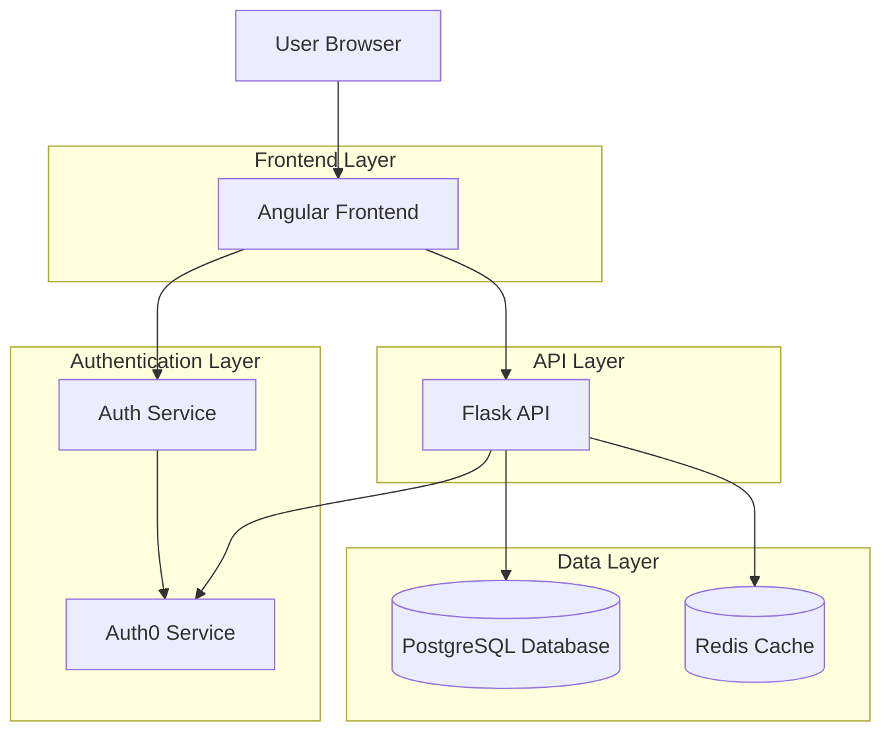

### 3.4 Data Flow Overview

1. User authenticates via Auth0 integration to obtain JWT token
2. Token contains user identity and site access claims
3. Frontend communicates with API sending the JWT in request headers
4. API validates token and extracts site context
5. API enforces site-scoping on all database operations
6. Results return to frontend filtered by site access
7. Frontend renders data according to user's permissions

## 4. Component Architecture

### 4.1 Frontend Application

The Angular frontend provides the user interface for interaction management and implements client-side validation, state management, and responsive design.

#### 4.1.1 Frontend Component Structure

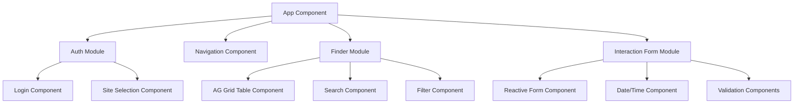

#### 4.1.2 State Management

The application manages state through a combination of:

- Angular services for shared state
- Angular Signals for reactive state updates
- Angular Reactive Forms for form state
- Local component state for UI-specific state
- Route parameters for navigation state

#### 4.1.3 Frontend Technical Stack

| Component | Technology | Version | Purpose |
|-----------|------------|---------|---------|
| Framework | Angular | 16.2.0 | Core UI framework |
| UI Components | Angular Material | 16.2.0 | Common UI components |
| Data Grid | AG Grid | 30.0.3 | Finder table implementation |
| Styling | TailwindCSS | 3.3.3 | Utility-based styling |
| HTTP Client | Angular HttpClient | 16.2.0 | API communication |
| Date Handling | date-fns | 2.30.0 | Date/time manipulation |
| Routing | Angular Router | 16.2.0 | Navigation management |

### 4.2 Backend API

The Flask backend implements the business logic, data access, and security controls for the system.

#### 4.2.1 Backend Component Structure

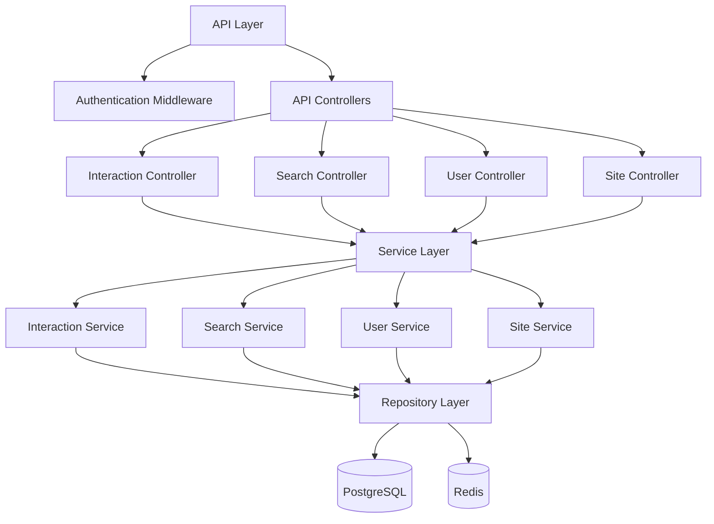

#### 4.2.2 API Controllers

| Controller | Endpoints | Responsibilities |
|------------|-----------|------------------|
| InteractionController | `/api/interactions`, `/api/interactions/{id}` | CRUD operations for interactions |
| SearchController | `/api/search/interactions` | Advanced search functionality |
| UserController | `/api/users`, `/api/users/profile` | User management |
| SiteController | `/api/sites`, `/api/users/sites` | Site management and access |
| AuthController | `/api/auth/*` | Authentication operations |

#### 4.2.3 Backend Technical Stack

| Component | Technology | Version | Purpose |
|-----------|------------|---------|---------|
| Web Framework | Flask | 2.3.2 | API routing and handling |
| ORM | SQLAlchemy | 2.0.19 | Database abstraction |
| Authentication | Flask-JWT-Extended | 4.5.2 | JWT validation |
| Serialization | Marshmallow | 3.20.1 | Data validation and serialization |
| CORS | Flask-CORS | 4.0.0 | Cross-origin support |
| Logging | Structured Logging | - | Application logging |

### 4.3 Authentication Service

The authentication service integrates with Auth0 to provide secure user authentication and site-scoped authorization.

#### 4.3.1 Auth Flow Diagram

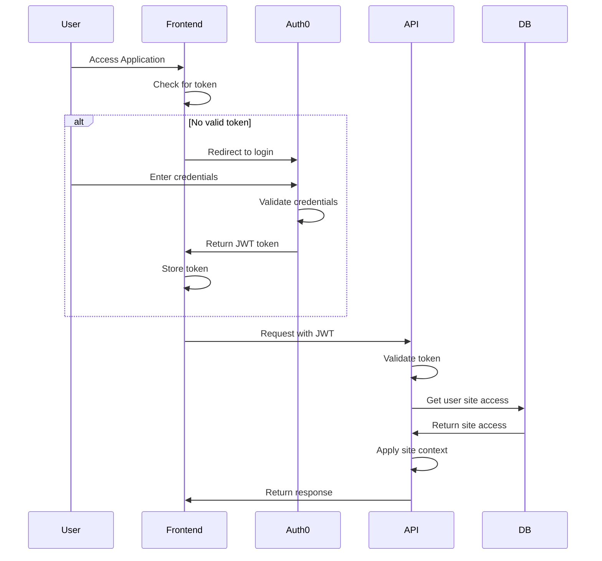

#### 4.3.2 Token Structure

```json
{
  "iss": "https://auth.example.com/",
  "sub": "auth0|user123",
  "aud": "interaction-api",
  "exp": 1617974730,
  "iat": 1617938730,
  "sites": [1, 2, 3],
  "email": "user@example.com",
  "name": "User Name"
}
```

#### 4.3.3 Site-Based Authorization

The system implements site-based authorization through:

1. JWT tokens containing site access claims
2. API middleware extracting site context from tokens
3. Database queries filtered by site access
4. Frontend components adapting to site context

### 4.4 Database Layer

#### 4.4.1 Data Model

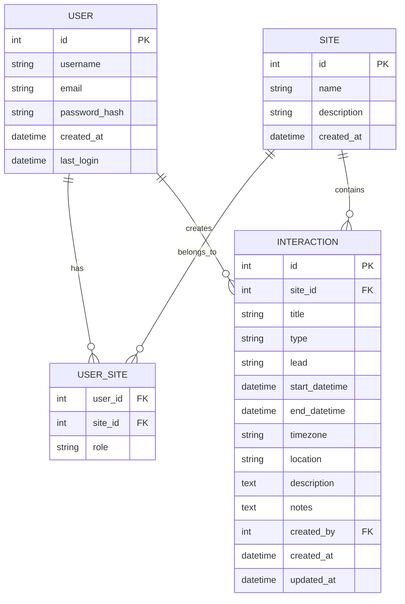

#### 4.4.2 Database Technology

PostgreSQL 15.3 is used as the primary database for:
- Robust relational data model
- Powerful querying capabilities
- Full-text search functionality
- Transaction support and data integrity
- Advanced indexing for optimized queries

#### 4.4.3 Caching Strategy

Redis 7.0.12 is used for caching:
- Authentication results and site access
- Common search queries
- Reference data
- Session management

Cache invalidation is triggered by:
- Interaction creation/updates/deletion
- User site access changes
- Time-based expiration

## 5. Core Services Architecture

### 5.1 Service Architecture Overview

While the system is designed as a monolithic application rather than a microservices architecture, it is organized into logical service components with clear boundaries and responsibilities.

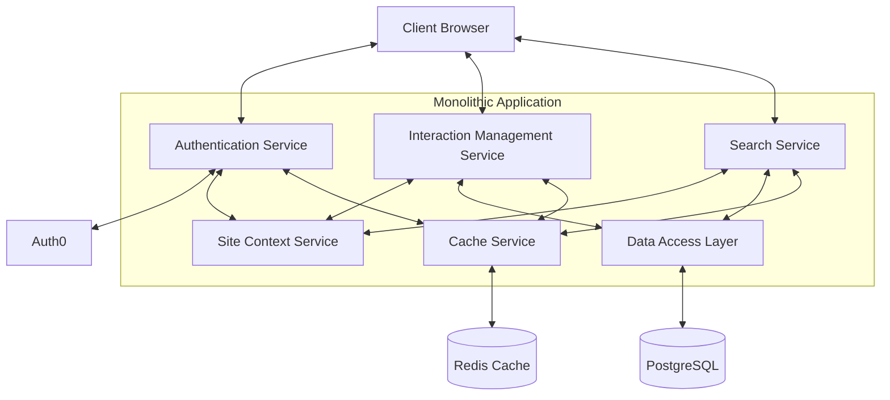

### 5.2 Core Services

#### 5.2.1 Authentication Service

**Primary Responsibilities:**
- User authentication via Auth0
- JWT token validation
- Site access management
- Session handling
- Permission enforcement

**Key Interfaces:**
- Auth0 integration
- Token validation interface
- User-site association management
- Permission checking

#### 5.2.2 Interaction Management Service

**Primary Responsibilities:**
- CRUD operations for Interaction entities
- Business logic validation
- Data persistence
- Field validation
- Audit logging

**Key Interfaces:**
- Interaction retrieval interface
- Interaction creation/update interface
- Validation interface
- History tracking

#### 5.2.3 Search Service

**Primary Responsibilities:**
- Advanced searching
- Query optimization
- Result formatting
- Filter processing
- Pagination handling

**Key Interfaces:**
- Search execution interface
- Filter building interface
- Result formatting interface
- Query optimization

#### 5.2.4 Site Context Service

**Primary Responsibilities:**
- Site context management
- Site-scoped data access enforcement
- Site listing and selection
- User-site relationship management

**Key Interfaces:**
- Site context retrieval
- Access validation interface
- Site selection interface
- Site metadata management

### 5.3 Service Communication Patterns

| Pattern | Implementation | Use Cases |
|---------|----------------|-----------|
| Direct Method Invocation | In-process function calls | Primary communication between services in monolith |
| HTTP REST | JSON over HTTPS | Client-server communication |
| Caching | Redis key-value operations | Performance optimization |
| Event-Based | Minimal internal event system | Cache invalidation, audit logging |

### 5.4 Resilience Patterns

| Pattern | Implementation | Purpose |
|---------|----------------|---------|
| Circuit Breaker | External service calls | Prevent cascading failures |
| Retry with Backoff | Transient error handling | Recover from temporary issues |
| Fallback Responses | Degraded operation modes | Maintain basic functionality during partial failures |
| Timeout Controls | API and database operations | Prevent request hanging |

### 5.5 Scaling Approach

| Scaling Strategy | Implementation | When Applied |
|------------------|----------------|-------------|
| Vertical Scaling | Increase server resources | Initial scaling approach |
| Read Replicas | Database read distribution | When read operations dominate |
| Connection Pooling | Database connection management | Optimize connection usage |
| Caching Layers | Multi-level caching | Reduce database load |

## 6. Data Architecture

### 6.1 Database Schema Design

The database schema is designed around site-scoped interactions, with User and Site entities serving as organizational boundaries.

#### 6.1.1 Core Tables

**Users Table:**
```sql
CREATE TABLE users (
    id SERIAL PRIMARY KEY,
    username VARCHAR(50) UNIQUE NOT NULL,
    email VARCHAR(100) UNIQUE NOT NULL,
    password_hash VARCHAR(256) NOT NULL,
    created_at TIMESTAMP NOT NULL DEFAULT CURRENT_TIMESTAMP,
    last_login TIMESTAMP
);
```

**Sites Table:**
```sql
CREATE TABLE sites (
    id SERIAL PRIMARY KEY,
    name VARCHAR(100) NOT NULL,
    description TEXT,
    created_at TIMESTAMP NOT NULL DEFAULT CURRENT_TIMESTAMP
);
```

**User-Site Association Table:**
```sql
CREATE TABLE user_sites (
    user_id INTEGER REFERENCES users(id) ON DELETE CASCADE,
    site_id INTEGER REFERENCES sites(id) ON DELETE CASCADE,
    role VARCHAR(20) NOT NULL DEFAULT 'user',
    PRIMARY KEY (user_id, site_id),
    CONSTRAINT valid_role CHECK (role IN ('admin', 'user', 'viewer'))
);
```

**Interactions Table:**
```sql
CREATE TABLE interactions (
    id SERIAL PRIMARY KEY,
    site_id INTEGER NOT NULL REFERENCES sites(id) ON DELETE CASCADE,
    title VARCHAR(100) NOT NULL,
    type VARCHAR(50) NOT NULL,
    lead VARCHAR(100) NOT NULL,
    start_datetime TIMESTAMP NOT NULL,
    end_datetime TIMESTAMP NOT NULL,
    timezone VARCHAR(50) NOT NULL,
    location VARCHAR(200),
    description TEXT NOT NULL,
    notes TEXT,
    created_by INTEGER NOT NULL REFERENCES users(id),
    created_at TIMESTAMP NOT NULL DEFAULT CURRENT_TIMESTAMP,
    updated_at TIMESTAMP NOT NULL DEFAULT CURRENT_TIMESTAMP,
    CONSTRAINT valid_dates CHECK (end_datetime > start_datetime)
);
```

### 6.2 Indexing Strategy

| Table | Index Type | Columns | Purpose |
|-------|------------|---------|---------|
| interactions | Foreign Key | site_id | Site-based filtering |
| interactions | Composite | site_id, type | Common filtering scenario |
| interactions | Composite | site_id, start_datetime | Date-based filtering |
| interactions | Full-text | GIN index on title, description, notes | Text searching |
| user_sites | Composite | user_id, site_id | Quick access validation |

### 6.3 Query Optimization

Key query optimizations include:

1. **Site-Scoped Filtering:**
```sql
-- All queries include site-scoping
SELECT * FROM interactions 
WHERE site_id IN (SELECT site_id FROM user_sites WHERE user_id = ?)
```

2. **Optimized Search:**
```sql
-- Full-text search with site-scoping
SELECT * FROM interactions 
WHERE site_id IN (SELECT site_id FROM user_sites WHERE user_id = ?)
  AND to_tsvector('english', title || ' ' || description || ' ' || COALESCE(notes, '')) 
      @@ plainto_tsquery('english', ?)
```

3. **Efficient Pagination:**
```sql
-- Keyset pagination for better performance
SELECT * FROM interactions 
WHERE site_id IN (SELECT site_id FROM user_sites WHERE user_id = ?)
  AND (start_datetime, id) < (?, ?)  -- Last seen values
ORDER BY start_datetime DESC, id DESC
LIMIT 20
```

### 6.4 Data Access Patterns

| Access Pattern | Implementation | Optimization |
|----------------|----------------|--------------|
| Read by ID | Direct primary key lookup | Cached for frequent access |
| List with Filtering | Query with WHERE clauses | Indexed filtering, pagination |
| Full-text Search | PostgreSQL full-text search | GIN indexes, result caching |
| Create/Update | Direct INSERT/UPDATE | Transaction management |
| Multi-table Joins | SQL joins | Join optimization, selective columns |

### 6.5 Caching Strategy

| Cache Type | Data | TTL | Invalidation Trigger |
|------------|------|-----|----------------------|
| Site Access | User's site associations | 30 minutes | Role changes, sign out |
| Search Results | Common search queries | 5 minutes | Data modifications |
| Interaction Details | Frequently accessed records | 10 minutes | Record updates |
| Reference Data | Types, static lists | 1 hour | Admin updates |

## 7. Infrastructure Architecture

### 7.1 Deployment Environment

The system is deployed on AWS infrastructure using containerized components.

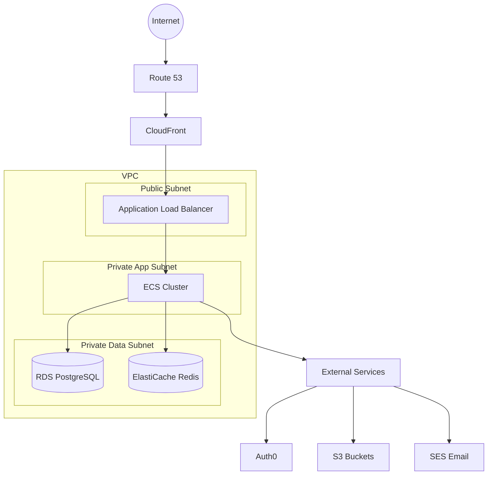

### 7.2 Container Architecture

The application is containerized using Docker with the following structure:

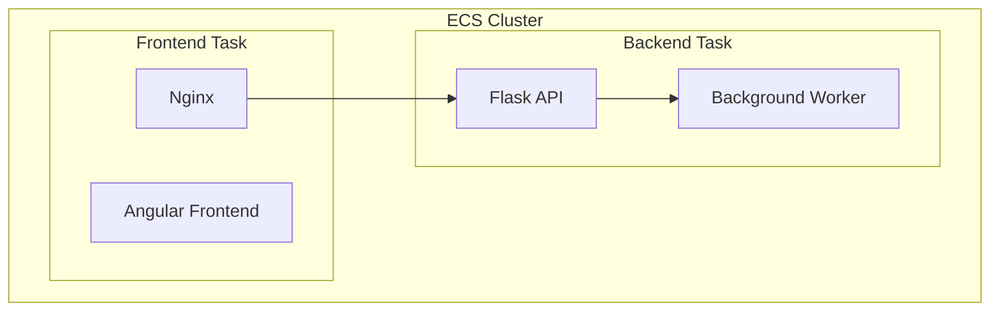

#### 7.2.1 Container Images

| Component | Base Image | Purpose |
|-----------|------------|---------|
| Frontend | node:19-alpine | Serve Angular application |
| Backend API | python:3.11-slim | Run Flask API service |
| Worker | python:3.11-slim | Process background tasks |

### 7.3 Network Architecture

| Network Zone | Components | Access Control |
|--------------|------------|----------------|
| Public Zone | Load Balancer, CloudFront | Internet accessible, WAF protection |
| App Zone | ECS services | No public access, security group control |
| Data Zone | RDS, ElastiCache | No public access, security group control |

### 7.4 Scalability Architecture

Scalability is addressed through multiple mechanisms:

1. **Horizontal Scaling:**
   - Auto-scaling ECS services based on CPU/memory utilization
   - ECS service placement across multiple availability zones

2. **Database Scaling:**
   - RDS Multi-AZ for high availability
   - Read replicas for scaling read operations
   - Connection pooling for efficient resource usage

3. **Performance Optimization:**
   - CloudFront caching for static assets
   - Redis caching for API responses and frequent queries
   - Optimized database queries and indexes

### 7.5 CI/CD Pipeline

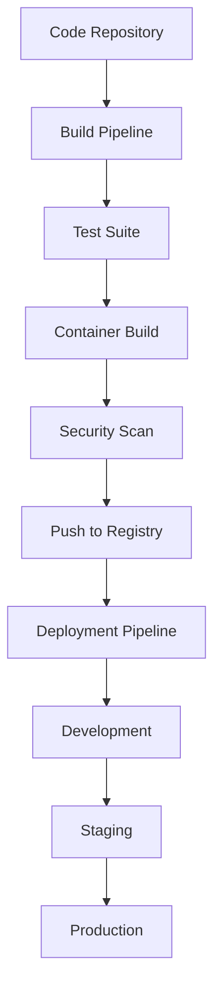

#### 7.5.1 Pipeline Components

| Component | Technology | Purpose |
|-----------|------------|---------|
| Source Control | GitHub | Code repository |
| CI/CD | GitHub Actions | Automated build and deploy |
| Container Registry | ECR | Docker image storage |
| Infrastructure as Code | Terraform | Infrastructure management |
| Environment Config | AWS Parameter Store | Environment-specific configuration |

## 8. Security Architecture

### 8.1 Authentication Architecture

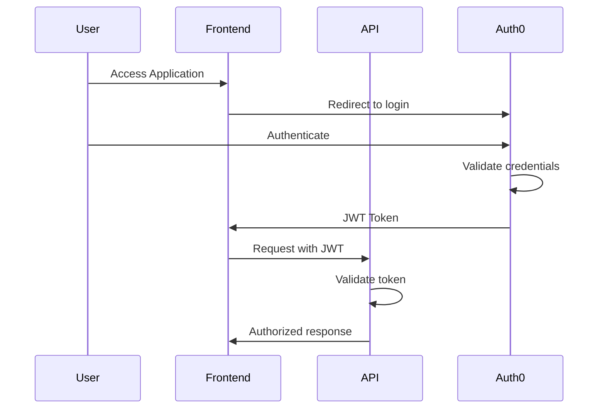

### 8.2 Authorization Model

The system implements a multi-layered authorization approach:

1. **Authentication Layer:**
   - JWT token validation
   - User identification

2. **Site-Scoping Layer:**
   - Site access validation
   - Data visibility boundaries

3. **Role-Based Controls:**
   - User roles within sites (admin, user, viewer)
   - Operation-based permissions

4. **Resource-Level Authorization:**
   - Creator-specific permissions
   - Record-level access controls

### 8.3 Data Protection

| Data State | Protection Method | Implementation |
|------------|-------------------|----------------|
| In Transit | TLS 1.2+ | HTTPS for all communications |
| At Rest | Encryption | RDS and S3 encryption |
| In Database | Column-level security | Field-level access controls |
| In Memory | Minimal exposure | Secrets management |

### 8.4 Security Controls

| Security Aspect | Control Mechanism | Implementation |
|-----------------|-------------------|----------------|
| Input Validation | Client and server validation | Form validation, parameter checking |
| Output Encoding | Context-appropriate encoding | HTML escaping, JSON serialization |
| Authentication | Token-based auth | JWT with appropriate algorithms |
| Authorization | Multi-layer access control | Site-scoping, role checks |
| Session Management | Secure token handling | Short lived tokens, secure storage |
| Error Handling | Security-conscious errors | Limited exposure of details |
| Logging & Monitoring | Comprehensive audit trail | Structured logging, alerting |

## 9. Monitoring & Observability

### 9.1 Logging Strategy

The system implements structured logging with the following characteristics:

| Log Level | Purpose | Examples |
|-----------|---------|----------|
| ERROR | System failures, exceptions | Database failures, authentication errors |
| WARN | Potential issues | Slow queries, suspicious activities |
| INFO | Normal operations | User logins, interaction operations |
| DEBUG | Troubleshooting details | Request parameters, response data |

All logs include:
- Timestamp
- Correlation ID
- User ID (if authenticated)
- Site context
- Component/operation
- Request details

### 9.2 Metrics Collection

| Metric Type | Examples | Collection Method |
|-------------|----------|-------------------|
| System Metrics | CPU, memory, disk usage | CloudWatch agent |
| Application Metrics | Request counts, error rates | Custom instrumentation |
| Business Metrics | Interactions created, searches performed | Application events |
| User Experience | Page load time, time to interactive | Frontend monitoring |

### 9.3 Alerting Framework

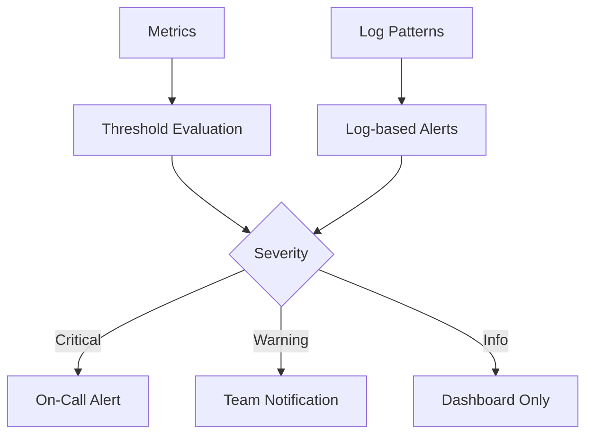

| Alert Type | Trigger | Response | Recovery |
|------------|---------|----------|----------|
| System Down | Service unavailable | Immediate page | Automatic recovery attempt |
| Performance Degradation | Slow response times | Team notification | Performance analysis |
| Security Event | Unusual access patterns | Security team alert | Access review |
| Business Anomaly | Unusual usage patterns | Dashboard highlight | Trend analysis |

### 9.4 Dashboards

The monitoring system provides different dashboard views for various stakeholders:

1. **Operations Dashboard:**
   - System health indicators
   - Error rates and anomalies
   - Resource utilization
   - Real-time alerts

2. **Developer Dashboard:**
   - API performance metrics
   - Database query performance
   - Error details and stack traces
   - Deployment status

3. **Business Dashboard:**
   - User activity metrics
   - Interaction creation rates
   - Search patterns
   - Site usage comparison

## 10. Deployment Architecture

### 10.1 Environment Strategy

| Environment | Purpose | Refresh Cycle | Data Strategy |
|-------------|---------|---------------|---------------|
| Development | Feature development | Continuous | Synthetic test data |
| Staging | Pre-production validation | Release-based | Anonymized production data |
| Production | Live system | Scheduled releases | Full production data |

### 10.2 Deployment Process

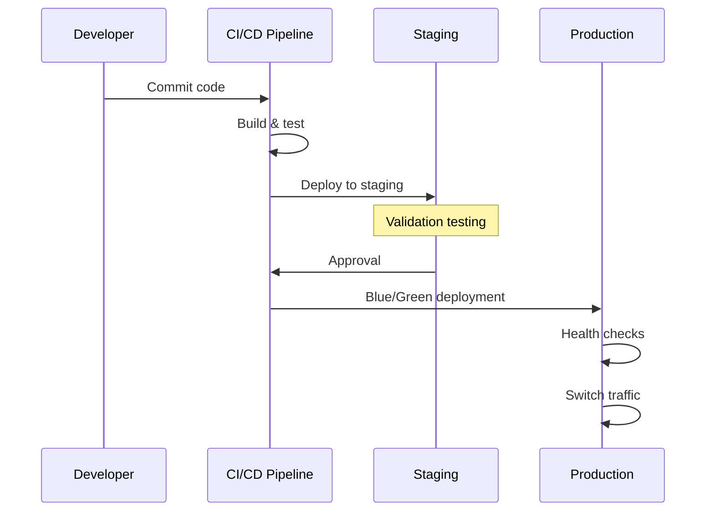

### 10.3 Rollback Strategy

| Failure Point | Rollback Mechanism | Recovery Time |
|---------------|---------------------|---------------|
| Failed deployment | Revert to previous version | < 5 minutes |
| Database migration issue | Database rollback script | < 15 minutes |
| Infrastructure change | Terraform rollback | < 30 minutes |
| Major system failure | Restore from backup | < 4 hours |

### 10.4 Release Management

| Release Type | Frequency | Process | Approval |
|--------------|-----------|---------|----------|
| Patch | As needed | Fast-track deployment | Team lead approval |
| Minor Release | Bi-weekly | Standard deployment | Product owner approval |
| Major Release | Quarterly | Extended testing | Stakeholder approval |

## 11. References

| Reference | Description | URL |
|-----------|-------------|-----|
| Angular Documentation | Official Angular framework documentation | https://angular.io/docs |
| Flask Documentation | Official Flask framework documentation | https://flask.palletsprojects.com/ |
| PostgreSQL Documentation | Official PostgreSQL documentation | https://www.postgresql.org/docs/ |
| Auth0 Documentation | Auth0 integration guides | https://auth0.com/docs/ |
| AWS Best Practices | AWS architecture best practices | https://aws.amazon.com/architecture/well-architected/ |
| OWASP Top Ten | Web application security guidance | https://owasp.org/www-project-top-ten/ |
| Twelve-Factor App | Modern application methodology | https://12factor.net/ |