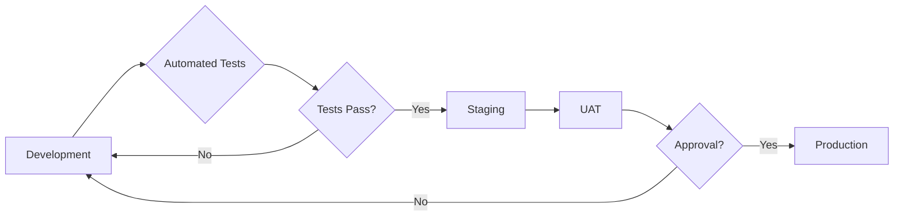
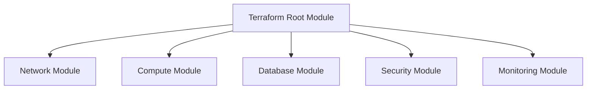

# Interaction Management System - Deployment Documentation

## Introduction

This document outlines the deployment strategy and procedures for the Interaction Management System. It covers infrastructure setup, environment configuration, deployment processes, and operational procedures necessary for a successful deployment.

### Purpose of this Document

This document is intended for system administrators, DevOps engineers, and developers involved in deploying and maintaining the Interaction Management System. It provides step-by-step instructions and best practices for deploying the application across different environments.

### System Overview

The Interaction Management System follows a multi-tier architecture with clear separation between presentation, business logic, and data persistence layers. The key components are:

- **Angular Frontend**: Provides the user interface for interaction management.
- **Flask API Backend**: Implements the business logic, data access, and security controls.
- **Authentication Service**: Manages user authentication and authorization.
- **PostgreSQL Database**: Stores all application data.
- **Redis Cache**: Caches frequent data requests and user sessions.

For a detailed overview of the system architecture, refer to [architecture.md](#1-system-overview).

### Deployment Principles

The deployment approach is guided by the following principles:

- **Automation**: Automate all deployment tasks to reduce manual effort and errors.
- **Infrastructure as Code**: Manage infrastructure using code for consistency and repeatability.
- **Security by Design**: Implement security best practices at every stage of the deployment process.
- **Zero-Downtime Updates**: Ensure minimal disruption to users during application updates.

## Environment Strategy

The system utilizes multiple environments to support the software development lifecycle. Each environment has a specific purpose and configuration.

### Environment Types

- **Development**: Used by developers for local development and unit testing.
  - Configuration: Local Docker Compose setup with hot-reloading enabled.
  - Data: Synthetic test data.
- **Staging**: Used for integration testing, performance validation, and user acceptance testing.
  - Configuration: Production-like environment with sandboxed external services.
  - Data: Anonymized production data.
- **Production**: The live system used by end-users.
  - Configuration: Highly available and scalable infrastructure.
  - Data: Full production data with regular backups.

### Environment Promotion Flow

The code promotion flow ensures that changes are thoroughly tested before reaching production:



### Environment Configuration Management

Environment-specific configurations are managed using:

- **AWS Parameter Store**: Securely stores configuration parameters, including database URLs, API keys, and feature flags.
- **AWS Secrets Manager**: Manages sensitive credentials, such as database passwords and API secrets, with automatic rotation.
- **Environment Variables**: Used for application-level configuration, such as log levels and feature toggles.

### Environment Isolation

Security boundaries are enforced between environments to prevent cross-contamination:

- **Separate AWS accounts**: Use separate AWS accounts for production and non-production environments.
- **VPC isolation**: Isolate environments within separate Virtual Private Clouds (VPCs).
- **IAM roles**: Use distinct IAM roles with least privilege access for each environment.
- **Data masking**: Mask sensitive data in non-production environments.

## Infrastructure Provisioning

The infrastructure is provisioned using Terraform, enabling infrastructure as code (IaC) for consistent and repeatable deployments.

### Prerequisites

- An AWS account with appropriate permissions to create and manage resources.
- The AWS CLI installed and configured with credentials.
- Terraform installed and configured.
- Necessary environment variables set (AWS_ACCESS_KEY_ID, AWS_SECRET_ACCESS_KEY, AWS_REGION).

### Terraform Configuration

The Terraform configuration is structured into modules for better organization and reusability:



The main Terraform configuration file is [terraform/main.tf](#main-terraform-configuration).

### Networking Setup

The networking module creates the following resources:

- **Virtual Private Cloud (VPC)**: Isolated network for the application.
- **Public Subnets**: Subnets for internet-facing resources like load balancers.
- **Private Application Subnets**: Subnets for application servers with no direct internet access.
- **Private Data Subnets**: Subnets for database and cache instances with restricted access.
- **Security Groups**: Virtual firewalls controlling traffic to and from resources.
- **Network Access Control Lists (NACLs)**: Optional network-level access control.

### Database Infrastructure

The database module provisions a PostgreSQL RDS instance with the following features:

- **Multi-AZ Deployment**: High availability with automatic failover to a standby instance.
- **Automated Backups**: Daily backups with point-in-time recovery.
- **Encryption at Rest**: Data encryption using AWS Key Management Service (KMS).
- **Connection Pooling**: PgBouncer for efficient database connection management.

### Caching Infrastructure

The caching module deploys an ElastiCache Redis cluster for:

- **Session Storage**: Storing user session data for fast access.
- **Frequent Data Caching**: Caching common queries and API responses to reduce database load.
- **Automatic Failover**: High availability with automatic node replacement.

### Compute Resources

The compute module provisions the following resources:

- **Elastic Container Service (ECS) Cluster**: Manages containerized application deployments.
- **Task Definitions**: Specifies container configurations, resource requirements, and networking settings.
- **Service Definitions**: Defines how ECS services are deployed and scaled.
- **Application Load Balancer (ALB)**: Distributes traffic across application instances.

### Load Balancing and Routing

The system uses an Application Load Balancer (ALB) to:

- **Distribute Traffic**: Route incoming requests to healthy application instances.
- **Handle SSL Termination**: Manage SSL certificates for secure communication.
- **Implement Health Checks**: Monitor the health of application instances.
- **Route 53 DNS Configuration**: Configures DNS records to point to the load balancer.

### Infrastructure Modification

When making changes to the infrastructure:

- **Use Version Control**: Commit all changes to the Terraform configuration to a version control system (Git).
- **Test Changes**: Test changes in a non-production environment before applying them to production.
- **Apply Changes Gradually**: Apply changes in small increments to minimize risk.
- **Monitor Changes**: Monitor the system after applying changes to ensure everything is working as expected.

## Containerization

The application is containerized using Docker to ensure consistent environments across development and production.

### Dockerfile Descriptions

- **Backend Dockerfile**: Located at `src/backend/Dockerfile`.
  - Uses a multi-stage build to reduce the final image size.
  - Installs Python dependencies using `pip`.
  - Copies application code and configuration files.
  - Configures a non-root user for security.
  - Exposes port 5000 for the API.
  - Defines a health check endpoint.
  - Starts the Gunicorn WSGI server.
- **Frontend Dockerfile**: Located at `src/web/Dockerfile`.
  - Uses a multi-stage build to build the Angular application and serve it with Nginx.
  - Installs Node.js dependencies using `npm`.
  - Copies application code and assets.
  - Configures Nginx to serve the Angular application.
  - Exposes port 80 for HTTP and 443 for HTTPS.
  - Defines a health check endpoint.

### Docker Compose Configuration

The `docker-compose.yml` file defines the services and dependencies for local development:

- **Backend**: Flask API service.
- **Frontend**: Angular web application served by Nginx.
- **Database**: PostgreSQL database service.
- **Cache**: Redis cache service.

The `docker-compose.yml` file is located at [docker-compose.yml](#docker-composeyml).

### Image Versioning and Tagging

Docker images are versioned and tagged using the following strategy:

- **Semantic Versioning**: `major.minor.patch` for release tracking.
- **Git Commit SHA**: `sha-8chars` for build traceability.
- **Environment**: `env-name` for deployment context.

Example: `my-app:1.2.3-sha-abcdefg-prod`

### Container Security

Security best practices for container configuration:

- **Use Minimal Base Images**: Use Alpine Linux-based images to reduce the attack surface.
- **Run as Non-Root User**: Configure containers to run as a non-root user.
- **Limit Capabilities**: Drop unnecessary Linux capabilities.
- **Use Read-Only Filesystems**: Mount filesystems as read-only where possible.
- **Regularly Scan Images**: Scan images for vulnerabilities using tools like Trivy.

### Local Container Development

For local development, use Docker Compose to manage the application services:

```bash
docker-compose up --build
```

This command builds the Docker images and starts the application services.

## Continuous Integration & Deployment

The system uses GitHub Actions for CI/CD, automating the build, test, and deployment workflows.

### GitHub Actions Workflows

Separate workflows are defined for the backend and frontend components:

- **Backend CI/CD Workflow**: Located at `.github/workflows/backend.yml`.
  - Triggers on code pushes and pull requests.
  - Runs linters, unit tests, and integration tests.
  - Builds the Docker image and pushes it to Amazon Elastic Container Registry (ECR).
  - Deploys the application to the staging and production environments.
- **Frontend CI/CD Workflow**: Located at `.github/workflows/frontend.yml`.
  - Triggers on code pushes and pull requests.
  - Runs linters, unit tests, and end-to-end tests.
  - Builds the Angular application and uploads the artifacts to an S3 bucket.
  - Invalidates the CloudFront cache for the static assets.

### Build Process

The build process includes the following steps:

1. **Code Linting**: Enforces code style and identifies potential issues.
2. **Unit Tests**: Verifies the functionality of individual components.
3. **Integration Tests**: Validates the interaction between different components.
4. **Security Scanning**: Scans dependencies for known vulnerabilities.
5. **Artifact Building**: Creates distribution packages and Docker images.

### Testing Strategy

The testing strategy includes the following phases:

- **Unit Testing**: Tests individual components in isolation.
- **Integration Testing**: Tests the interaction between different components.
- **End-to-End Testing**: Tests the entire application workflow from the user's perspective.
- **Performance Testing**: Validates the application's performance under load.
- **Security Testing**: Identifies potential security vulnerabilities.

### Deployment Workflows

The deployment workflows are defined for each environment:

- **Development**:
  - Deploys to a local Docker Compose environment.
  - Used for rapid iteration and testing.
- **Staging**:
  - Deploys to a production-like environment.
  - Used for integration testing, performance validation, and user acceptance testing.
- **Production**:
  - Deploys to the live production environment.
  - Uses a blue/green deployment strategy for zero-downtime updates.

### Blue/Green Deployment

The production environment uses a blue/green deployment strategy to minimize downtime during updates:

1. **Deploy New Version**: Deploy the new version of the application to a separate "green" environment.
2. **Test New Version**: Thoroughly test the new version in the green environment.
3. **Switch Traffic**: Switch traffic from the "blue" (current) environment to the "green" environment.
4. **Monitor New Version**: Monitor the new version for any issues.
5. **Rollback if Necessary**: If any issues are found, switch traffic back to the blue environment.

### Approval Gates

Manual and automated approval processes are used to ensure quality and security:

- **Code Review**: All code changes must be reviewed and approved by at least one other developer.
- **Automated Testing**: All code changes must pass automated unit and integration tests.
- **Security Scanning**: All code changes must pass security scans with no critical vulnerabilities.
- **User Acceptance Testing (UAT)**: Key stakeholders must approve the new version in the staging environment before it is deployed to production.

### Rollback Procedures

Automated and manual processes are in place for rolling back failed deployments:

- **Automated Rollback**: If automated tests fail after deployment, the system automatically rolls back to the previous version.
- **Manual Rollback**: If issues are discovered after deployment, a manual rollback can be initiated by a system administrator.

## Database Operations

### Migration Strategy

Database schema changes are managed using Alembic, a database migration tool for SQLAlchemy.

- **Version Control**: All migration scripts are stored in a version control system (Git).
- **Automated Execution**: Migrations are automatically applied during deployment.
- **Rollback Capability**: Migrations can be rolled back if necessary.
- **Testing**: Migrations are tested in a non-production environment before being applied to production.

### Migration Execution

To execute database migrations:

1. Activate the virtual environment.
2. Run the Alembic upgrade command:

```bash
alembic upgrade head